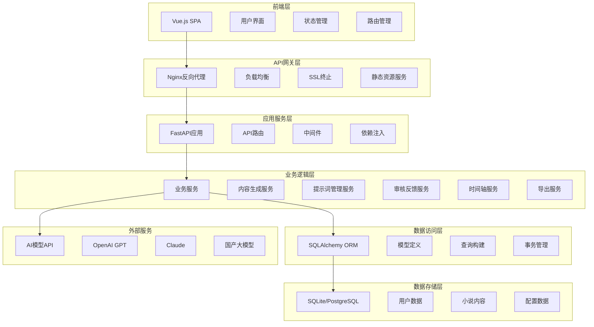
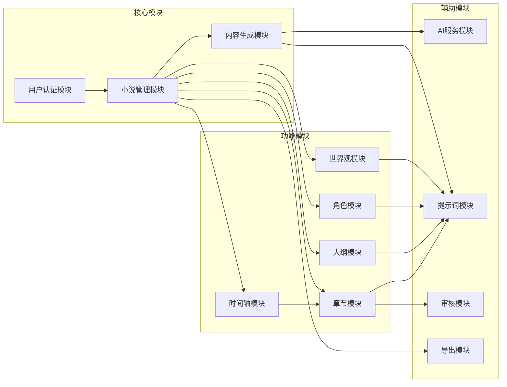
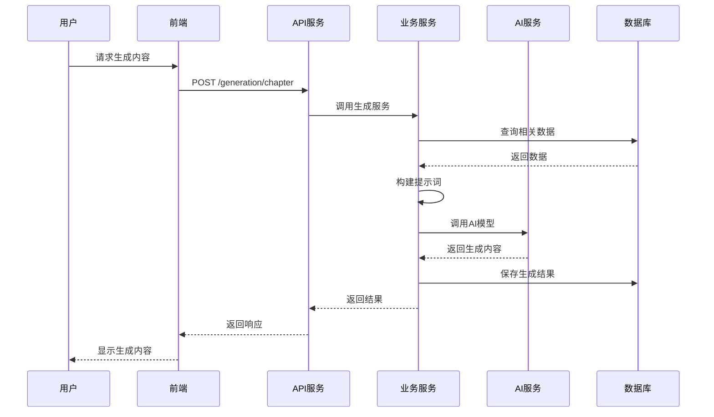

# AI小说生成器系统架构文档

## 技术栈

### 后端
- **语言**：Python 3.9+
- **框架**：FastAPI
- **数据库**：SQLite (开发) / PostgreSQL (生产)
- **ORM**：SQLAlchemy
- **依赖管理**：Poetry
- **异步支持**：asyncio, aiofiles
- **API文档**：Swagger/OpenAPI
- **测试**：pytest, pytest-asyncio

### 前端
- **语言**：JavaScript/TypeScript
- **框架**：Vue 3 + Composition API
- **构建工具**：Vite
- **UI框架**：Element Plus + Bootstrap
- **状态管理**：Pinia
- **路由**：Vue Router
- **HTTP客户端**：Axios
- **富文本编辑器**：Quill.js
- **测试**：Vitest

### AI模型集成
- **支持模型**：OpenAI GPT, Claude, 文心一言, 通义千问等，支持自定义模型名和模型接口地址
- **调用方式**：统一API适配器模式
- **配置管理**：数据库存放 模型配置，支持配置首选模型和调用频率

### 部署和运维
本地部署

## 项目目录结构

```
ai-writer-design1/
├── backend/                          # 后端项目根目录
│   ├── app/                          # 应用核心代码
│   │   ├── __init__.py
│   │   ├── main.py                   # FastAPI应用入口
│   │   ├── core/                     # 核心配置和基础设施
│   │   │   ├── __init__.py
│   │   │   ├── config.py             # 应用配置
│   │   │   ├── database.py           # 数据库连接
│   │   │   ├── security.py           # 安全相关
│   │   │   └── dependencies.py       # 依赖注入
│   │   ├── models/                   # 数据模型
│   │   │   ├── __init__.py
│   │   │   ├── base.py               # 基础模型类
│   │   │   ├── user.py               # 用户模型
│   │   │   ├── novel.py              # 小说基础模型
│   │   │   ├── worldview.py          # 世界观模型
│   │   │   ├── outline.py            # 大纲模型
│   │   │   ├── character.py          # 角色模型
│   │   │   ├── chapter.py            # 章节模型
│   │   │   ├── prompt.py             # 提示词模型
│   │   │   └── ai_model_config.py    # AI模型配置
│   │   ├── schemas/                  # Pydantic模式定义
│   │   │   ├── __init__.py
│   │   │   ├── user.py
│   │   │   ├── novel.py
│   │   │   ├── worldview.py
│   │   │   ├── outline.py
│   │   │   ├── character.py
│   │   │   ├── chapter.py
│   │   │   ├── prompt.py
│   │   │   └── ai_model_config.py    # AI模型配置模式
│   │   ├── api/                      # API路由
│   │   │   ├── __init__.py
│   │   │   └── v1/                   # API版本1
│   │   │       ├── __init__.py
│   │   │       ├── api.py            # 路由聚合
│   │   │       ├── auth.py           # 认证相关
│   │   │       ├── novels.py         # 小说管理
│   │   │       ├── worldview.py      # 世界观管理
│   │   │       ├── outline.py        # 大纲管理
│   │   │       ├── characters.py     # 角色管理
│   │   │       ├── chapters.py       # 章节管理
│   │   │       ├── generation.py     # AI生成接口
│   │   │       ├── ai_configs.py     # AI配置管理
│   │   │       └── demo.py           # 演示接口
│   │   └── services/                 # 业务逻辑服务
│   │       ├── ai_service.py         # AI模型调用服务
│   │       ├── generation_service.py # 内容生成服务
│   │       ├── prompt_service.py     # 提示词管理服务
│   │       └── http_adapter.py       # HTTP适配器服务
│   ├── scripts/                      # 初始化脚本
│   │   ├── init_prompts.py           # 提示词初始化
│   │   ├── init_chapter_prompts.py   # 章节提示词初始化
│   │   ├── init_character_outline_prompts.py # 角色大纲提示词
│   │   └── simple_init.py            # 简单初始化
│   ├── .env                          # 环境变量
│   ├── .env.example                  # 环境变量模板
│   ├── pyproject.toml                # Python依赖配置
│   ├── requirements.txt              # Python依赖列表
│   ├── alembic.ini                   # 数据库迁移配置
│   ├── backend.log                   # 后端日志
│   ├── ai_writer.db                  # SQLite数据库
│   └── README.md                     # 后端说明文档
├── frontend/                         # 前端项目根目录
│   ├── src/                          # 源代码目录
│   │   ├── App.vue                   # 根组件
│   │   ├── main.ts                   # 应用入口
│   │   ├── env.d.ts                  # TypeScript环境声明
│   │   ├── api/                      # API接口
│   │   │   ├── index.ts              # API统一入口
│   │   │   ├── auth.ts               # 认证接口
│   │   │   ├── novels.ts             # 小说接口
│   │   │   ├── chapters.ts           # 章节接口
│   │   │   ├── characters.ts         # 角色接口
│   │   │   ├── outline.ts            # 大纲接口
│   │   │   ├── generation.ts         # 生成接口
│   │   │   ├── homepage.ts           # 首页接口
│   │   │   └── ai-configs.ts         # AI配置接口
│   │   ├── components/               # 组件目录
│   │   │   ├── HelloWorld.vue
│   │   │   ├── TheWelcome.vue
│   │   │   ├── WelcomeItem.vue
│   │   │   ├── __tests__/            # 组件测试
│   │   │   ├── ai-configs/           # AI配置组件
│   │   │   ├── chapters/             # 章节组件
│   │   │   ├── home/                 # 首页组件
│   │   │   ├── icons/                # 图标组件
│   │   │   ├── layout/               # 布局组件
│   │   │   ├── novels/               # 小说组件
│   │   │   ├── outline/              # 大纲组件
│   │   │   └── worldview/            # 世界观组件
│   │   ├── views/                    # 页面组件
│   │   │   ├── AboutView.vue
│   │   │   ├── BrainGenerator.vue
│   │   │   ├── HomeView.vue
│   │   │   ├── NovelCreate.vue
│   │   │   ├── NovelListView.vue
│   │   │   ├── auth/                 # 认证页面
│   │   │   └── workspace/            # 工作台页面
│   │   ├── router/                   # 路由配置
│   │   │   └── index.ts
│   │   ├── stores/                   # 状态管理
│   │   │   └── counter.ts
│   │   └── assets/                   # 静态资源
│   │       ├── base.css
│   │       ├── main.css
│   │       └── logo.svg
│   ├── public/                       # 公共资源
│   │   └── favicon.ico
│   ├── e2e/                          # E2E测试
│   │   ├── tsconfig.json
│   │   └── vue.spec.ts
│   ├── .env                          # 环境变量
│   ├── package.json                  # NPM依赖配置
│   ├── package-lock.json             # NPM依赖锁定
│   ├── vite.config.ts                # Vite构建配置
│   ├── vitest.config.ts              # Vitest测试配置
│   ├── tsconfig.json                 # TypeScript配置
│   ├── eslint.config.ts              # ESLint配置
│   ├── playwright.config.ts          # Playwright配置
│   └── README.md                     # 前端说明文档
├── docs/                             # 项目文档
│   ├── 设计.md                       # 功能设计文档
│   ├── 架构.md                       # 架构设计文档
│   ├── 开发计划.md                   # 开发计划文档
│   ├── pages.md                      # 页面设计文档
│   ├── AI配置管理功能说明.md         # AI配置功能说明
│   ├── AI配置管理使用指南.md         # AI配置使用指南
│   ├── Sprint1-完成总结.md           # Sprint完成报告
│   ├── Sprint-5-完成报告.md
│   ├── Sprint-6-完成报告.md
│   └── Sprint-7-登录注册完成报告.md
├── memory-bank/                      # 记忆银行(项目上下文)
│   ├── productContext.md            # 产品上下文
│   ├── activeContext.md             # 活跃上下文
│   ├── progress.md                   # 进度记录
│   ├── decisionLog.md               # 决策日志
│   └── systemPatterns.md            # 系统模式
├── page-design/                      # 页面设计文档
│   ├── 00-页面设计汇总.md
│   ├── 01-整体架构设计.md
│   ├── 02-首页设计.md
│   ├── 03-我的小说设计.md
│   ├── 04-小说详情设计.md
│   ├── 05-小说创建设计.md
│   ├── 06-脑洞生成器设计.md
│   ├── 07-角色模板设计.md
│   ├── 08-工作台设计.md
│   ├── 09-登录注册设计.md
│   ├── 10-工作台-世界观模块设计.md
│   ├── 11-工作台-角色模块设计.md
│   ├── 12-工作台-大纲模块设计.md
│   ├── 13-工作台-章节模块设计.md
│   ├── 14-工作台-时间轴模块设计.md
│   ├── 15-工作台整体设计汇总.md
│   ├── 16-模态框-预览提示词组件设计.md
│   ├── 17-模态框-AI审核结果组件设计.md
│   ├── 18-模态框-生成总结组件设计.md
│   ├── 19-模态框-角色库选择组件设计.md
│   ├── 20-模态框-章节预览组件设计.md
│   ├── 21-模态框-小说导出组件设计.md
│   ├── 22-模态框-时间轴标记组件设计.md
│   └── 23-模态框组件设计汇总.md
├── .gitignore                        # Git忽略配置
├── .roo/                            # Roo配置目录
├── ai_writer.db                      # 主数据库文件
├── Sprint-4-验收报告.md              # Sprint验收报告
├── Sprint-5-启动计划.md
├── Sprint-6-首页重设计完成报告.md
└── README.md                         # 项目说明
```

## 核心数据模型设计

### 基础模型

#### 用户模型 (User)
```python
class User(BaseModel):
    id: int                           # 主键
    username: str                     # 用户名
    email: str                        # 邮箱
    password_hash: str                # 密码哈希
    avatar_url: Optional[str]         # 头像URL
    created_at: datetime              # 创建时间
    updated_at: datetime              # 更新时间
    is_active: bool = True            # 是否活跃
```

#### 小说基础模型 (Novel)
```python
class Novel(BaseModel):
    id: int                           # 主键
    user_id: int                      # 用户ID (外键)
    title: str                        # 小说名称
    genre: str                        # 小说类型
    author: str                       # 作者名
    description: Optional[str]        # 小说简介
    target_words: int                 # 字数目标
    target_audience: str              # 面向读者群体
    writing_style: str                # 写作风格
    worldview_count: int = 1          # 世界观数量
    status: str = "draft"             # 状态：draft/writing/completed
    cover_url: Optional[str]          # 封面URL
    created_at: datetime              # 创建时间
    updated_at: datetime              # 更新时间
```

### 世界观模型

#### 世界观主表 (Worldview)
```python
class Worldview(BaseModel):
    id: int                           # 主键
    novel_id: int                     # 小说ID (外键)
    name: str                         # 世界名称
    description: Optional[str]        # 世界描述
    is_primary: bool = False          # 是否主世界
    created_at: datetime              # 创建时间
    updated_at: datetime              # 更新时间
```

#### 世界地图 (WorldMap)
```python
class WorldMap(BaseModel):
    id: int                           # 主键
    worldview_id: int                 # 世界观ID (外键)
    region_name: str                  # 区域名称
    description: str                  # 区域描述
    parent_id: Optional[int]          # 父区域ID (外键，自关联)
    level: int = 1                    # 层级
    created_at: datetime              # 创建时间
    updated_at: datetime              # 更新时间
```

#### 修炼体系 (CultivationSystem)
```python
class CultivationSystem(BaseModel):
    id: int                           # 主键
    worldview_id: int                 # 世界观ID (外键)
    system_name: str                  # 体系名称
    level_name: str                   # 等级名称
    description: str                  # 等级描述
    cultivation_method: Optional[str] # 修炼方法
    required_resources: Optional[str] # 所需资源
    level_order: int                  # 等级顺序
    created_at: datetime              # 创建时间
    updated_at: datetime              # 更新时间
```

#### 历史事件 (History)
```python
class History(BaseModel):
    id: int                           # 主键
    worldview_id: int                 # 世界观ID (外键)
    event_name: str                   # 事件名称
    dynasty_name: Optional[str]       # 朝代名称
    background: str                   # 历史背景
    important_events: Optional[str]   # 重要事件
    impact_description: Optional[str] # 影响描述
    time_order: int                   # 时间顺序
    created_at: datetime              # 创建时间
    updated_at: datetime              # 更新时间
```

#### 阵营势力 (Faction)
```python
class Faction(BaseModel):
    id: int                           # 主键
    worldview_id: int                 # 世界观ID (外键)
    name: str                         # 阵营名称
    faction_type: str                 # 类型：阵营/势力/组织
    organization_structure: Optional[str] # 组织架构
    territory: Optional[str]          # 势力范围
    ideology: Optional[str]           # 理念目标
    important_figures: Optional[str]  # 重要人物
    created_at: datetime              # 创建时间
    updated_at: datetime              # 更新时间
```

### 大纲模型

#### 粗略大纲 (RoughOutline)
```python
class RoughOutline(BaseModel):
    id: int                           # 主键
    novel_id: int                     # 小说ID (外键)
    outline_type: str                 # 类型：storyline/character_growth/major_event/plot_point
    title: str                        # 标题
    content: str                      # 内容
    order_index: int                  # 排序索引
    created_at: datetime              # 创建时间
    updated_at: datetime              # 更新时间
```

#### 详细大纲 (DetailedOutline)
```python
class DetailedOutline(BaseModel):
    id: int                           # 主键
    novel_id: int                     # 小说ID (外键)
    chapter_number: int               # 章节号
    chapter_title: str                # 章节标题
    plot_points: str                  # 章节情节点
    participating_characters: str     # 参与角色
    entering_characters: Optional[str] # 入场角色
    exiting_characters: Optional[str]  # 离场角色
    chapter_summary: str              # 章节简介
    is_plot_end: bool = False         # 是否剧情结束
    is_new_plot: bool = False         # 是否新剧情开始
    new_plot_summary: Optional[str]   # 新剧情简介
    created_at: datetime              # 创建时间
    updated_at: datetime              # 更新时间
```

### 角色模型

#### 角色表 (Character)
```python
class Character(BaseModel):
    id: int                           # 主键
    novel_id: Optional[int]           # 小说ID (外键，模板角色可为空)
    worldview_id: Optional[int]       # 世界观ID (外键)
    name: str                         # 角色名
    gender: str                       # 性别
    personality: str                  # 性格
    character_type: str               # 角色类型：主角/配角/反派等
    faction_id: Optional[int]         # 所属阵营ID (外键)
    tags: Optional[str]               # 角色标签 (JSON存储)
    description: Optional[str]        # 角色描述
    abilities: Optional[str]          # 角色能力
    power_system: Optional[str]       # 力量体系
    original_world: Optional[str]     # 原生世界名
    is_template: bool = False         # 是否为模板角色
    created_at: datetime              # 创建时间
    updated_at: datetime              # 更新时间
```

### 章节模型

#### 章节表 (Chapter)
```python
class Chapter(BaseModel):
    id: int                           # 主键
    novel_id: int                     # 小说ID (外键)
    chapter_number: int               # 章节号
    title: str                        # 章节标题
    content: str                      # 章节内容
    status: str = "draft"             # 状态：draft/completed/reviewed
    word_count: int = 0               # 字数统计
    summary: Optional[str]            # 章节总结
    created_at: datetime              # 创建时间
    updated_at: datetime              # 更新时间
```

### 时间轴模型

#### 时间轴事件 (TimelineEvent)
```python
class TimelineEvent(BaseModel):
    id: int                           # 主键
    novel_id: int                     # 小说ID (外键)
    chapter_id: Optional[int]         # 章节ID (外键)
    event_name: str                   # 事件名称
    event_type: str                   # 事件类型：重大事件/角色事件/剧情转折/其他
    event_time: str                   # 事件时间
    description: str                  # 事件描述
    related_characters: Optional[str] # 相关角色 (JSON存储)
    created_at: datetime              # 创建时间
    updated_at: datetime              # 更新时间
```

### 提示词和审核模型

#### 提示词模板 (PromptTemplate)
```python
class PromptTemplate(BaseModel):
    id: int                           # 主键
    template_type: str                # 模板类型：worldview/character/outline/chapter
    template_name: str                # 模板名称
    template_content: str             # 模板内容
    default_includes: str             # 默认包含项 (JSON存储)
    is_system_template: bool = True   # 是否系统模板
    created_at: datetime              # 创建时间
    updated_at: datetime              # 更新时间
```

#### 审核记录 (ReviewRecord)
```python
class ReviewRecord(BaseModel):
    id: int                           # 主键
    target_type: str                  # 目标类型：chapter/worldview/character等
    target_id: int                    # 目标ID
    review_type: str                  # 审核类型：ai_review/user_feedback
    issues_found: Optional[str]       # 发现的问题 (JSON存储)
    user_feedback: Optional[str]      # 用户反馈
    status: str = "pending"           # 状态：pending/resolved/ignored
    created_at: datetime              # 创建时间
    updated_at: datetime              # 更新时间
```

## API接口设计规范

### RESTful API设计原则

#### 1. URL规范
- 使用名词表示资源，动词表示操作
- 使用复数形式表示资源集合
- 嵌套资源使用层级路径

```
GET    /api/v1/novels                    # 获取小说列表
POST   /api/v1/novels                    # 创建小说
GET    /api/v1/novels/{id}               # 获取特定小说
PUT    /api/v1/novels/{id}               # 更新小说
DELETE /api/v1/novels/{id}               # 删除小说

GET    /api/v1/novels/{id}/chapters      # 获取小说章节列表
POST   /api/v1/novels/{id}/chapters      # 创建章节
GET    /api/v1/chapters/{id}             # 获取特定章节
```

#### 2. 统一响应格式
```json
{
  "success": true,
  "code": 200,
  "message": "操作成功",
  "data": {
    // 响应数据
  },
  "timestamp": "2024-01-01T00:00:00Z"
}
```

#### 3. 错误处理格式
```json
{
  "success": false,
  "code": 400,
  "message": "请求参数错误",
  "errors": [
    {
      "field": "title",
      "message": "标题不能为空"
    }
  ],
  "timestamp": "2024-01-01T00:00:00Z"
}
```

#### 4. 分页参数
```
GET /api/v1/novels?page=1&page_size=20&sort=created_at&order=desc
```

响应格式：
```json
{
  "success": true,
  "data": {
    "items": [],
    "total": 100,
    "page": 1,
    "page_size": 20,
    "total_pages": 5
  }
}
```

### 核心API接口

#### 小说管理
```
GET    /api/v1/novels                    # 获取小说列表
POST   /api/v1/novels                    # 创建小说
GET    /api/v1/novels/{id}               # 获取小说详情
PUT    /api/v1/novels/{id}               # 更新小说
DELETE /api/v1/novels/{id}               # 删除小说
POST   /api/v1/novels/{id}/export        # 导出小说
```

#### 世界观管理
```
GET    /api/v1/novels/{novel_id}/worldviews              # 获取世界观列表
POST   /api/v1/novels/{novel_id}/worldviews              # 创建世界观
GET    /api/v1/worldviews/{id}                           # 获取世界观详情
PUT    /api/v1/worldviews/{id}                           # 更新世界观

GET    /api/v1/worldviews/{id}/maps                      # 获取世界地图
POST   /api/v1/worldviews/{id}/maps                      # 创建地图区域
GET    /api/v1/worldviews/{id}/cultivation                # 获取修炼体系
POST   /api/v1/worldviews/{id}/cultivation                # 创建修炼体系
GET    /api/v1/worldviews/{id}/history                   # 获取历史
POST   /api/v1/worldviews/{id}/history                   # 创建历史事件
GET    /api/v1/worldviews/{id}/factions                  # 获取阵营势力
POST   /api/v1/worldviews/{id}/factions                  # 创建阵营势力
```

#### 角色管理
```
GET    /api/v1/novels/{novel_id}/characters              # 获取角色列表
POST   /api/v1/novels/{novel_id}/characters              # 创建角色
GET    /api/v1/characters/{id}                           # 获取角色详情
PUT    /api/v1/characters/{id}                           # 更新角色
DELETE /api/v1/characters/{id}                           # 删除角色
GET    /api/v1/character-templates                       # 获取角色模板
```

#### 大纲管理
```
GET    /api/v1/novels/{novel_id}/rough-outline           # 获取粗略大纲
POST   /api/v1/novels/{novel_id}/rough-outline           # 创建粗略大纲
GET    /api/v1/novels/{novel_id}/detailed-outline        # 获取详细大纲
POST   /api/v1/novels/{novel_id}/detailed-outline        # 创建详细大纲
PUT    /api/v1/outline/{id}                              # 更新大纲项
DELETE /api/v1/outline/{id}                              # 删除大纲项
```

#### 章节管理
```
GET    /api/v1/novels/{novel_id}/chapters                # 获取章节列表
POST   /api/v1/novels/{novel_id}/chapters                # 创建章节
GET    /api/v1/chapters/{id}                             # 获取章节详情
PUT    /api/v1/chapters/{id}                             # 更新章节
DELETE /api/v1/chapters/{id}                             # 删除章节
POST   /api/v1/chapters/{id}/summary                     # 生成章节总结
```

#### AI生成接口
```
POST   /api/v1/generation/novel-name                     # 生成小说名
POST   /api/v1/generation/novel-idea                     # 生成小说创意
POST   /api/v1/generation/worldview                      # 生成世界观
POST   /api/v1/generation/outline                        # 生成大纲
POST   /api/v1/generation/characters                     # 生成角色
POST   /api/v1/generation/chapter                        # 生成章节内容
POST   /api/v1/generation/brain-storm                    # 脑洞生成器
```

#### 审核反馈
```
POST   /api/v1/review/ai-review                          # AI审核
POST   /api/v1/review/user-feedback                      # 用户反馈
GET    /api/v1/review/{target_type}/{target_id}          # 获取审核记录
```

#### 时间轴管理
```
GET    /api/v1/novels/{novel_id}/timeline                # 获取时间轴
POST   /api/v1/novels/{novel_id}/timeline                # 创建时间轴事件
PUT    /api/v1/timeline/{id}                             # 更新时间轴事件
DELETE /api/v1/timeline/{id}                             # 删除时间轴事件
```

## 系统架构设计

### 整体架构图



### 模块依赖关系



### 数据流设计



## 代码规范

### Python代码规范

#### 1. 基本规范
- 遵循PEP 8规范
- 使用Type Hints进行类型标注
- 使用f-string进行字符串格式化
- 类名使用PascalCase，函数名使用snake_case
- 常量使用UPPER_CASE

#### 2. 项目结构规范
```python
# 文件头部注释
"""
模块描述
Author: 作者名
Created: 创建时间
"""

# 导入顺序：标准库 -> 第三方库 -> 本地库
import os
from typing import Optional, List
from datetime import datetime

from fastapi import FastAPI, Depends
from sqlalchemy.orm import Session

from app.core.database import get_db
from app.models.user import User
```

#### 3. 函数和类规范
```python
class UserService:
    """用户服务类"""
    
    def __init__(self, db: Session):
        self.db = db
    
    async def create_user(
        self,
        username: str,
        email: str,
        password: str
    ) -> User:
        """
        创建用户
        
        Args:
            username: 用户名
            email: 邮箱
            password: 密码
            
        Returns:
            User: 创建的用户对象
            
        Raises:
            ValueError: 当用户名已存在时
        """
        # 实现逻辑
        pass
```

#### 4. 异常处理规范
```python
# 自定义异常
class NovelNotFoundError(Exception):
    """小说不存在异常"""
    pass

# 异常处理
try:
    novel = await novel_service.get_novel(novel_id)
except NovelNotFoundError:
    logger.warning(f"Novel {novel_id} not found")
    raise HTTPException(status_code=404, detail="小说不存在")
```

### JavaScript/Vue代码规范

#### 1. 基本规范
- 使用ESLint + Prettier进行代码格式化
- 组件名使用PascalCase
- 文件名使用kebab-case
- 变量名使用camelCase
- 常量使用UPPER_SNAKE_CASE

#### 2. Vue组件规范
```vue
<template>
  <div class="novel-card">
    <h3>{{ novel.title }}</h3>
    <p>{{ novel.description }}</p>
  </div>
</template>

<script setup>
import { ref, computed, onMounted } from 'vue'
import { useNovelStore } from '@/stores/novel'

// Props定义
const props = defineProps({
  novelId: {
    type: Number,
    required: true
  }
})

// Emits定义
const emit = defineEmits(['update', 'delete'])

// 响应式数据
const novelStore = useNovelStore()
const loading = ref(false)

// 计算属性
const novel = computed(() => 
  novelStore.getNovellById(props.novelId)
)

// 生命周期
onMounted(async () => {
  await loadNovel()
})

// 方法
const loadNovel = async () => {
  loading.value = true
  try {
    await novelStore.fetchNovel(props.novelId)
  } catch (error) {
    console.error('Failed to load novel:', error)
  } finally {
    loading.value = false
  }
}
</script>

<style scoped>
.novel-card {
  padding: 1rem;
  border: 1px solid #e0e0e0;
  border-radius: 8px;
}
</style>
```

#### 3. 状态管理规范
```javascript
// stores/novel.js
import { defineStore } from 'pinia'
import { ref, computed } from 'vue'
import { novelAPI } from '@/utils/api'

export const useNovelStore = defineStore('novel', () => {
  // State
  const novels = ref([])
  const currentNovel = ref(null)
  const loading = ref(false)
  
  // Getters
  const publishedNovels = computed(() =>
    novels.value.filter(novel => novel.status === 'published')
  )
  
  // Actions
  const fetchNovels = async () => {
    loading.value = true
    try {
      const response = await novelAPI.getList()
      novels.value = response.data
    } catch (error) {
      console.error('Failed to fetch novels:', error)
      throw error
    } finally {
      loading.value = false
    }
  }
  
  return {
    // State
    novels,
    currentNovel,
    loading,
    // Getters
    publishedNovels,
    // Actions
    fetchNovels
  }
})
```

### 数据库规范

#### 1. 表命名规范
- 使用复数形式，如 `users`, `novels`, `chapters`
- 使用snake_case命名法
- 关联表使用 `表1_表2` 格式，如 `novel_characters`

#### 2. 字段命名规范
- 主键统一使用 `id`
- 外键使用 `表名_id` 格式，如 `user_id`, `novel_id`
- 时间字段使用 `created_at`, `updated_at`
- 布尔字段使用 `is_` 前缀，如 `is_active`, `is_published`

#### 3. 索引规范
```sql
-- 主键索引（自动创建）
-- 外键索引
CREATE INDEX idx_novels_user_id ON novels(user_id);
-- 复合索引
CREATE INDEX idx_chapters_novel_status ON chapters(novel_id, status);
-- 唯一索引
CREATE UNIQUE INDEX idx_users_email ON users(email);
```


## 性能优化策略

### 后端优化
1. **数据库优化**
   - 合理使用索引
   - 查询优化，避免N+1问题
   - 数据库连接池配置

2. **缓存策略**
   - Redis缓存热点数据
   - 应用层缓存用户会话
   - CDN缓存静态资源

3. **异步处理**
   - AI模型调用异步化
   - 文件生成后台任务
   - WebSocket实时通信

### 前端优化
1. **构建优化**
   - 代码分割和懒加载
   - Tree shaking去除无用代码
   - 资源压缩和优化

2. **运行时优化**
   - 虚拟滚动处理大列表
   - 防抖节流优化用户操作
   - 组件缓存和复用

3. **加载优化**
   - 骨架屏提升感知性能
   - 预加载关键资源
   - 渐进式加载

## 安全考虑

### 认证授权
- JWT Token认证
- 角色权限管理
- API访问频率限制

### 数据安全
- 敏感数据加密存储
- SQL注入防护
- XSS攻击防护
- CSRF保护

### AI安全
- 输入内容过滤
- 输出内容审核
- API调用监控
- 用量控制

## 监控运维

### 应用监控
- 日志记录和分析
- 性能指标监控
- 错误追踪和报警
- 健康检查

### 业务监控
- 用户行为分析
- 功能使用统计
- AI调用成功率
- 生成内容质量评估


## 前端API调用规范

### API接口定义规范

#### 1. TypeScript接口定义标准

所有API接口都应按照以下标准定义：

```typescript
// 响应数据类型定义
export interface ApiResponse<T = any> {
  success: boolean
  code: number
  message: string
  data: T
  timestamp: string
}

// 分页响应类型
export interface PaginatedResponse<T> {
  items: T[]
  total: number
  page: number
  page_size: number
  total_pages: number
}

// 枚举类型定义
export enum NovelStatus {
  DRAFT = 'draft',
  WRITING = 'writing',
  COMPLETED = 'completed',
  PUBLISHED = 'published',
  PAUSED = 'paused'
}

// 数据模型接口定义
export interface Novel {
  id: number
  title: string
  description?: string
  genre: string
  status: NovelStatus
  word_count: number
  created_at: string
  updated_at: string
}
```

#### 2. API服务类设计标准

```typescript
// API服务类使用静态方法模式
export class NovelService {
  /**
   * 创建新小说
   */
  static async createNovel(novelData: NovelCreate): Promise<Novel> {
    const response = await apiClient.post('/novels', novelData)
    return response.data
  }

  /**
   * 获取小说列表 - 支持完整的筛选和排序参数
   */
  static async getNovels(params?: NovelSearchParams): Promise<PaginatedResponse<Novel>> {
    const response = await apiClient.get('/novels', { params })
    return response.data
  }
}
```

#### 3. 请求参数类型定义

```typescript
// 创建请求参数
export interface NovelCreate {
  title: string
  description?: string
  genre: string
  tags?: string[]
  target_word_count?: number
}

// 搜索参数
export interface NovelSearchParams {
  page?: number
  page_size?: number
  search?: string
  genre?: string
  status?: string
  sort_by?: string
  sort_order?: string
}

// 批量操作参数
export interface BatchDeleteResponse {
  success_count: number
  failed_count: number
  failed_items: { id: number; reason: string }[]
  message: string
}
```

### Vue组件中的API调用规范

#### 1. 导入API模块的标准方式

```typescript
// 导入统一API客户端
import apiClient from '@/api/index'

// 导入具体API服务模块
import * as charactersApi from '@/api/characters'
import * as novelsApi from '@/api/novels'
import { NovelService } from '@/api/novels'

// 导入Element Plus组件
import { ElMessage, ElMessageBox, ElNotification } from 'element-plus'
```

#### 2. 异步调用的标准错误处理模式

```typescript
// 标准的异步API调用模式
const loadCharacters = async () => {
  try {
    loading.value = true
    const data = await charactersApi.getCharacters({
      novel_id: novelId.value
    })
    characters.value = data.items || []
  } catch (error) {
    console.error('加载角色列表失败:', error)
    ElMessage.error('加载角色列表失败')
  } finally {
    loading.value = false
  }
}

// 删除操作的确认模式
const deleteCharacter = async () => {
  if (!selectedCharacter.value) return
  
  try {
    await ElMessageBox.confirm('确定要删除这个角色吗？', '确认删除', {
      type: 'warning'
    })
    
    await charactersApi.deleteCharacter(selectedCharacter.value.id)
    ElMessage.success('角色删除成功')
    selectedCharacter.value = null
    await loadCharacters()
  } catch (error) {
    if (error !== 'cancel') {
      console.error('删除角色失败:', error)
      ElMessage.error('删除角色失败')
    }
  }
}
```

#### 3. Loading状态管理标准

```typescript
// 使用ref管理loading状态
const loading = ref(false)
const generating = ref(false)

// 在API调用中正确设置loading状态
const submitForm = async () => {
  try {
    generating.value = true
    const result = await charactersApi.generateCharacters(formData)
    
    if (result.success) {
      ElMessage.success(`成功生成 ${result.total_generated} 个角色`)
      showDialog.value = false
      await loadCharacters()
    } else {
      ElMessage.error(result.message || 'AI生成失败')
    }
  } catch (error) {
    console.error('AI生成角色失败:', error)
    ElMessage.error('AI生成角色失败')
  } finally {
    generating.value = false
  }
}
```

#### 4. 用户反馈机制规范

```typescript
// 成功操作反馈
ElMessage.success('操作成功')
ElNotification.success({
  title: '成功',
  message: '角色创建成功',
  duration: 3000
})

// 错误反馈
ElMessage.error('操作失败')
ElMessage.warning('请选择要操作的项目')

// 信息提示
ElMessage.info('功能开发中...')

// 批量操作结果反馈
const result = await charactersApi.batchAddCharacters(formData)
ElMessage.success(`成功添加 ${result.added_count} 个角色`)
```

### API服务类设计规范

#### 1. 静态方法使用模式

```typescript
export class NovelService {
  // 使用静态方法避免实例化
  static async createNovel(novelData: NovelCreate): Promise<Novel> {
    const response = await apiClient.post('/novels', novelData)
    return response.data
  }

  // 支持可选参数的方法
  static async getNovels(params?: NovelSearchParams): Promise<PaginatedResponse<Novel>> {
    const response = await apiClient.get('/novels', { params })
    return response.data
  }

  // 复杂参数处理
  static async exportNovel(novelId: number, options: ExportRequest): Promise<ExportResponse> {
    const params = new URLSearchParams({
      export_format: options.format,
      include_outline: options.include_outline?.toString() || 'false',
      include_worldview: options.include_worldview?.toString() || 'false'
    })
    
    const response = await apiClient.post(`/novels/${novelId}/export?${params}`)
    return response.data
  }
}
```

#### 2. 统一的响应数据处理

```typescript
// API客户端配置
const apiClient = axios.create({
  baseURL: import.meta.env.VITE_API_URL || 'http://localhost:8001/api/v1',
  timeout: 30000,
  headers: {
    'Content-Type': 'application/json',
  }
})

// 响应拦截器处理统一数据格式
apiClient.interceptors.response.use(
  (response) => {
    // 直接返回后端的标准响应格式
    return response.data
  },
  (error) => {
    console.error('API Error:', error)
    throw error
  }
)
```

#### 3. 错误处理和重试机制

```typescript
// 带重试的API调用
const retryApiCall = async <T>(
  apiCall: () => Promise<T>,
  retries: number = 3,
  delay: number = 1000
): Promise<T> => {
  try {
    return await apiCall()
  } catch (error) {
    if (retries > 0) {
      await new Promise(resolve => setTimeout(resolve, delay))
      return retryApiCall(apiCall, retries - 1, delay * 2)
    }
    throw error
  }
}

// 使用示例
const loadDataWithRetry = async () => {
  try {
    const data = await retryApiCall(() =>
      charactersApi.getCharacters({ novel_id: novelId.value })
    )
    characters.value = data.items || []
  } catch (error) {
    ElMessage.error('加载失败，请稍后重试')
  }
}
```

### 最佳实践示例

#### 1. 标准的CRUD操作实现

```typescript
// 组合式API中的标准CRUD实现
export function useCharacterCRUD(novelId: Ref<number>) {
  const characters = ref<Character[]>([])
  const loading = ref(false)
  const selectedCharacter = ref<Character | null>(null)

  // 获取列表
  const loadCharacters = async () => {
    try {
      loading.value = true
      const data = await charactersApi.getCharacters({
        novel_id: novelId.value
      })
      characters.value = data.items || []
    } catch (error) {
      console.error('加载角色列表失败:', error)
      ElMessage.error('加载角色列表失败')
    } finally {
      loading.value = false
    }
  }

  // 创建角色
  const createCharacter = async (characterData: CharacterCreate) => {
    try {
      const newCharacter = await charactersApi.createCharacter({
        ...characterData,
        novel_id: novelId.value
      })
      characters.value.push(newCharacter)
      ElMessage.success('角色创建成功')
      return newCharacter
    } catch (error) {
      console.error('创建角色失败:', error)
      ElMessage.error('创建角色失败')
      throw error
    }
  }

  // 更新角色
  const updateCharacter = async (characterId: number, characterData: CharacterUpdate) => {
    try {
      const updatedCharacter = await charactersApi.updateCharacter(characterId, characterData)
      const index = characters.value.findIndex(c => c.id === characterId)
      if (index !== -1) {
        characters.value[index] = updatedCharacter
      }
      if (selectedCharacter.value?.id === characterId) {
        selectedCharacter.value = updatedCharacter
      }
      ElMessage.success('角色更新成功')
      return updatedCharacter
    } catch (error) {
      console.error('更新角色失败:', error)
      ElMessage.error('更新角色失败')
      throw error
    }
  }

  // 删除角色
  const deleteCharacter = async (characterId: number) => {
    try {
      await ElMessageBox.confirm('确定要删除这个角色吗？', '确认删除', {
        type: 'warning'
      })
      
      await charactersApi.deleteCharacter(characterId)
      characters.value = characters.value.filter(c => c.id !== characterId)
      if (selectedCharacter.value?.id === characterId) {
        selectedCharacter.value = null
      }
      ElMessage.success('角色删除成功')
    } catch (error) {
      if (error !== 'cancel') {
        console.error('删除角色失败:', error)
        ElMessage.error('删除角色失败')
      }
    }
  }

  return {
    characters: readonly(characters),
    loading: readonly(loading),
    selectedCharacter,
    loadCharacters,
    createCharacter,
    updateCharacter,
    deleteCharacter
  }
}
```

#### 2. 批量操作的处理方式

```typescript
// 批量删除实现
const batchDeleteNovels = async (selectedIds: number[]) => {
  if (selectedIds.length === 0) {
    ElMessage.warning('请选择要删除的小说')
    return
  }

  try {
    await ElMessageBox.confirm(
      `确定要删除选中的 ${selectedIds.length} 部小说吗？`,
      '批量删除确认',
      { type: 'warning' }
    )

    const result = await NovelService.batchDeleteNovels(selectedIds)
    
    if (result.success_count > 0) {
      ElNotification.success({
        title: '批量删除完成',
        message: `成功删除 ${result.success_count} 部小说`
      })
    }
    
    if (result.failed_count > 0) {
      ElNotification.warning({
        title: '部分删除失败',
        message: `${result.failed_count} 部小说删除失败`
      })
    }

    await loadNovels() // 重新加载列表
  } catch (error) {
    if (error !== 'cancel') {
      console.error('批量删除失败:', error)
      ElMessage.error('批量删除失败')
    }
  }
}
```

#### 3. 实时数据更新模式

```typescript
// 使用WebSocket或轮询实现实时更新
export function useRealTimeUpdates(novelId: Ref<number>) {
  const lastUpdateTime = ref<string>('')
  
  // 轮询检查更新
  const checkForUpdates = async () => {
    try {
      const response = await apiClient.get(`/novels/${novelId.value}/last-update`)
      if (response.data.last_update !== lastUpdateTime.value) {
        lastUpdateTime.value = response.data.last_update
        // 触发数据重新加载
        await loadLatestData()
      }
    } catch (error) {
      console.error('检查更新失败:', error)
    }
  }

  // 定时检查
  const startPolling = () => {
    const interval = setInterval(checkForUpdates, 30000) // 30秒检查一次
    onUnmounted(() => clearInterval(interval))
  }

  return {
    startPolling,
    lastUpdateTime: readonly(lastUpdateTime)
  }
}
```

### API调用性能优化

#### 1. 请求去重和缓存

```typescript
// 请求去重
const pendingRequests = new Map<string, Promise<any>>()

const deduplicateRequest = <T>(key: string, requestFn: () => Promise<T>): Promise<T> => {
  if (pendingRequests.has(key)) {
    return pendingRequests.get(key)!
  }

  const promise = requestFn().finally(() => {
    pendingRequests.delete(key)
  })

  pendingRequests.set(key, promise)
  return promise
}

// 使用示例
const loadCharacters = () => {
  return deduplicateRequest(
    `characters-${novelId.value}`,
    () => charactersApi.getCharacters({ novel_id: novelId.value })
  )
}
```

#### 2. 分页加载优化

```typescript
// 虚拟滚动和分页加载
export function usePaginatedData<T>(
  fetchFn: (page: number, pageSize: number) => Promise<PaginatedResponse<T>>,
  pageSize: number = 20
) {
  const items = ref<T[]>([])
  const loading = ref(false)
  const hasMore = ref(true)
  const currentPage = ref(1)

  const loadMore = async () => {
    if (loading.value || !hasMore.value) return

    try {
      loading.value = true
      const response = await fetchFn(currentPage.value, pageSize)
      
      if (currentPage.value === 1) {
        items.value = response.items
      } else {
        items.value.push(...response.items)
      }
      
      hasMore.value = response.items.length === pageSize
      currentPage.value++
    } catch (error) {
      console.error('加载数据失败:', error)
      ElMessage.error('加载数据失败')
    } finally {
      loading.value = false
    }
  }

  const refresh = () => {
    currentPage.value = 1
    hasMore.value = true
    items.value = []
    loadMore()
  }

  return {
    items: readonly(items),
    loading: readonly(loading),
    hasMore: readonly(hasMore),
    loadMore,
    refresh
  }
}
```

### 开发调试规范

#### 1. API调用日志记录

```typescript
// 开发环境下的详细日志
const isDev = import.meta.env.DEV

const logApiCall = (method: string, url: string, data?: any, response?: any) => {
  if (isDev) {
    console.group(`🌐 API ${method.toUpperCase()} ${url}`)
    if (data) console.log('📤 Request:', data)
    if (response) console.log('📥 Response:', response)
    console.groupEnd()
  }
}

// 在API服务中使用
static async createNovel(novelData: NovelCreate): Promise<Novel> {
  logApiCall('POST', '/novels', novelData)
  const response = await apiClient.post('/novels', novelData)
  logApiCall('POST', '/novels', novelData, response.data)
  return response.data
}
```

#### 2. 错误边界和降级处理

```typescript
// 全局错误处理
const handleApiError = (error: any, operation: string) => {
  const errorMessage = error.response?.data?.message || error.message || '操作失败'
  
  console.error(`${operation} 失败:`, error)
  
  // 根据错误类型提供不同的用户反馈
  if (error.response?.status === 401) {
    ElMessage.error('登录已过期，请重新登录')
    // 跳转到登录页面
  } else if (error.response?.status === 403) {
    ElMessage.error('没有权限执行此操作')
  } else if (error.response?.status >= 500) {
    ElMessage.error('服务器错误，请稍后重试')
  } else {
    ElMessage.error(errorMessage)
  }
}
```

以上规范确保了前端API调用的一致性、可维护性和用户体验。所有新开发的功能都应遵循这些标准。


限定使用的工具列表：
read_file
write_to_file
apply_diff
insert_content
search_and_replace
list_files
search_files
list_code_definition_names
execute_command
ask_followup_question
attempt_completion
switch_mode
new_task
fetch_instructions
## 常见问题解决方案

### SQLAlchemy 版本兼容性问题

#### 问题描述
在新版本的 SQLAlchemy 中，直接使用字符串 SQL 查询会报错：
```
Textual SQL expression 'SELECT 1' should be explicitly declared as text('SELECT 1')
```

#### 解决方案
需要从 `sqlalchemy` 导入 `text` 函数，并将原始 SQL 字符串包装在 `text()` 中：

```python
# 错误写法
db.execute("SELECT 1")

# 正确写法
from sqlalchemy import text
db.execute(text("SELECT 1"))
```

#### 规范要求
- 所有直接执行的 SQL 语句都必须使用 `text()` 包装
- 在文件顶部导入：`from sqlalchemy import text`
- 适用于所有 `.execute()` 调用中的字符串 SQL

#### 修复记录
- 文件：`backend/app/api/v1/generation.py`
- 位置：第 211 行数据库连接检查
- 修复时间：2025-06-02