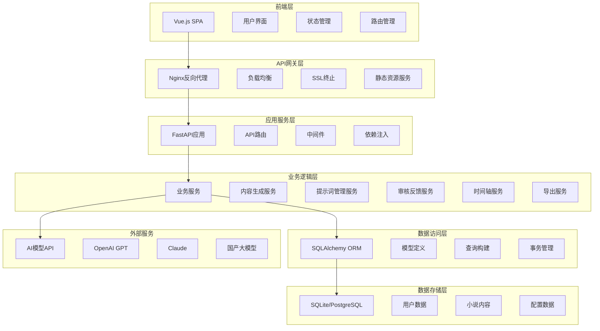
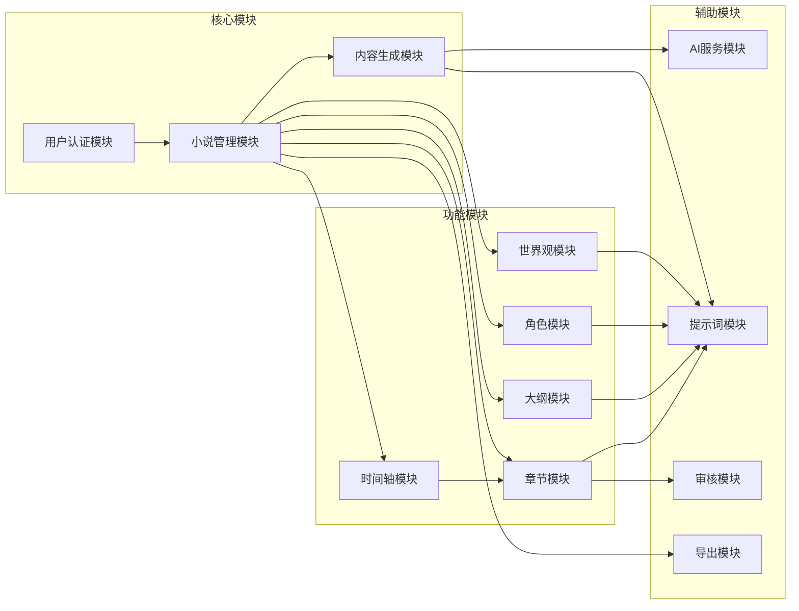
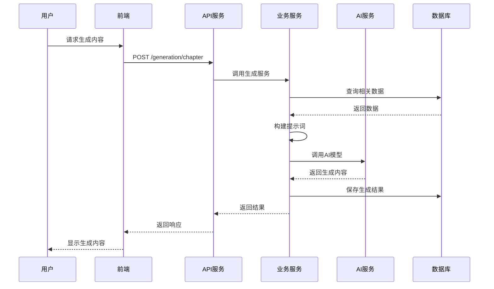

# AI小说生成器系统架构文档

## 技术栈

### 后端
- **语言**：Python 3.9+
- **框架**：FastAPI
- **数据库**：SQLite (开发) / PostgreSQL (生产)
- **ORM**：SQLAlchemy
- **依赖管理**：Poetry
- **异步支持**：asyncio, aiofiles
- **API文档**：Swagger/OpenAPI
- **测试**：pytest, pytest-asyncio

### 前端
- **语言**：JavaScript/TypeScript
- **框架**：Vue 3 + Composition API
- **构建工具**：Vite
- **UI框架**：Element Plus + Bootstrap
- **状态管理**：Pinia
- **路由**：Vue Router
- **HTTP客户端**：Axios
- **富文本编辑器**：Quill.js
- **测试**：Vitest

### AI模型集成
- **支持模型**：OpenAI GPT, Claude, 文心一言, 通义千问等，支持自定义模型名和模型接口地址
- **调用方式**：统一API适配器模式
- **配置管理**：数据库存放 模型配置，支持配置首选模型和调用频率

### 部署和运维
本地部署

## 项目目录结构

```
ai-writer-design1/
├── backend/                          # 后端项目根目录
│   ├── app/                          # 应用核心代码
│   │   ├── __init__.py
│   │   ├── main.py                   # FastAPI应用入口
│   │   ├── core/                     # 核心配置和基础设施
│   │   │   ├── __init__.py
│   │   │   ├── config.py             # 应用配置
│   │   │   ├── database.py           # 数据库连接
│   │   │   ├── security.py           # 安全相关
│   │   │   └── dependencies.py       # 依赖注入
│   │   ├── models/                   # 数据模型
│   │   │   ├── __init__.py
│   │   │   ├── base.py               # 基础模型类
│   │   │   ├── user.py               # 用户模型
│   │   │   ├── novel.py              # 小说基础模型
│   │   │   ├── worldview.py          # 世界观模型
│   │   │   ├── outline.py            # 大纲模型
│   │   │   ├── character.py          # 角色模型
│   │   │   ├── chapter.py            # 章节模型
│   │   │   ├── timeline.py           # 时间轴模型
│   │   │   └── prompt.py             # 提示词模型
│   │   ├── schemas/                  # Pydantic模式定义
│   │   │   ├── __init__.py
│   │   │   ├── user.py
│   │   │   ├── novel.py
│   │   │   ├── worldview.py
│   │   │   ├── outline.py
│   │   │   ├── character.py
│   │   │   ├── chapter.py
│   │   │   ├── timeline.py
│   │   │   └── common.py             # 通用模式
│   │   ├── api/                      # API路由
│   │   │   ├── __init__.py
│   │   │   ├── deps.py               # API依赖
│   │   │   ├── v1/                   # API版本1
│   │   │   │   ├── __init__.py
│   │   │   │   ├── api.py            # 路由聚合
│   │   │   │   ├── auth.py           # 认证相关
│   │   │   │   ├── novels.py         # 小说管理
│   │   │   │   ├── worldview.py      # 世界观管理
│   │   │   │   ├── outline.py        # 大纲管理
│   │   │   │   ├── characters.py     # 角色管理
│   │   │   │   ├── chapters.py       # 章节管理
│   │   │   │   ├── timeline.py       # 时间轴管理
│   │   │   │   ├── generation.py     # AI生成接口
│   │   │   │   ├── review.py         # 审核反馈
│   │   │   │   └── export.py         # 导出功能
│   │   ├── services/                 # 业务逻辑服务
│   │   │   ├── __init__.py
│   │   │   ├── ai_service.py         # AI模型调用服务
│   │   │   ├── generation_service.py # 内容生成服务
│   │   │   ├── prompt_service.py     # 提示词管理服务
│   │   │   ├── review_service.py     # 审核反馈服务
│   │   │   ├── timeline_service.py   # 时间轴服务
│   │   │   ├── export_service.py     # 导出服务
│   │   │   └── template_service.py   # 模板管理服务
│   │   ├── utils/                    # 工具函数
│   │   │   ├── __init__.py
│   │   │   ├── text_processing.py    # 文本处理
│   │   │   ├── file_utils.py         # 文件操作
│   │   │   ├── validators.py         # 数据验证
│   │   │   └── exceptions.py         # 自定义异常
│   │   └── db/                       # 数据库相关
│   │       ├── __init__.py
│   │       ├── base.py               # 数据库基础类
│   │       └── session.py            # 会话管理
│   ├── tests/                        # 测试代码
│   │   ├── __init__.py
│   │   ├── conftest.py               # pytest配置
│   │   ├── test_api/                 # API测试
│   │   ├── test_services/            # 服务测试
│   │   └── test_utils/               # 工具测试
│   ├── alembic/                      # 数据库迁移
│   │   ├── versions/
│   │   ├── env.py
│   │   └── script.py.mako
│   ├── pyproject.toml                # Poetry配置
│   ├── alembic.ini                   # Alembic配置
│   └── README.md
├── frontend/                         # 前端项目根目录
│   ├── src/
│   │   ├── main.js                   # 应用入口
│   │   ├── App.vue                   # 根组件
│   │   ├── router/                   # 路由配置
│   │   │   └── index.js
│   │   ├── stores/                   # Pinia状态管理
│   │   │   ├── index.js
│   │   │   ├── user.js               # 用户状态
│   │   │   ├── novel.js              # 小说状态
│   │   │   ├── workspace.js          # 工作台状态
│   │   │   └── settings.js           # 设置状态
│   │   ├── views/                    # 页面组件
│   │   │   ├── Home.vue              # 首页
│   │   │   ├── NovelList.vue         # 小说列表
│   │   │   ├── NovelDetail.vue       # 小说详情
│   │   │   ├── NovelCreate.vue       # 创建小说
│   │   │   ├── BrainGenerator.vue    # 脑洞生成器
│   │   │   ├── CharacterTemplate.vue # 角色模板
│   │   │   ├── Workspace.vue         # 工作台
│   │   │   ├── workspace/            # 工作台子页面
│   │   │   │   ├── Worldview.vue     # 世界观
│   │   │   │   ├── Characters.vue    # 角色管理
│   │   │   │   ├── Outline.vue       # 大纲
│   │   │   │   ├── Chapters.vue      # 章节
│   │   │   │   └── Timeline.vue      # 时间轴
│   │   │   ├── Statistics.vue        # 统计页面
│   │   │   └── Settings.vue          # 设置页面
│   │   ├── components/               # 可复用组件
│   │   │   ├── common/               # 通用组件
│   │   │   │   ├── BaseModal.vue     # 基础模态框
│   │   │   │   ├── BaseForm.vue      # 基础表单
│   │   │   │   ├── BaseTable.vue     # 基础表格
│   │   │   │   ├── BaseTree.vue      # 基础树形组件
│   │   │   │   └── RichEditor.vue    # 富文本编辑器
│   │   │   ├── workspace/            # 工作台组件
│   │   │   │   ├── PromptPreview.vue # 提示词预览
│   │   │   │   ├── AIReview.vue      # AI审核组件
│   │   │   │   ├── SummaryModal.vue  # 总结模态框
│   │   │   │   ├── TimelineMarker.vue# 时间轴标记
│   │   │   │   └── ContentSelector.vue# 内容选择器
│   │   │   └── layout/               # 布局组件
│   │   │       ├── Header.vue        # 页头
│   │   │       ├── Sidebar.vue       # 侧边栏
│   │   │       └── Footer.vue        # 页脚
│   │   ├── composables/              # 组合式函数
│   │   │   ├── useAPI.js             # API调用
│   │   │   ├── useAuth.js            # 认证逻辑
│   │   │   ├── useGeneration.js      # 生成功能
│   │   │   ├── useWorkspace.js       # 工作台逻辑
│   │   │   └── useExport.js          # 导出功能
│   │   ├── utils/                    # 工具函数
│   │   │   ├── api.js                # API配置
│   │   │   ├── constants.js          # 常量定义
│   │   │   ├── helpers.js            # 辅助函数
│   │   │   └── validators.js         # 表单验证
│   │   ├── assets/                   # 静态资源
│   │   │   ├── styles/               # 样式文件
│   │   │   ├── images/               # 图片资源
│   │   │   └── icons/                # 图标资源
│   │   └── styles/                   # 全局样式
│   │       ├── main.css
│   │       ├── variables.css
│   │       └── components.css
│   ├── public/                       # 公共资源
│   │   ├── index.html
│   │   └── favicon.ico
│   ├── package.json                  # 依赖配置
│   ├── vite.config.js                # Vite配置
│   └── README.md
│ 
├── docs/                             # 项目文档
│   ├── 设计.md                       # 功能设计文档
│   ├── 架构.md                       # 架构设计文档
│   ├── pages.md                      # 页面设计文档
│   ├── api.md                        # API文档
│   └── deployment.md                 # 部署文档
└── README.md                         # 项目说明
```

## 核心数据模型设计

### 基础模型

#### 用户模型 (User)
```python
class User(BaseModel):
    id: int                           # 主键
    username: str                     # 用户名
    email: str                        # 邮箱
    password_hash: str                # 密码哈希
    avatar_url: Optional[str]         # 头像URL
    created_at: datetime              # 创建时间
    updated_at: datetime              # 更新时间
    is_active: bool = True            # 是否活跃
```

#### 小说基础模型 (Novel)
```python
class Novel(BaseModel):
    id: int                           # 主键
    user_id: int                      # 用户ID (外键)
    title: str                        # 小说名称
    genre: str                        # 小说类型
    author: str                       # 作者名
    description: Optional[str]        # 小说简介
    target_words: int                 # 字数目标
    target_audience: str              # 面向读者群体
    writing_style: str                # 写作风格
    worldview_count: int = 1          # 世界观数量
    status: str = "draft"             # 状态：draft/writing/completed
    cover_url: Optional[str]          # 封面URL
    created_at: datetime              # 创建时间
    updated_at: datetime              # 更新时间
```

### 世界观模型

#### 世界观主表 (Worldview)
```python
class Worldview(BaseModel):
    id: int                           # 主键
    novel_id: int                     # 小说ID (外键)
    name: str                         # 世界名称
    description: Optional[str]        # 世界描述
    is_primary: bool = False          # 是否主世界
    created_at: datetime              # 创建时间
    updated_at: datetime              # 更新时间
```

#### 世界地图 (WorldMap)
```python
class WorldMap(BaseModel):
    id: int                           # 主键
    worldview_id: int                 # 世界观ID (外键)
    region_name: str                  # 区域名称
    description: str                  # 区域描述
    parent_id: Optional[int]          # 父区域ID (外键，自关联)
    level: int = 1                    # 层级
    created_at: datetime              # 创建时间
    updated_at: datetime              # 更新时间
```

#### 修炼体系 (CultivationSystem)
```python
class CultivationSystem(BaseModel):
    id: int                           # 主键
    worldview_id: int                 # 世界观ID (外键)
    system_name: str                  # 体系名称
    level_name: str                   # 等级名称
    description: str                  # 等级描述
    cultivation_method: Optional[str] # 修炼方法
    required_resources: Optional[str] # 所需资源
    level_order: int                  # 等级顺序
    created_at: datetime              # 创建时间
    updated_at: datetime              # 更新时间
```

#### 历史事件 (History)
```python
class History(BaseModel):
    id: int                           # 主键
    worldview_id: int                 # 世界观ID (外键)
    event_name: str                   # 事件名称
    dynasty_name: Optional[str]       # 朝代名称
    background: str                   # 历史背景
    important_events: Optional[str]   # 重要事件
    impact_description: Optional[str] # 影响描述
    time_order: int                   # 时间顺序
    created_at: datetime              # 创建时间
    updated_at: datetime              # 更新时间
```

#### 阵营势力 (Faction)
```python
class Faction(BaseModel):
    id: int                           # 主键
    worldview_id: int                 # 世界观ID (外键)
    name: str                         # 阵营名称
    faction_type: str                 # 类型：阵营/势力/组织
    organization_structure: Optional[str] # 组织架构
    territory: Optional[str]          # 势力范围
    ideology: Optional[str]           # 理念目标
    important_figures: Optional[str]  # 重要人物
    created_at: datetime              # 创建时间
    updated_at: datetime              # 更新时间
```

### 大纲模型

#### 粗略大纲 (RoughOutline)
```python
class RoughOutline(BaseModel):
    id: int                           # 主键
    novel_id: int                     # 小说ID (外键)
    outline_type: str                 # 类型：storyline/character_growth/major_event/plot_point
    title: str                        # 标题
    content: str                      # 内容
    order_index: int                  # 排序索引
    created_at: datetime              # 创建时间
    updated_at: datetime              # 更新时间
```

#### 详细大纲 (DetailedOutline)
```python
class DetailedOutline(BaseModel):
    id: int                           # 主键
    novel_id: int                     # 小说ID (外键)
    chapter_number: int               # 章节号
    chapter_title: str                # 章节标题
    plot_points: str                  # 章节情节点
    participating_characters: str     # 参与角色
    entering_characters: Optional[str] # 入场角色
    exiting_characters: Optional[str]  # 离场角色
    chapter_summary: str              # 章节简介
    is_plot_end: bool = False         # 是否剧情结束
    is_new_plot: bool = False         # 是否新剧情开始
    new_plot_summary: Optional[str]   # 新剧情简介
    created_at: datetime              # 创建时间
    updated_at: datetime              # 更新时间
```

### 角色模型

#### 角色表 (Character)
```python
class Character(BaseModel):
    id: int                           # 主键
    novel_id: Optional[int]           # 小说ID (外键，模板角色可为空)
    worldview_id: Optional[int]       # 世界观ID (外键)
    name: str                         # 角色名
    gender: str                       # 性别
    personality: str                  # 性格
    character_type: str               # 角色类型：主角/配角/反派等
    faction_id: Optional[int]         # 所属阵营ID (外键)
    tags: Optional[str]               # 角色标签 (JSON存储)
    description: Optional[str]        # 角色描述
    abilities: Optional[str]          # 角色能力
    power_system: Optional[str]       # 力量体系
    original_world: Optional[str]     # 原生世界名
    is_template: bool = False         # 是否为模板角色
    created_at: datetime              # 创建时间
    updated_at: datetime              # 更新时间
```

### 章节模型

#### 章节表 (Chapter)
```python
class Chapter(BaseModel):
    id: int                           # 主键
    novel_id: int                     # 小说ID (外键)
    chapter_number: int               # 章节号
    title: str                        # 章节标题
    content: str                      # 章节内容
    status: str = "draft"             # 状态：draft/completed/reviewed
    word_count: int = 0               # 字数统计
    summary: Optional[str]            # 章节总结
    created_at: datetime              # 创建时间
    updated_at: datetime              # 更新时间
```

### 时间轴模型

#### 时间轴事件 (TimelineEvent)
```python
class TimelineEvent(BaseModel):
    id: int                           # 主键
    novel_id: int                     # 小说ID (外键)
    chapter_id: Optional[int]         # 章节ID (外键)
    event_name: str                   # 事件名称
    event_type: str                   # 事件类型：重大事件/角色事件/剧情转折/其他
    event_time: str                   # 事件时间
    description: str                  # 事件描述
    related_characters: Optional[str] # 相关角色 (JSON存储)
    created_at: datetime              # 创建时间
    updated_at: datetime              # 更新时间
```

### 提示词和审核模型

#### 提示词模板 (PromptTemplate)
```python
class PromptTemplate(BaseModel):
    id: int                           # 主键
    template_type: str                # 模板类型：worldview/character/outline/chapter
    template_name: str                # 模板名称
    template_content: str             # 模板内容
    default_includes: str             # 默认包含项 (JSON存储)
    is_system_template: bool = True   # 是否系统模板
    created_at: datetime              # 创建时间
    updated_at: datetime              # 更新时间
```

#### 审核记录 (ReviewRecord)
```python
class ReviewRecord(BaseModel):
    id: int                           # 主键
    target_type: str                  # 目标类型：chapter/worldview/character等
    target_id: int                    # 目标ID
    review_type: str                  # 审核类型：ai_review/user_feedback
    issues_found: Optional[str]       # 发现的问题 (JSON存储)
    user_feedback: Optional[str]      # 用户反馈
    status: str = "pending"           # 状态：pending/resolved/ignored
    created_at: datetime              # 创建时间
    updated_at: datetime              # 更新时间
```

## API接口设计规范

### RESTful API设计原则

#### 1. URL规范
- 使用名词表示资源，动词表示操作
- 使用复数形式表示资源集合
- 嵌套资源使用层级路径

```
GET    /api/v1/novels                    # 获取小说列表
POST   /api/v1/novels                    # 创建小说
GET    /api/v1/novels/{id}               # 获取特定小说
PUT    /api/v1/novels/{id}               # 更新小说
DELETE /api/v1/novels/{id}               # 删除小说

GET    /api/v1/novels/{id}/chapters      # 获取小说章节列表
POST   /api/v1/novels/{id}/chapters      # 创建章节
GET    /api/v1/chapters/{id}             # 获取特定章节
```

#### 2. 统一响应格式
```json
{
  "success": true,
  "code": 200,
  "message": "操作成功",
  "data": {
    // 响应数据
  },
  "timestamp": "2024-01-01T00:00:00Z"
}
```

#### 3. 错误处理格式
```json
{
  "success": false,
  "code": 400,
  "message": "请求参数错误",
  "errors": [
    {
      "field": "title",
      "message": "标题不能为空"
    }
  ],
  "timestamp": "2024-01-01T00:00:00Z"
}
```

#### 4. 分页参数
```
GET /api/v1/novels?page=1&page_size=20&sort=created_at&order=desc
```

响应格式：
```json
{
  "success": true,
  "data": {
    "items": [],
    "total": 100,
    "page": 1,
    "page_size": 20,
    "total_pages": 5
  }
}
```

### 核心API接口

#### 小说管理
```
GET    /api/v1/novels                    # 获取小说列表
POST   /api/v1/novels                    # 创建小说
GET    /api/v1/novels/{id}               # 获取小说详情
PUT    /api/v1/novels/{id}               # 更新小说
DELETE /api/v1/novels/{id}               # 删除小说
POST   /api/v1/novels/{id}/export        # 导出小说
```

#### 世界观管理
```
GET    /api/v1/novels/{novel_id}/worldviews              # 获取世界观列表
POST   /api/v1/novels/{novel_id}/worldviews              # 创建世界观
GET    /api/v1/worldviews/{id}                           # 获取世界观详情
PUT    /api/v1/worldviews/{id}                           # 更新世界观

GET    /api/v1/worldviews/{id}/maps                      # 获取世界地图
POST   /api/v1/worldviews/{id}/maps                      # 创建地图区域
GET    /api/v1/worldviews/{id}/cultivation                # 获取修炼体系
POST   /api/v1/worldviews/{id}/cultivation                # 创建修炼体系
GET    /api/v1/worldviews/{id}/history                   # 获取历史
POST   /api/v1/worldviews/{id}/history                   # 创建历史事件
GET    /api/v1/worldviews/{id}/factions                  # 获取阵营势力
POST   /api/v1/worldviews/{id}/factions                  # 创建阵营势力
```

#### 角色管理
```
GET    /api/v1/novels/{novel_id}/characters              # 获取角色列表
POST   /api/v1/novels/{novel_id}/characters              # 创建角色
GET    /api/v1/characters/{id}                           # 获取角色详情
PUT    /api/v1/characters/{id}                           # 更新角色
DELETE /api/v1/characters/{id}                           # 删除角色
GET    /api/v1/character-templates                       # 获取角色模板
```

#### 大纲管理
```
GET    /api/v1/novels/{novel_id}/rough-outline           # 获取粗略大纲
POST   /api/v1/novels/{novel_id}/rough-outline           # 创建粗略大纲
GET    /api/v1/novels/{novel_id}/detailed-outline        # 获取详细大纲
POST   /api/v1/novels/{novel_id}/detailed-outline        # 创建详细大纲
PUT    /api/v1/outline/{id}                              # 更新大纲项
DELETE /api/v1/outline/{id}                              # 删除大纲项
```

#### 章节管理
```
GET    /api/v1/novels/{novel_id}/chapters                # 获取章节列表
POST   /api/v1/novels/{novel_id}/chapters                # 创建章节
GET    /api/v1/chapters/{id}                             # 获取章节详情
PUT    /api/v1/chapters/{id}                             # 更新章节
DELETE /api/v1/chapters/{id}                             # 删除章节
POST   /api/v1/chapters/{id}/summary                     # 生成章节总结
```

#### AI生成接口
```
POST   /api/v1/generation/novel-name                     # 生成小说名
POST   /api/v1/generation/novel-idea                     # 生成小说创意
POST   /api/v1/generation/worldview                      # 生成世界观
POST   /api/v1/generation/outline                        # 生成大纲
POST   /api/v1/generation/characters                     # 生成角色
POST   /api/v1/generation/chapter                        # 生成章节内容
POST   /api/v1/generation/brain-storm                    # 脑洞生成器
```

#### 审核反馈
```
POST   /api/v1/review/ai-review                          # AI审核
POST   /api/v1/review/user-feedback                      # 用户反馈
GET    /api/v1/review/{target_type}/{target_id}          # 获取审核记录
```

#### 时间轴管理
```
GET    /api/v1/novels/{novel_id}/timeline                # 获取时间轴
POST   /api/v1/novels/{novel_id}/timeline                # 创建时间轴事件
PUT    /api/v1/timeline/{id}                             # 更新时间轴事件
DELETE /api/v1/timeline/{id}                             # 删除时间轴事件
```

## 系统架构设计

### 整体架构图



### 模块依赖关系



### 数据流设计



## 代码规范

### Python代码规范

#### 1. 基本规范
- 遵循PEP 8规范
- 使用Type Hints进行类型标注
- 使用f-string进行字符串格式化
- 类名使用PascalCase，函数名使用snake_case
- 常量使用UPPER_CASE

#### 2. 项目结构规范
```python
# 文件头部注释
"""
模块描述
Author: 作者名
Created: 创建时间
"""

# 导入顺序：标准库 -> 第三方库 -> 本地库
import os
from typing import Optional, List
from datetime import datetime

from fastapi import FastAPI, Depends
from sqlalchemy.orm import Session

from app.core.database import get_db
from app.models.user import User
```

#### 3. 函数和类规范
```python
class UserService:
    """用户服务类"""
    
    def __init__(self, db: Session):
        self.db = db
    
    async def create_user(
        self,
        username: str,
        email: str,
        password: str
    ) -> User:
        """
        创建用户
        
        Args:
            username: 用户名
            email: 邮箱
            password: 密码
            
        Returns:
            User: 创建的用户对象
            
        Raises:
            ValueError: 当用户名已存在时
        """
        # 实现逻辑
        pass
```

#### 4. 异常处理规范
```python
# 自定义异常
class NovelNotFoundError(Exception):
    """小说不存在异常"""
    pass

# 异常处理
try:
    novel = await novel_service.get_novel(novel_id)
except NovelNotFoundError:
    logger.warning(f"Novel {novel_id} not found")
    raise HTTPException(status_code=404, detail="小说不存在")
```

### JavaScript/Vue代码规范

#### 1. 基本规范
- 使用ESLint + Prettier进行代码格式化
- 组件名使用PascalCase
- 文件名使用kebab-case
- 变量名使用camelCase
- 常量使用UPPER_SNAKE_CASE

#### 2. Vue组件规范
```vue
<template>
  <div class="novel-card">
    <h3>{{ novel.title }}</h3>
    <p>{{ novel.description }}</p>
  </div>
</template>

<script setup>
import { ref, computed, onMounted } from 'vue'
import { useNovelStore } from '@/stores/novel'

// Props定义
const props = defineProps({
  novelId: {
    type: Number,
    required: true
  }
})

// Emits定义
const emit = defineEmits(['update', 'delete'])

// 响应式数据
const novelStore = useNovelStore()
const loading = ref(false)

// 计算属性
const novel = computed(() => 
  novelStore.getNovellById(props.novelId)
)

// 生命周期
onMounted(async () => {
  await loadNovel()
})

// 方法
const loadNovel = async () => {
  loading.value = true
  try {
    await novelStore.fetchNovel(props.novelId)
  } catch (error) {
    console.error('Failed to load novel:', error)
  } finally {
    loading.value = false
  }
}
</script>

<style scoped>
.novel-card {
  padding: 1rem;
  border: 1px solid #e0e0e0;
  border-radius: 8px;
}
</style>
```

#### 3. 状态管理规范
```javascript
// stores/novel.js
import { defineStore } from 'pinia'
import { ref, computed } from 'vue'
import { novelAPI } from '@/utils/api'

export const useNovelStore = defineStore('novel', () => {
  // State
  const novels = ref([])
  const currentNovel = ref(null)
  const loading = ref(false)
  
  // Getters
  const publishedNovels = computed(() =>
    novels.value.filter(novel => novel.status === 'published')
  )
  
  // Actions
  const fetchNovels = async () => {
    loading.value = true
    try {
      const response = await novelAPI.getList()
      novels.value = response.data
    } catch (error) {
      console.error('Failed to fetch novels:', error)
      throw error
    } finally {
      loading.value = false
    }
  }
  
  return {
    // State
    novels,
    currentNovel,
    loading,
    // Getters
    publishedNovels,
    // Actions
    fetchNovels
  }
})
```

### 数据库规范

#### 1. 表命名规范
- 使用复数形式，如 `users`, `novels`, `chapters`
- 使用snake_case命名法
- 关联表使用 `表1_表2` 格式，如 `novel_characters`

#### 2. 字段命名规范
- 主键统一使用 `id`
- 外键使用 `表名_id` 格式，如 `user_id`, `novel_id`
- 时间字段使用 `created_at`, `updated_at`
- 布尔字段使用 `is_` 前缀，如 `is_active`, `is_published`

#### 3. 索引规范
```sql
-- 主键索引（自动创建）
-- 外键索引
CREATE INDEX idx_novels_user_id ON novels(user_id);
-- 复合索引
CREATE INDEX idx_chapters_novel_status ON chapters(novel_id, status);
-- 唯一索引
CREATE UNIQUE INDEX idx_users_email ON users(email);
```


## 性能优化策略

### 后端优化
1. **数据库优化**
   - 合理使用索引
   - 查询优化，避免N+1问题
   - 数据库连接池配置

2. **缓存策略**
   - Redis缓存热点数据
   - 应用层缓存用户会话
   - CDN缓存静态资源

3. **异步处理**
   - AI模型调用异步化
   - 文件生成后台任务
   - WebSocket实时通信

### 前端优化
1. **构建优化**
   - 代码分割和懒加载
   - Tree shaking去除无用代码
   - 资源压缩和优化

2. **运行时优化**
   - 虚拟滚动处理大列表
   - 防抖节流优化用户操作
   - 组件缓存和复用

3. **加载优化**
   - 骨架屏提升感知性能
   - 预加载关键资源
   - 渐进式加载

## 安全考虑

### 认证授权
- JWT Token认证
- 角色权限管理
- API访问频率限制

### 数据安全
- 敏感数据加密存储
- SQL注入防护
- XSS攻击防护
- CSRF保护

### AI安全
- 输入内容过滤
- 输出内容审核
- API调用监控
- 用量控制

## 监控运维

### 应用监控
- 日志记录和分析
- 性能指标监控
- 错误追踪和报警
- 健康检查

### 业务监控
- 用户行为分析
- 功能使用统计
- AI调用成功率
- 生成内容质量评估

---

此架构文档将随着项目的发展不断完善和更新。
