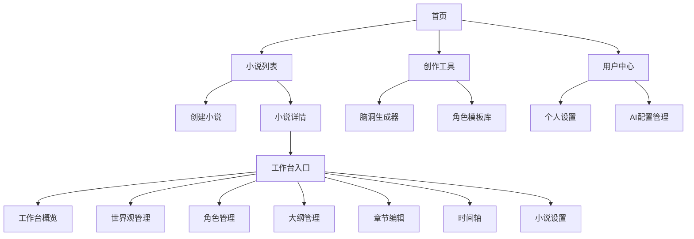

# AI小说创作平台 - 前端页面整体架构设计

## 1. 项目概述

基于已有的AI小说创作平台后端系统，设计完整的前端页面架构。该平台已完成Sprint 1-5的开发，包含用户管理、小说管理、AI生成、角色管理、大纲管理、章节管理等核心功能。

### 1.1 技术栈
- **前端框架**: Vue 3 + TypeScript + Composition API
- **UI组件库**: Element Plus
- **路由管理**: Vue Router 4
- **状态管理**: Pinia
- **富文本编辑**: Quill.js
- **构建工具**: Vite
- **样式方案**: CSS3 + Element Plus主题

### 1.2 设计原则
- **用户体验优先**: 直观的创作流程，减少学习成本
- **模块化设计**: 组件复用，便于维护和扩展
- **响应式布局**: 支持桌面端和移动端访问
- **数据驱动**: 基于后端API的完整数据流
- **AI集成**: 无缝集成AI生成功能

## 2. 页面层级结构

### 2.1 顶层路由结构

```
/                           # 首页 - 项目介绍和功能入口
├── /auth/                  # 认证相关
│   ├── /login             # 登录页面
│   └── /register          # 注册页面
├── /novels/               # 小说管理
│   ├── /                  # 我的小说列表
│   ├── /create           # 创建小说
│   └── /:novelId/        # 小说详情
│       └── /workspace/    # 工作台
├── /tools/               # 创作工具
│   ├── /brain-generator  # 脑洞生成器
│   └── /character-templates # 角色模板库
├── /workspace/:novelId/  # 小说工作台
│   ├── /overview         # 工作台概览
│   ├── /worldview       # 世界观管理
│   ├── /characters      # 角色管理
│   ├── /outline         # 大纲管理
│   ├── /chapters        # 章节编辑
│   ├── /timeline        # 时间轴
│   └── /settings        # 小说设置
├── /profile/            # 用户相关
│   ├── /settings        # 个人设置
│   └── /ai-configs      # AI配置管理
└── /admin/              # 管理功能（可选）
```

### 2.2 页面层次关系图



## 3. 路由规划详细设计

### 3.1 核心路由配置

```typescript
// router/index.ts
const routes = [
  // 公共页面
  { path: '/', name: 'Home', component: () => import('@/views/HomeView.vue') },
  
  // 认证相关
  {
    path: '/auth',
    name: 'Auth',
    children: [
      { path: 'login', name: 'Login', component: () => import('@/views/auth/LoginView.vue') },
      { path: 'register', name: 'Register', component: () => import('@/views/auth/RegisterView.vue') }
    ]
  },
  
  // 小说管理
  {
    path: '/novels',
    name: 'Novels',
    meta: { requiresAuth: true },
    children: [
      { path: '', name: 'NovelList', component: () => import('@/views/novels/NovelListView.vue') },
      { path: 'create', name: 'NovelCreate', component: () => import('@/views/novels/NovelCreateView.vue') },
      { path: ':novelId', name: 'NovelDetail', component: () => import('@/views/novels/NovelDetailView.vue') }
    ]
  },
  
  // 创作工具
  {
    path: '/tools',
    name: 'Tools',
    meta: { requiresAuth: true },
    children: [
      { path: 'brain-generator', name: 'BrainGenerator', component: () => import('@/views/tools/BrainGeneratorView.vue') },
      { path: 'character-templates', name: 'CharacterTemplates', component: () => import('@/views/tools/CharacterTemplatesView.vue') }
    ]
  },
  
  // 工作台
  {
    path: '/workspace/:novelId',
    name: 'Workspace',
    meta: { requiresAuth: true, requiresNovel: true },
    component: () => import('@/layouts/WorkspaceLayout.vue'),
    children: [
      { path: '', redirect: 'overview' },
      { path: 'overview', name: 'WorkspaceOverview', component: () => import('@/views/workspace/OverviewView.vue') },
      { path: 'worldview', name: 'Worldview', component: () => import('@/views/workspace/WorldviewView.vue') },
      { path: 'characters', name: 'Characters', component: () => import('@/views/workspace/CharactersView.vue') },
      { path: 'outline', name: 'Outline', component: () => import('@/views/workspace/OutlineView.vue') },
      { path: 'chapters', name: 'Chapters', component: () => import('@/views/workspace/ChaptersView.vue') },
      { path: 'timeline', name: 'Timeline', component: () => import('@/views/workspace/TimelineView.vue') },
      { path: 'settings', name: 'NovelSettings', component: () => import('@/views/workspace/SettingsView.vue') }
    ]
  },
  
  // 用户中心
  {
    path: '/profile',
    name: 'Profile',
    meta: { requiresAuth: true },
    children: [
      { path: 'settings', name: 'ProfileSettings', component: () => import('@/views/profile/SettingsView.vue') },
      { path: 'ai-configs', name: 'AIConfigs', component: () => import('@/views/profile/AIConfigsView.vue') }
    ]
  }
]
```

### 3.2 路由守卫设计

```typescript
// 路由守卫逻辑
router.beforeEach(async (to, from, next) => {
  const authStore = useAuthStore()
  const novelStore = useNovelStore()
  
  // 检查认证要求
  if (to.meta.requiresAuth && !authStore.isAuthenticated) {
    return next('/auth/login')
  }
  
  // 检查小说访问权限
  if (to.meta.requiresNovel && to.params.novelId) {
    const hasAccess = await novelStore.checkNovelAccess(to.params.novelId as string)
    if (!hasAccess) {
      return next('/novels')
    }
  }
  
  next()
})
```

## 4. 组件复用策略

### 4.1 布局组件层次

```
src/layouts/
├── DefaultLayout.vue          # 默认布局（首页、工具页等）
├── AuthLayout.vue            # 认证页面布局
├── WorkspaceLayout.vue       # 工作台布局
└── components/
    ├── AppHeader.vue         # 全局头部
    ├── AppSidebar.vue        # 侧边栏
    ├── WorkspaceNavbar.vue   # 工作台导航
    └── AppFooter.vue         # 全局底部
```

### 4.2 通用业务组件

```
src/components/
├── common/                   # 通用组件
│   ├── AIGeneratorDialog.vue # AI生成配置对话框
│   ├── PreviewModal.vue      # 预览提示词模态框
│   ├── BatchOperationBar.vue # 批量操作栏
│   ├── FilterPanel.vue       # 筛选面板
│   ├── DataTable.vue        # 数据表格
│   ├── RichTextEditor.vue   # 富文本编辑器
│   ├── FormValidator.vue    # 表单验证
│   ├── LoadingSpinner.vue   # 加载动画
│   └── ErrorBoundary.vue    # 错误边界
├── novels/                  # 小说相关组件
│   ├── NovelCard.vue        # 小说卡片
│   ├── NovelForm.vue        # 小说表单
│   └── NovelStats.vue       # 小说统计
├── workspace/               # 工作台组件
│   ├── worldview/          # 世界观组件
│   ├── characters/         # 角色组件
│   ├── outline/           # 大纲组件
│   ├── chapters/          # 章节组件
│   └── timeline/          # 时间轴组件
└── tools/                  # 工具组件
    ├── BrainStormPanel.vue # 脑洞生成面板
    └── TemplateSelector.vue # 模板选择器
```

### 4.3 组件复用原则

#### 4.3.1 CRUD模式组件
- **统一的数据表格组件**: 支持排序、筛选、分页、批量操作
- **统一的表单组件**: 支持验证、自动保存、取消确认
- **统一的详情展示组件**: 支持编辑模式切换、字段展示配置

#### 4.3.2 AI生成模式组件
- **AI配置对话框**: 参数设置、模板选择、进度显示
- **生成结果展示**: 结果预览、编辑、应用功能
- **提示词预览**: 内容展示、编辑、复制功能

#### 4.3.3 工作台模式组件
- **左中右三栏布局**: 列表、详情、操作的统一模式
- **标签页切换**: 不同内容类型的统一导航
- **工具栏组件**: 新建、编辑、删除、AI生成等操作

## 5. 状态管理设计

### 5.1 Store结构设计

```typescript
// stores/index.ts
import { createPinia } from 'pinia'

// 全局状态管理结构
stores/
├── auth.ts              # 认证状态管理
├── user.ts              # 用户信息管理
├── novels.ts            # 小说数据管理
├── workspace.ts         # 工作台状态管理
├── ai.ts               # AI配置和生成状态
├── ui.ts               # UI状态管理
└── cache.ts            # 缓存管理
```

### 5.2 核心Store设计

#### 5.2.1 认证Store
```typescript
// stores/auth.ts
export const useAuthStore = defineStore('auth', {
  state: () => ({
    isAuthenticated: false,
    token: '',
    user: null as User | null,
    loginLoading: false
  }),
  
  actions: {
    async login(credentials: LoginCredentials),
    async logout(),
    async refreshToken(),
    async checkAuthStatus()
  }
})
```

#### 5.2.2 工作台Store
```typescript
// stores/workspace.ts
export const useWorkspaceStore = defineStore('workspace', {
  state: () => ({
    currentNovel: null as Novel | null,
    activeWorldview: null as Worldview | null,
    characters: [] as Character[],
    outlines: {} as OutlineData,
    chapters: [] as Chapter[],
    timeline: [] as TimelineEvent[],
    
    // UI状态
    activeTab: 'overview',
    sidebarCollapsed: false,
    editingMode: false
  }),
  
  actions: {
    async loadNovelData(novelId: string),
    async switchWorldview(worldviewId: string),
    setActiveTab(tab: string),
    toggleEditingMode()
  }
})
```

#### 5.2.3 AI生成Store
```typescript
// stores/ai.ts
export const useAIStore = defineStore('ai', {
  state: () => ({
    configs: [] as AIConfig[],
    activeConfig: null as AIConfig | null,
    generationHistory: [] as GenerationRecord[],
    isGenerating: false,
    generationProgress: 0
  }),
  
  actions: {
    async loadConfigs(),
    async generateContent(type: string, params: GenerationParams),
    async saveGenerationResult(result: GenerationResult)
  }
})
```

### 5.3 数据持久化策略

```typescript
// 使用pinia-plugin-persistedstate进行状态持久化
import { createPersistedState } from 'pinia-plugin-persistedstate'

const pinia = createPinia()
pinia.use(createPersistedState({
  storage: localStorage,
  include: ['auth', 'ui'], // 需要持久化的store
  exclude: ['workspace.characters'] // 排除的状态
}))
```

## 6. 接口设计原则

### 6.1 API客户端架构

```
src/api/
├── index.ts              # API客户端配置
├── types.ts              # 接口类型定义
├── auth.ts              # 认证相关接口
├── novels.ts            # 小说管理接口
├── characters.ts        # 角色管理接口
├── outline.ts           # 大纲管理接口
├── chapters.ts          # 章节管理接口
├── worldview.ts         # 世界观管理接口
├── generation.ts        # AI生成接口
├── ai-configs.ts        # AI配置接口
└── interceptors.ts      # 请求拦截器
```

### 6.2 接口调用模式

#### 6.2.1 统一的API客户端
```typescript
// api/index.ts
import axios from 'axios'

const apiClient = axios.create({
  baseURL: process.env.VITE_API_BASE_URL || 'http://localhost:8001/api/v1',
  timeout: 30000,
  headers: {
    'Content-Type': 'application/json'
  }
})

// 请求拦截器
apiClient.interceptors.request.use(
  (config) => {
    const authStore = useAuthStore()
    if (authStore.token) {
      config.headers.Authorization = `Bearer ${authStore.token}`
    }
    return config
  },
  (error) => Promise.reject(error)
)

// 响应拦截器
apiClient.interceptors.response.use(
  (response) => response.data,
  (error) => {
    handleAPIError(error)
    return Promise.reject(error)
  }
)
```

#### 6.2.2 接口调用模式
```typescript
// api/characters.ts
export const characterAPI = {
  // 获取角色列表
  async getCharacters(novelId: string, params?: CharacterQuery): Promise<CharacterListResponse> {
    return apiClient.get(`/characters/`, { params: { novel_id: novelId, ...params } })
  },
  
  // 创建角色
  async createCharacter(data: CharacterCreate): Promise<Character> {
    return apiClient.post('/characters/', data)
  },
  
  // AI生成角色
  async generateCharacters(params: CharacterGenerationRequest): Promise<CharacterGenerationResponse> {
    return apiClient.post('/characters/generate', params)
  },
  
  // 批量操作
  async batchOperation(operation: BatchOperation): Promise<BatchOperationResult> {
    return apiClient.post('/characters/batch', operation)
  }
}
```

### 6.3 错误处理策略

```typescript
// utils/errorHandler.ts
export const handleAPIError = (error: AxiosError) => {
  const { response } = error
  
  switch (response?.status) {
    case 401:
      // 未认证，跳转登录
      const authStore = useAuthStore()
      authStore.logout()
      router.push('/auth/login')
      break
      
    case 403:
      // 权限不足
      ElMessage.error('权限不足，无法执行此操作')
      break
      
    case 404:
      // 资源不存在
      ElMessage.error('请求的资源不存在')
      break
      
    case 500:
      // 服务器错误
      ElMessage.error('服务器内部错误，请稍后重试')
      break
      
    default:
      // 其他错误
      ElMessage.error(response?.data?.message || '操作失败')
  }
}
```

## 7. 页面功能模块设计

### 7.1 首页模块
**功能**: 项目介绍、功能导航、用户引导
**组件**:
- `HeroSection.vue` - 主要介绍区域
- `FeatureCards.vue` - 功能特性展示
- `QuickActions.vue` - 快速操作入口
- `RecentNovels.vue` - 最近编辑的小说

### 7.2 小说管理模块
**功能**: 小说列表、创建、详情、设置
**组件**:
- `NovelGrid.vue` - 小说网格展示
- `NovelFilters.vue` - 筛选和搜索
- `CreateNovelWizard.vue` - 创建小说向导
- `NovelDetailPanel.vue` - 小说详情面板

### 7.3 工作台模块
**功能**: 核心创作环境，包含所有创作工具
**子模块**:

#### 7.3.1 世界观管理
- `WorldviewSelector.vue` - 世界选择器
- `WorldMapsPanel.vue` - 世界地图管理
- `CultivationPanel.vue` - 修炼体系管理
- `HistoryPanel.vue` - 历史事件管理
- `FactionsPanel.vue` - 阵营势力管理

#### 7.3.2 角色管理
- `CharacterList.vue` - 角色列表
- `CharacterForm.vue` - 角色编辑表单
- `CharacterLibrary.vue` - 角色模板库
- `CharacterRelations.vue` - 角色关系图

#### 7.3.3 大纲管理
- `OutlineOverview.vue` - 大纲概览
- `RoughOutline.vue` - 粗略大纲编辑
- `DetailedOutline.vue` - 详细大纲编辑
- `PlotPointEditor.vue` - 情节点编辑器

#### 7.3.4 章节编辑
- `ChapterList.vue` - 章节列表
- `ChapterEditor.vue` - 章节编辑器
- `AIWritingAssistant.vue` - AI写作助手
- `WritingStats.vue` - 写作统计

### 7.4 创作工具模块
**功能**: 独立的创作辅助工具
**组件**:
- `BrainStormGenerator.vue` - 脑洞生成器
- `CharacterTemplateLibrary.vue` - 角色模板库
- `PlotGenerator.vue` - 情节生成器
- `NameGenerator.vue` - 名称生成器

## 8. 响应式设计方案

### 8.1 断点设计
```scss
// styles/breakpoints.scss
$breakpoints: (
  'xs': 480px,    // 手机竖屏
  'sm': 768px,    // 手机横屏 / 小平板
  'md': 1024px,   // 平板
  'lg': 1280px,   // 小桌面
  'xl': 1536px    // 大桌面
);
```

### 8.2 响应式布局策略

#### 8.2.1 移动端优化
- **导航**: 使用抽屉式侧边栏
- **工作台**: 单列布局，标签页切换
- **编辑器**: 全屏模式，工具栏收缩
- **表格**: 卡片式展示，支持横向滚动

#### 8.2.2 桌面端优化
- **导航**: 固定侧边栏或顶部导航
- **工作台**: 多列布局，分栏显示
- **编辑器**: 支持分屏编辑
- **表格**: 完整表格显示

### 8.3 组件响应式设计
```vue
<!-- 响应式组件示例 -->
<template>
  <div class="workspace-layout">
    <!-- 桌面端三栏布局 -->
    <div v-if="!isMobile" class="desktop-layout">
      <aside class="sidebar">
        <slot name="sidebar" />
      </aside>
      <main class="content">
        <slot name="content" />
      </main>
      <aside class="tools">
        <slot name="tools" />
      </aside>
    </div>
    
    <!-- 移动端单栏布局 -->
    <div v-else class="mobile-layout">
      <el-tabs v-model="activeTab" type="border-card">
        <el-tab-pane label="内容" name="content">
          <slot name="content" />
        </el-tab-pane>
        <el-tab-pane label="工具" name="tools">
          <slot name="tools" />
        </el-tab-pane>
        <el-tab-pane label="设置" name="sidebar">
          <slot name="sidebar" />
        </el-tab-pane>
      </el-tabs>
    </div>
  </div>
</template>

<script setup lang="ts">
import { ref, computed } from 'vue'
import { useBreakpoints } from '@/composables/useBreakpoints'

const { isMobile } = useBreakpoints()
const activeTab = ref('content')
</script>
```

## 9. 性能优化策略

### 9.1 代码分割
```typescript
// 路由懒加载
const routes = [
  {
    path: '/workspace/:novelId',
    component: () => import('@/layouts/WorkspaceLayout.vue'),
    children: [
      {
        path: 'chapters',
        component: () => import(
          /* webpackChunkName: "workspace-chapters" */
          '@/views/workspace/ChaptersView.vue'
        )
      }
    ]
  }
]

// 组件懒加载
const LazyRichTextEditor = defineAsyncComponent(() =>
  import('@/components/common/RichTextEditor.vue')
)
```

### 9.2 数据缓存策略
```typescript
// composables/useCache.ts
export const useCache = () => {
  const cache = new Map()
  
  const getCached = <T>(key: string, fetcher: () => Promise<T>, ttl = 300000): Promise<T> => {
    const cached = cache.get(key)
    
    if (cached && Date.now() - cached.timestamp < ttl) {
      return Promise.resolve(cached.data)
    }
    
    return fetcher().then(data => {
      cache.set(key, { data, timestamp: Date.now() })
      return data
    })
  }
  
  return { getCached }
}
```

### 9.3 虚拟滚动
```vue
<!-- 大列表虚拟滚动 -->
<template>
  <el-virtual-list
    :data="chapters"
    :height="400"
    :item-size="60"
    class="chapter-list"
  >
    <template #default="{ item, index }">
      <ChapterListItem :chapter="item" :index="index" />
    </template>
  </el-virtual-list>
</template>
```

## 10. 开发规范和约定

### 10.1 文件命名规范
- **组件**: PascalCase (UserProfile.vue)
- **页面**: PascalCase + View后缀 (HomeView.vue)
- **工具函数**: camelCase (formatDate.ts)
- **常量**: UPPER_SNAKE_CASE (API_BASE_URL)

### 10.2 组件开发规范
```vue
<template>
  <!-- HTML结构 -->
</template>

<script setup lang="ts">
// 1. 导入依赖
import { ref, computed, onMounted } from 'vue'
import type { ComponentProps } from '@/types'

// 2. 定义Props和Emits
interface Props {
  modelValue: string
  disabled?: boolean
}

interface Emits {
  'update:modelValue': [value: string]
  'change': [value: string]
}

const props = defineProps<Props>()
const emit = defineEmits<Emits>()

// 3. 响应式数据
const loading = ref(false)
const data = ref<any[]>([])

// 4. 计算属性
const computedValue = computed(() => {
  return props.modelValue.trim()
})

// 5. 方法定义
const handleSubmit = () => {
  emit('update:modelValue', computedValue.value)
}

// 6. 生命周期
onMounted(() => {
  // 初始化逻辑
})
</script>

<style scoped>
/* 组件样式 */
</style>
```

### 10.3 API接口规范
```typescript
// 接口函数命名规范
export const novelAPI = {
  // 获取列表: get + 复数名词
  getNovels(params?: NovelQuery): Promise<NovelListResponse>
  
  // 获取详情: get + 单数名词 + ById
  getNovelById(id: string): Promise<Novel>
  
  // 创建: create + 单数名词
  createNovel(data: NovelCreate): Promise<Novel>
  
  // 更新: update + 单数名词
  updateNovel(id: string, data: NovelUpdate): Promise<Novel>
  
  // 删除: delete + 单数名词
  deleteNovel(id: string): Promise<void>
  
  // 批量操作: batch + 操作名
  batchDeleteNovels(ids: string[]): Promise<BatchResult>
}
```

## 11. 部署和构建配置

### 11.1 环境配置
```typescript
// .env.development
VITE_API_BASE_URL=http://localhost:8001/api/v1
VITE_APP_TITLE=AI小说创作平台 - 开发环境
VITE_UPLOAD_MAX_SIZE=10485760

// .env.production
VITE_API_BASE_URL=https://api.example.com/v1
VITE_APP_TITLE=AI小说创作平台
VITE_UPLOAD_MAX_SIZE=10485760
```

### 11.2 Vite构建配置
```typescript
// vite.config.ts
export default defineConfig({
  plugins: [
    vue(),
    AutoImport({
      imports: ['vue', 'vue-router', 'pinia'],
      dts: true
    }),
    Components({
      resolvers: [ElementPlusResolver()]
    })
  ],
  
  build: {
    target: 'es2015',
    outDir: 'dist',
    assetsDir: 'assets',
    sourcemap: false,
    
    rollupOptions: {
      output: {
        manualChunks: {
          'element-plus': ['element-plus'],
          'editor': ['quill']
        }
      }
    }
  },
  
  server: {
    port: 5173,
    proxy: {
      '/api': {
        target: 'http://localhost:8001',
        changeOrigin: true
      }
    }
  }
})
```

## 12. 总结

本架构设计基于已有的AI小说创作平台后端系统，提供了完整的前端页面架构方案。设计重点包括：

### 12.1 核心优势
1. **模块化设计**: 清晰的组件层次和复用策略
2. **响应式布局**: 支持多设备访问的自适应设计
3. **性能优化**: 代码分割、虚拟滚动、数据缓存等优化措施
4. **开发规范**: 统一的命名规范和开发约定
5. **AI集成**: 无缝集成AI生成功能的用户体验

### 12.2 技术特色
- Vue 3 Composition API的现代化开发模式
- Element Plus组件库的完整UI体系
- Pinia状态管理的响应式数据流
- TypeScript的类型安全保障
- Quill.js富文本编辑器的专业写作体验

### 12.3 扩展性
- 支持新增功能模块的插件化架构
- 支持多主题和国际化的可配置设计
- 支持移动端App的hybrid开发模式
- 支持第三方服务集成的开放架构

该架构设计为AI小说创作平台提供了坚实的前端基础，能够支撑平台的长期发展和功能扩展需求。