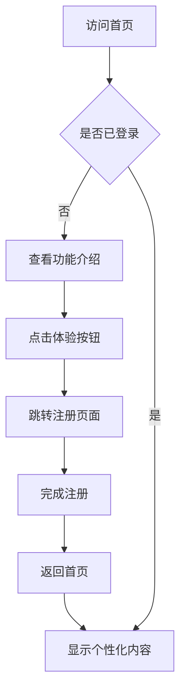
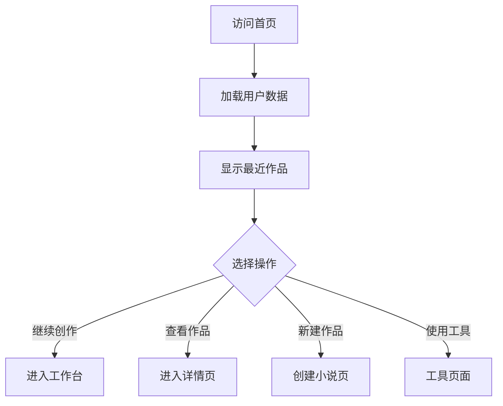

# 首页设计文档

## 页面概述

首页作为AI小说创作平台的入口页面，主要功能是项目介绍、功能展示和用户引导。页面需要清晰地展示平台的核心价值，提供便捷的功能入口，并引导用户开始创作旅程。

## 页面布局设计

### 整体结构
```
┌─────────────────────────────────────────┐
│              全局导航栏                    │
├─────────────────────────────────────────┤
│              英雄区域                      │
│         (主标题 + 核心价值展示)              │
├─────────────────────────────────────────┤
│              功能特性区域                   │
│         (4个核心功能卡片展示)               │
├─────────────────────────────────────────┤
│              快速入口区域                   │
│         (创作相关快捷操作)                  │
├─────────────────────────────────────────┤
│              用户作品展示                   │
│         (最近编辑的小说)                    │
├─────────────────────────────────────────┤
│              页面底部                      │
└─────────────────────────────────────────┘
```

### 组件层次结构
```
HomeView.vue
├── AppHeader.vue (全局导航)
├── HeroSection.vue (英雄区域)
├── FeatureCards.vue (功能特性)
├── QuickActions.vue (快速操作)
├── RecentNovels.vue (最近作品)
└── AppFooter.vue (页面底部)
```

### 响应式布局方案

#### 桌面端 (≥1024px)
- 全屏宽度布局
- 功能卡片4列网格展示
- 侧边栏导航固定显示
- 最近作品3列卡片展示

#### 平板端 (768px - 1023px)
- 容器宽度90%
- 功能卡片2列网格展示
- 导航栏收缩为菜单按钮
- 最近作品2列卡片展示

#### 移动端 (<768px)
- 全屏宽度，左右留边距
- 功能卡片1列垂直排列
- 抽屉式导航菜单
- 最近作品1列卡片展示

### UI组件选择和样式规范

#### 组件库
- **基础组件**: Element Plus
- **图标库**: Element Plus Icons
- **布局组件**: el-container, el-row, el-col
- **卡片组件**: el-card
- **按钮组件**: el-button

#### 设计规范
```scss
// 主题色彩
$primary-color: #409EFF;      // 主色调
$success-color: #67C23A;      // 成功色
$warning-color: #E6A23C;      // 警告色
$danger-color: #F56C6C;       // 危险色
$info-color: #909399;         // 信息色

// 间距规范
$spacing-xs: 8px;
$spacing-sm: 16px;
$spacing-md: 24px;
$spacing-lg: 32px;
$spacing-xl: 48px;

// 字体规范
$font-size-large: 20px;       // 大标题
$font-size-medium: 16px;      // 正文
$font-size-small: 14px;       // 辅助文字
$font-size-mini: 12px;        // 最小文字
```

## 按钮功能设计

### 主要功能按钮

#### 1. 创建小说按钮
- **位置**: 英雄区域和快速操作区域
- **样式**: Primary类型，大尺寸
- **功能**: 跳转到小说创建页面
- **路由**: `/novels/create`
- **状态变化**: 
  - 未登录: 提示登录
  - 已登录: 直接跳转

#### 2. 我的小说按钮
- **位置**: 快速操作区域
- **样式**: Default类型，中等尺寸
- **功能**: 查看用户的小说列表
- **路由**: `/novels`
- **状态变化**:
  - 未登录: 提示登录
  - 已登录: 跳转到小说列表

#### 3. 脑洞生成器按钮
- **位置**: 功能特性区域和快速操作区域
- **样式**: Success类型，中等尺寸
- **功能**: 打开脑洞生成工具
- **路由**: `/tools/brain-generator`
- **状态变化**: 直接跳转，无需登录

#### 4. 角色模板按钮
- **位置**: 功能特性区域和快速操作区域
- **样式**: Info类型，中等尺寸
- **功能**: 查看角色模板库
- **路由**: `/tools/character-templates`
- **状态变化**: 直接跳转，无需登录

#### 5. 登录/注册按钮
- **位置**: 全局导航栏
- **样式**: 登录-Text类型，注册-Primary类型
- **功能**: 用户认证
- **路由**: `/auth/login`, `/auth/register`
- **状态变化**:
  - 未登录: 显示登录/注册
  - 已登录: 显示用户菜单

#### 6. 最近作品快捷按钮
- **位置**: 最近作品卡片
- **样式**: 继续编辑-Primary，查看详情-Default
- **功能**: 
  - 继续编辑: 跳转到工作台
  - 查看详情: 跳转到小说详情
- **路由**: 
  - `/workspace/{novelId}/chapters`
  - `/novels/{novelId}`

### 用户操作流程

#### 新用户首次访问流程


#### 老用户访问流程


### 状态变化和反馈

#### 加载状态
- **组件**: 最近作品区域
- **状态**: 骨架屏显示
- **时长**: 2-3秒
- **失败处理**: 显示错误提示和重试按钮

#### 按钮交互状态
- **Hover状态**: 颜色加深，轻微放大(scale: 1.02)
- **Active状态**: 颜色进一步加深，轻微缩小(scale: 0.98)
- **Loading状态**: 显示加载图标，禁用点击
- **Disabled状态**: 灰色显示，不可点击

#### 数据更新反馈
- **成功**: 绿色提示消息，自动消失
- **失败**: 红色错误消息，需手动关闭
- **警告**: 橙色警告消息，5秒后消失

## 后端接口列表设计

### 页面数据接口

#### 1. 获取用户统计数据
```typescript
// GET /api/v1/novels/stats/overview
interface NovelStatsResponse {
  total_novels: number;           // 总小说数
  total_chapters: number;         // 总章节数
  total_words: number;           // 总字数
  active_novels: number;         // 进行中的小说数
  completed_novels: number;      // 已完成的小说数
  recent_activity: {             // 最近活动
    last_edit_date: string;
    daily_words: number;
  };
}
```

#### 2. 获取最近编辑的小说
```typescript
// GET /api/v1/novels?limit=6&sort=updated_at&order=desc
interface RecentNovelsResponse {
  novels: Novel[];
  total: number;
}

interface Novel {
  id: string;
  title: string;
  description: string;
  genre: string;
  status: 'draft' | 'ongoing' | 'completed';
  cover_image?: string;
  word_count: number;
  chapter_count: number;
  created_at: string;
  updated_at: string;
  last_chapter_title?: string;
}
```

#### 3. 获取用户基本信息
```typescript
// GET /api/v1/auth/me
interface UserInfoResponse {
  id: string;
  username: string;
  email: string;
  avatar_url?: string;
  created_at: string;
  last_login_at: string;
  preferences: {
    theme: 'light' | 'dark' | 'auto';
    language: string;
  };
}
```

### 功能操作接口

#### 4. 检查系统状态
```typescript
// GET /api/v1/generation/status
interface SystemStatusResponse {
  ai_service: 'available' | 'unavailable' | 'limited';
  database: 'connected' | 'disconnected';
  feature_flags: {
    brain_generator: boolean;
    character_templates: boolean;
    ai_generation: boolean;
  };
}
```

#### 5. 快速创建小说
```typescript
// POST /api/v1/novels
interface QuickCreateNovelRequest {
  title: string;
  genre: string;
  description?: string;
  target_words?: number;
  audience?: 'male' | 'female' | 'general';
}

interface QuickCreateNovelResponse {
  novel: Novel;
  redirect_url: string;  // 工作台链接
}
```

### 接口调用时机和错误处理

#### 调用时机
1. **页面初始化**: 
   - 检查用户登录状态
   - 获取系统状态信息
   
2. **用户已登录**:
   - 获取用户统计数据
   - 获取最近编辑的小说列表
   - 获取用户基本信息

3. **功能按钮点击**:
   - 检查权限状态
   - 执行相应的页面跳转或API调用

#### 错误处理策略

#### 网络错误处理
```typescript
// 网络超时处理
const handleNetworkError = (error: AxiosError) => {
  if (error.code === 'ECONNABORTED') {
    ElMessage.error('网络连接超时，请检查网络后重试');
    return;
  }
  
  if (!navigator.onLine) {
    ElMessage.error('网络连接已断开，请检查网络设置');
    return;
  }
  
  ElMessage.error('网络错误，请稍后重试');
};
```

#### API错误处理
```typescript
// API响应错误处理
const handleAPIError = (error: any) => {
  const status = error.response?.status;
  const message = error.response?.data?.message;
  
  switch (status) {
    case 401:
      // 未认证，清除本地状态
      authStore.logout();
      ElMessage.error('登录已过期，请重新登录');
      break;
      
    case 403:
      ElMessage.error('权限不足，无法访问');
      break;
      
    case 404:
      ElMessage.error('请求的资源不存在');
      break;
      
    case 500:
      ElMessage.error('服务器错误，请稍后重试');
      break;
      
    default:
      ElMessage.error(message || '操作失败，请稍后重试');
  }
};
```

#### 数据加载失败处理
```typescript
// 最近作品加载失败
const handleRecentNovelsError = () => {
  // 显示空状态组件
  showEmptyState.value = true;
  emptyStateConfig.value = {
    image: '/images/error-state.svg',
    title: '加载失败',
    description: '无法获取最近作品，请检查网络后重试',
    actions: [
      {
        text: '重新加载',
        type: 'primary',
        handler: () => loadRecentNovels()
      }
    ]
  };
};
```

#### 降级处理策略
```typescript
// 功能降级处理
const handleFeatureDegradation = (feature: string) => {
  switch (feature) {
    case 'ai_generation':
      // AI功能不可用时的降级处理
      showAIFeatures.value = false;
      ElNotification({
        title: '功能提示',
        message: 'AI生成功能暂时不可用，您仍可以使用其他创作工具',
        type: 'warning',
        duration: 5000
      });
      break;
      
    case 'recent_novels':
      // 最近作品加载失败时的降级处理
      showQuickCreate.value = true;
      break;
  }
};
```

### 缓存策略

#### 用户数据缓存
```typescript
// 用户统计数据缓存5分钟
const STATS_CACHE_TTL = 5 * 60 * 1000;

// 最近作品缓存2分钟
const RECENT_NOVELS_CACHE_TTL = 2 * 60 * 1000;

// 系统状态缓存1分钟
const SYSTEM_STATUS_CACHE_TTL = 1 * 60 * 1000;
```

#### 离线体验
```typescript
// 离线状态处理
const handleOfflineMode = () => {
  // 显示缓存的数据
  if (cachedRecentNovels.value) {
    recentNovels.value = cachedRecentNovels.value;
  }
  
  // 显示离线提示
  ElMessage({
    message: '当前处于离线状态，显示的是缓存数据',
    type: 'info',
    duration: 3000
  });
  
  // 隐藏需要网络的功能
  hideNetworkFeatures.value = true;
};
```

## 性能优化考虑

### 首屏加载优化
- 关键资源预加载
- 图片懒加载
- 组件按需加载
- 骨架屏占位

### 用户体验优化
- 平滑的页面过渡动画
- 智能的预取策略
- 渐进式功能增强
- 无障碍访问支持

### 监控和分析
- 页面加载时间监控
- 用户行为分析
- 错误率统计
- 转化率跟踪