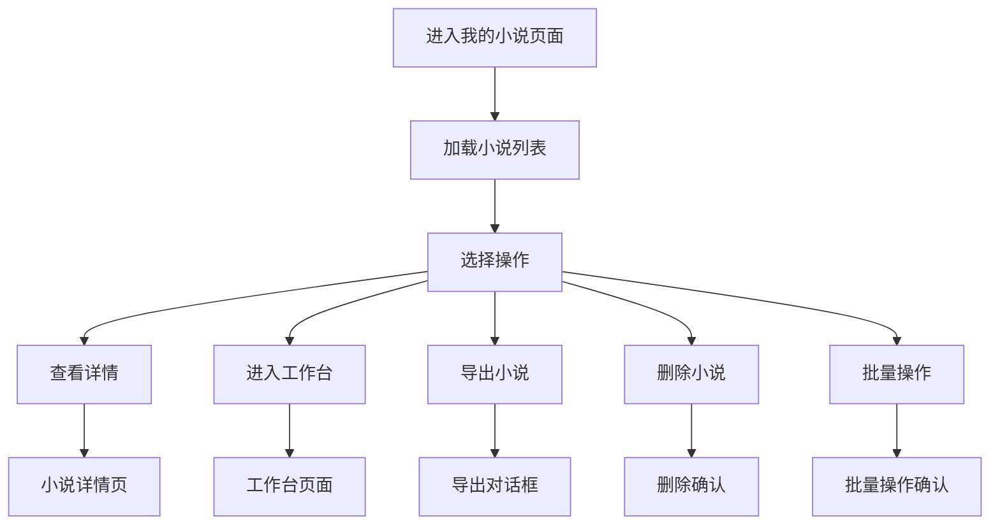
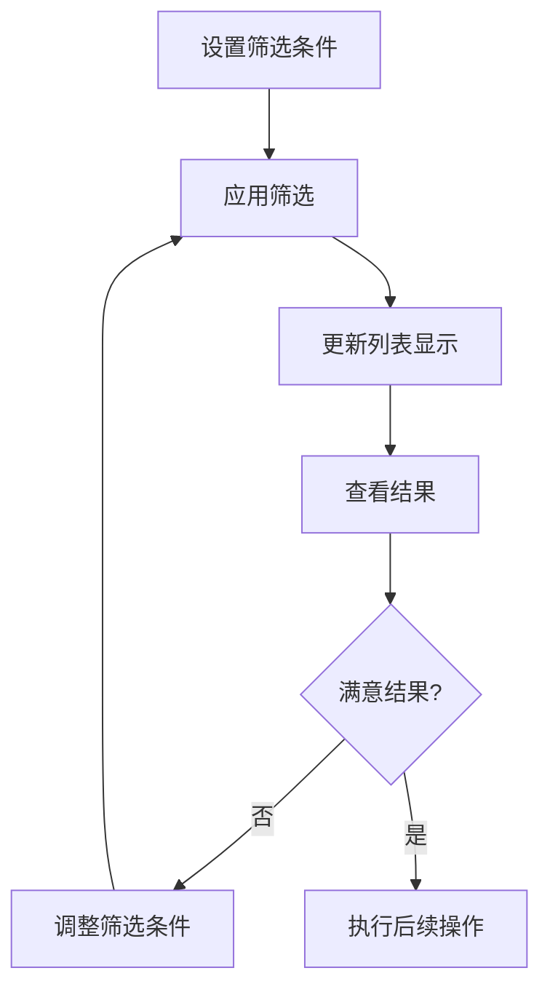

# 我的小说页面设计文档

## 页面概述

我的小说页面是用户管理和查看个人创作作品的核心页面。主要功能包括小说列表展示、筛选搜索、批量操作、导出功能以及快速访问工作台等。页面需要提供高效的作品管理体验和直观的创作进度展示。

## 页面布局设计

### 整体结构
```
┌─────────────────────────────────────────┐
│              页面头部                      │
│         (标题 + 新建按钮 + 搜索)            │
├─────────────────────────────────────────┤
│              筛选工具栏                    │
│      (状态筛选 + 排序 + 视图切换)           │
├─────────────────────────────────────────┤
│              小说列表区域                   │
│         (网格视图 或 列表视图)              │
│                                         │
│  ┌─────┐ ┌─────┐ ┌─────┐ ┌─────┐        │
│  │小说1│ │小说2│ │小说3│ │小说4│        │
│  └─────┘ └─────┘ └─────┘ └─────┘        │
│                                         │
├─────────────────────────────────────────┤
│              分页组件                      │
└─────────────────────────────────────────┘
```

### 组件层次结构
```
NovelListView.vue
├── PageHeader.vue (页面标题和操作)
├── NovelFilters.vue (筛选工具栏)
├── NovelGrid.vue (网格视图)
├── NovelTable.vue (表格视图)
├── NovelCard.vue (小说卡片)
├── BatchOperationBar.vue (批量操作栏)
├── ExportDialog.vue (导出对话框)
└── PaginationBar.vue (分页组件)
```

### 响应式布局方案

#### 桌面端 (≥1200px)
- 5列网格布局 (网格视图)
- 完整表格显示 (表格视图)
- 侧边栏筛选面板
- 悬浮工具提示

#### 平板端 (768px - 1199px)
- 3列网格布局
- 简化表格显示
- 折叠筛选面板
- 触摸优化操作

#### 移动端 (<768px)
- 1列卡片布局
- 抽屉式筛选
- 底部操作菜单
- 手势操作支持

### UI组件选择和样式规范

#### 组件库选择
- **卡片组件**: el-card (小说卡片容器)
- **表格组件**: el-table (列表视图)
- **筛选组件**: el-select, el-date-picker, el-input
- **分页组件**: el-pagination
- **对话框**: el-dialog (导出、删除确认)
- **按钮组**: el-button-group (视图切换)

#### 卡片设计规范
```scss
.novel-card {
  width: 100%;
  height: 320px;
  border-radius: 8px;
  box-shadow: 0 2px 8px rgba(0, 0, 0, 0.1);
  transition: all 0.3s ease;
  
  &:hover {
    transform: translateY(-4px);
    box-shadow: 0 4px 16px rgba(0, 0, 0, 0.15);
  }
  
  .cover-image {
    width: 100%;
    height: 180px;
    object-fit: cover;
    border-radius: 8px 8px 0 0;
  }
  
  .card-content {
    padding: 16px;
    height: 140px;
    display: flex;
    flex-direction: column;
    justify-content: space-between;
  }
}
```

#### 状态标识设计
```scss
// 小说状态颜色
.status-draft { color: #909399; }      // 草稿
.status-ongoing { color: #E6A23C; }    // 进行中
.status-completed { color: #67C23A; }  // 已完成
.status-paused { color: #F56C6C; }     // 暂停

// 进度条设计
.progress-bar {
  height: 4px;
  background: #EBEEF5;
  border-radius: 2px;
  overflow: hidden;
  
  .progress-fill {
    height: 100%;
    background: linear-gradient(90deg, #409EFF, #67C23A);
    transition: width 0.3s ease;
  }
}
```

## 按钮功能设计

### 主要操作按钮

#### 1. 新建小说按钮
- **位置**: 页面头部右上角
- **样式**: Primary类型，图标+文字
- **功能**: 跳转到小说创建页面
- **权限**: 需要登录
- **交互**: 
  ```typescript
  const createNovel = () => {
    router.push('/novels/create');
  };
  ```

#### 2. 进入工作台按钮
- **位置**: 小说卡片和表格行
- **样式**: Primary类型，小尺寸
- **功能**: 进入小说工作台
- **权限**: 小说所有者
- **交互**:
  ```typescript
  const enterWorkspace = (novelId: string) => {
    router.push(`/workspace/${novelId}/overview`);
  };
  ```

#### 3. 查看详情按钮
- **位置**: 小说卡片和表格行
- **样式**: Default类型，小尺寸
- **功能**: 查看小说详细信息
- **权限**: 小说可访问者
- **交互**:
  ```typescript
  const viewDetail = (novelId: string) => {
    router.push(`/novels/${novelId}`);
  };
  ```

#### 4. 导出按钮
- **位置**: 小说卡片菜单和表格行
- **样式**: Text类型，下拉菜单
- **功能**: 导出小说为多种格式
- **格式**: TXT, DOCX, PDF
- **交互**:
  ```typescript
  const exportNovel = (novelId: string, format: 'txt' | 'docx' | 'pdf') => {
    showExportDialog.value = true;
    selectedNovel.value = novelId;
    exportFormat.value = format;
  };
  ```

#### 5. 删除按钮
- **位置**: 小说卡片菜单和表格行
- **样式**: Danger类型，Text样式
- **功能**: 删除小说
- **权限**: 小说所有者
- **确认**: 二次确认对话框
- **交互**:
  ```typescript
  const deleteNovel = async (novelId: string, title: string) => {
    const confirmed = await ElMessageBox.confirm(
      `确定要删除小说《${title}》吗？此操作不可恢复。`,
      '删除确认',
      {
        confirmButtonText: '确定删除',
        cancelButtonText: '取消',
        type: 'warning',
        confirmButtonClass: 'el-button--danger'
      }
    );
    
    if (confirmed) {
      await novelAPI.deleteNovel(novelId);
      await loadNovels();
      ElMessage.success('小说删除成功');
    }
  };
  ```

#### 6. 批量操作按钮
- **位置**: 筛选工具栏下方 (选中项目时显示)
- **功能**: 批量删除、批量导出、批量修改状态
- **样式**: 固定在页面底部的操作栏
- **交互**:
  ```typescript
  const batchOperation = async (action: string, selectedIds: string[]) => {
    switch (action) {
      case 'delete':
        await batchDeleteNovels(selectedIds);
        break;
      case 'export':
        await batchExportNovels(selectedIds);
        break;
      case 'changeStatus':
        await batchChangeStatus(selectedIds, newStatus);
        break;
    }
  };
  ```

### 辅助功能按钮

#### 7. 视图切换按钮
- **位置**: 筛选工具栏右侧
- **样式**: 按钮组，图标按钮
- **功能**: 切换网格/列表视图
- **状态**: 当前视图高亮显示

#### 8. 筛选重置按钮
- **位置**: 筛选条件右侧
- **样式**: Text类型，小尺寸
- **功能**: 清空所有筛选条件
- **显示条件**: 有激活的筛选条件时显示

#### 9. 刷新按钮
- **位置**: 页面头部或筛选工具栏
- **样式**: Icon按钮
- **功能**: 刷新小说列表数据
- **状态**: 加载时显示旋转动画

### 用户操作流程

#### 浏览和管理流程


#### 筛选和搜索流程


### 状态变化和反馈

#### 加载状态管理
```typescript
const loadingStates = ref({
  initial: false,        // 初始加载
  refresh: false,        // 刷新数据
  delete: false,         // 删除操作
  export: false,         // 导出操作
  batchOperation: false  // 批量操作
});
```

#### 空状态处理
```typescript
const emptyStateConfig = computed(() => {
  if (hasFilters.value) {
    return {
      image: '/images/no-results.svg',
      title: '没有找到匹配的小说',
      description: '尝试调整筛选条件或清空筛选器',
      actions: [
        {
          text: '清空筛选',
          type: 'primary',
          handler: clearFilters
        }
      ]
    };
  } else {
    return {
      image: '/images/empty-novels.svg',
      title: '还没有创作任何小说',
      description: '开始您的第一部小说创作吧',
      actions: [
        {
          text: '创建小说',
          type: 'primary',
          handler: () => router.push('/novels/create')
        }
      ]
    };
  }
});
```

#### 操作反馈机制
```typescript
// 成功反馈
const showSuccessMessage = (message: string) => {
  ElMessage({
    type: 'success',
    message,
    duration: 3000,
    showClose: true
  });
};

// 错误反馈
const showErrorMessage = (message: string) => {
  ElMessage({
    type: 'error',
    message,
    duration: 5000,
    showClose: true
  });
};

// 加载反馈
const showLoadingMessage = (message: string) => {
  return ElLoading.service({
    lock: true,
    text: message,
    spinner: 'el-icon-loading',
    background: 'rgba(0, 0, 0, 0.7)'
  });
};
```

## 后端接口列表设计

### 核心数据接口

#### 1. 获取小说列表
```typescript
// GET /api/v1/novels
interface GetNovelsRequest {
  page?: number;           // 页码 (默认1)
  page_size?: number;      // 每页数量 (默认20)
  status?: 'draft' | 'ongoing' | 'completed' | 'paused';  // 状态筛选
  genre?: string;          // 类型筛选
  sort_by?: 'created_at' | 'updated_at' | 'title' | 'word_count';  // 排序字段
  sort_order?: 'asc' | 'desc';  // 排序方向
  search?: string;         // 搜索关键词
  date_from?: string;      // 创建时间起始
  date_to?: string;        // 创建时间结束
}

interface GetNovelsResponse {
  novels: NovelListItem[];
  total: number;
  page: number;
  page_size: number;
  total_pages: number;
}

interface NovelListItem {
  id: string;
  title: string;
  description: string;
  genre: string;
  status: 'draft' | 'ongoing' | 'completed' | 'paused';
  cover_image?: string;
  word_count: number;
  chapter_count: number;
  target_words?: number;
  progress_percentage: number;  // 完成进度
  created_at: string;
  updated_at: string;
  last_chapter_title?: string;
  last_edit_date?: string;
}
```

#### 2. 获取小说统计信息
```typescript
// GET /api/v1/novels/stats/overview
interface NovelStatsResponse {
  total_novels: number;
  novels_by_status: {
    draft: number;
    ongoing: number;
    completed: number;
    paused: number;
  };
  total_words: number;
  total_chapters: number;
  average_words_per_novel: number;
  most_productive_day: string;
  writing_streak_days: number;
}
```

#### 3. 删除小说
```typescript
// DELETE /api/v1/novels/{novel_id}
interface DeleteNovelResponse {
  message: string;
  deleted_novel_id: string;
}
```

### 批量操作接口

#### 4. 批量删除小说
```typescript
// POST /api/v1/novels/batch/delete
interface BatchDeleteRequest {
  novel_ids: string[];
}

interface BatchDeleteResponse {
  success_count: number;
  failed_count: number;
  failed_items: {
    novel_id: string;
    reason: string;
  }[];
  message: string;
}
```

#### 5. 批量修改状态
```typescript
// POST /api/v1/novels/batch/status
interface BatchStatusUpdateRequest {
  novel_ids: string[];
  status: 'draft' | 'ongoing' | 'completed' | 'paused';
}

interface BatchStatusUpdateResponse {
  success_count: number;
  failed_count: number;
  updated_novels: NovelListItem[];
}
```

### 导出功能接口

#### 6. 生成导出链接
```typescript
// POST /api/v1/novels/{novel_id}/export
interface ExportNovelRequest {
  format: 'txt' | 'docx' | 'pdf';
  include_outline?: boolean;    // 是否包含大纲
  include_worldview?: boolean;  // 是否包含世界观
  include_characters?: boolean; // 是否包含角色信息
  chapter_range?: {            // 章节范围
    start_chapter: number;
    end_chapter: number;
  };
  only_completed?: boolean;     // 仅包含已完成章节
}

interface ExportNovelResponse {
  export_id: string;
  download_url: string;
  expires_at: string;
  file_size: number;
  estimated_time: number;  // 预计生成时间(秒)
}
```

#### 7. 获取导出状态
```typescript
// GET /api/v1/novels/export/{export_id}/status
interface ExportStatusResponse {
  export_id: string;
  status: 'pending' | 'processing' | 'completed' | 'failed';
  progress_percentage: number;
  download_url?: string;
  error_message?: string;
  file_info?: {
    filename: string;
    size: number;
    format: string;
  };
}
```

#### 8. 批量导出
```typescript
// POST /api/v1/novels/batch/export
interface BatchExportRequest {
  novel_ids: string[];
  format: 'txt' | 'docx' | 'pdf';
  export_options: ExportNovelRequest;
}

interface BatchExportResponse {
  batch_export_id: string;
  individual_exports: {
    novel_id: string;
    export_id: string;
    status: string;
  }[];
  zip_download_url?: string;  // 打包下载链接
}
```

### 接口调用时机和错误处理

#### 调用时机设计

```typescript
// 页面生命周期调用
onMounted(async () => {
  await Promise.all([
    loadNovels(),      // 加载小说列表
    loadStats()        // 加载统计信息
  ]);
});

// 筛选条件变化时调用
watch([filters, sortConfig, searchKeyword], 
  debounce(async () => {
    await loadNovels();
  }, 300)
);

// 分页变化时调用
const handlePageChange = async (page: number) => {
  currentPage.value = page;
  await loadNovels();
};
```

#### 错误处理策略

##### 1. 网络错误处理
```typescript
const handleNetworkError = (error: AxiosError) => {
  if (error.code === 'ECONNABORTED') {
    ElMessage.error('请求超时，请检查网络连接');
    return;
  }
  
  if (error.response?.status === 429) {
    ElMessage.error('请求过于频繁，请稍后再试');
    return;
  }
  
  ElMessage.error('网络连接失败，请检查网络设置');
};
```

##### 2. 业务错误处理
```typescript
const handleBusinessError = (error: any) => {
  const { status, data } = error.response || {};
  
  switch (status) {
    case 404:
      ElMessage.error('小说不存在或已被删除');
      // 从列表中移除不存在的小说
      novels.value = novels.value.filter(n => n.id !== error.config.novelId);
      break;
      
    case 403:
      ElMessage.error('权限不足，无法执行此操作');
      break;
      
    case 422:
      ElMessage.error(data.message || '请求参数错误');
      break;
      
    default:
      ElMessage.error('操作失败，请稍后重试');
  }
};
```

##### 3. 批量操作错误处理
```typescript
const handleBatchOperationResult = (result: BatchDeleteResponse) => {
  if (result.success_count > 0) {
    ElMessage.success(`成功处理 ${result.success_count} 个项目`);
  }
  
  if (result.failed_count > 0) {
    const failedTitles = result.failed_items
      .map(item => getNovelTitle(item.novel_id))
      .join('、');
      
    ElMessage.error(`${result.failed_count} 个项目处理失败：${failedTitles}`);
    
    // 显示详细错误信息
    showBatchErrorDialog.value = true;
    batchErrors.value = result.failed_items;
  }
};
```

##### 4. 导出功能错误处理
```typescript
const handleExportError = (error: any, novelTitle: string) => {
  const errorMessage = error.response?.data?.message || '导出失败';
  
  ElNotification({
    title: '导出失败',
    message: `《${novelTitle}》${errorMessage}`,
    type: 'error',
    duration: 5000,
    position: 'bottom-right'
  });
  
  // 清除导出进度
  exportProgress.value.delete(error.config.novelId);
};
```

#### 数据缓存和同步

##### 缓存策略
```typescript
// 列表数据缓存配置
const CACHE_CONFIG = {
  novels: { ttl: 5 * 60 * 1000 },      // 5分钟
  stats: { ttl: 10 * 60 * 1000 },      // 10分钟
  filters: { ttl: 30 * 60 * 1000 }     // 30分钟
};

// 缓存键生成
const generateCacheKey = (prefix: string, params: any) => {
  const sortedParams = Object.keys(params)
    .sort()
    .reduce((result, key) => {
      result[key] = params[key];
      return result;
    }, {} as any);
    
  return `${prefix}_${JSON.stringify(sortedParams)}`;
};
```

##### 数据同步
```typescript
// 实时数据同步 (WebSocket)
const setupRealtimeSync = () => {
  const ws = new WebSocket(`${WS_BASE_URL}/novels/sync`);
  
  ws.onmessage = (event) => {
    const { type, data } = JSON.parse(event.data);
    
    switch (type) {
      case 'novel_updated':
        updateNovelInList(data.novel);
        break;
        
      case 'novel_deleted':
        removeNovelFromList(data.novel_id);
        break;
        
      case 'export_completed':
        handleExportCompleted(data.export_id, data.download_url);
        break;
    }
  };
};
```

## 性能优化考虑

### 列表虚拟化
```typescript
// 大列表虚拟滚动
import { FixedSizeList as List } from 'react-window';

const VirtualizedNovelList = defineComponent({
  setup() {
    const itemHeight = 120;
    const containerHeight = 600;
    
    return () => (
      <List
        height={containerHeight}
        itemCount={novels.value.length}
        itemSize={itemHeight}
        itemData={novels.value}
      >
        {NovelListItem}
      </List>
    );
  }
});
```

### 图片懒加载
```typescript
// 封面图片懒加载
const useLazyImage = (src: string) => {
  const imageRef = ref<HTMLImageElement>();
  const isLoaded = ref(false);
  const isError = ref(false);
  
  const observer = new IntersectionObserver((entries) => {
    entries.forEach((entry) => {
      if (entry.isIntersecting) {
        loadImage(src);
        observer.unobserve(entry.target);
      }
    });
  });
  
  onMounted(() => {
    if (imageRef.value) {
      observer.observe(imageRef.value);
    }
  });
  
  return { imageRef, isLoaded, isError };
};
```

### 搜索防抖
```typescript
// 搜索关键词防抖处理
const debouncedSearch = debounce(async (keyword: string) => {
  if (keyword.trim()) {
    await searchNovels(keyword);
  } else {
    await loadNovels();
  }
}, 300);