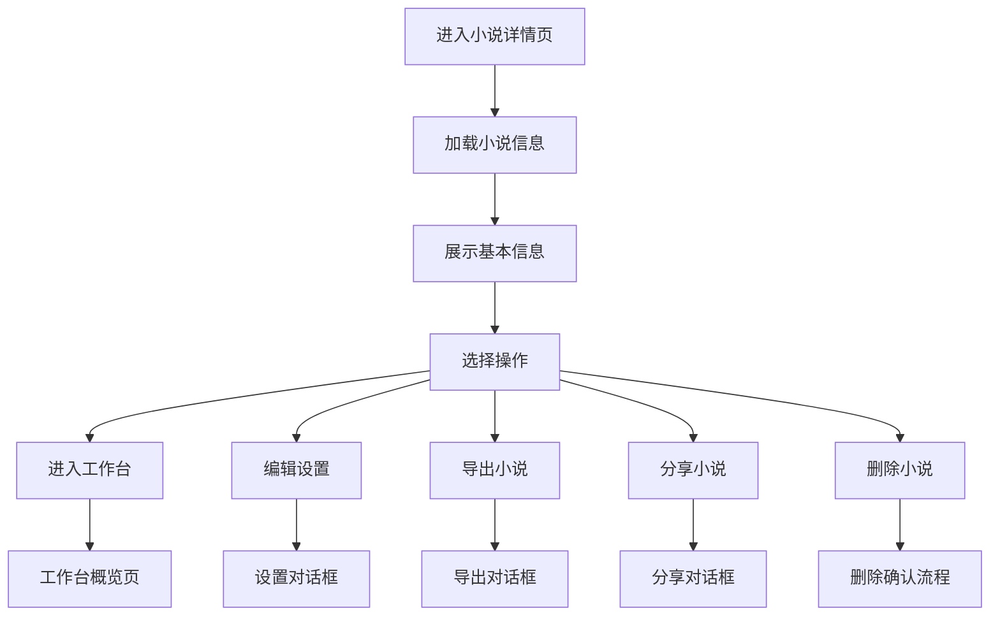
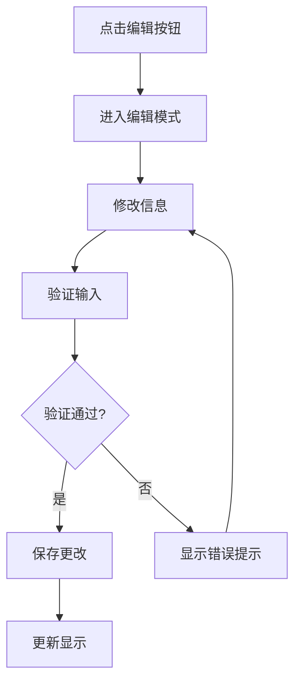

# 小说详情页面设计文档

## 页面概述

小说详情页面展示单个小说的完整信息，包括基本信息、创作进度、统计数据等，并提供进入工作台的入口。页面设计注重信息展示的清晰性和操作的便捷性，为用户提供小说概览和快速访问工作台的功能。

## 页面布局设计

### 整体结构
```
┌─────────────────────────────────────────┐
│              页面头部                      │
│         (返回按钮 + 面包屑导航)             │
├─────────────────────────────────────────┤
│              小说主要信息区域                │
│    ┌─────────┐  ┌─────────────────────┐ │
│    │         │  │    小说基本信息        │ │
│    │ 封面图片 │  │   (标题、作者、类型)    │ │
│    │         │  │                     │ │
│    │         │  │  ┌─────┐ ┌─────┐   │ │
│    └─────────┘  │  │设置  │ │工作台│   │ │
│                 │  └─────┘ └─────┘   │ │
│                 └─────────────────────┘ │
├─────────────────────────────────────────┤
│              详细信息区域                   │
│  ┌─────────────┐ ┌─────────────────┐   │
│  │  创作统计    │ │    内容概览      │   │
│  │   数据      │ │   (简介、标签)   │   │
│  └─────────────┘ └─────────────────┘   │
├─────────────────────────────────────────┤
│              进度和时间轴                   │
│        (创作进度条 + 最近活动)              │
└─────────────────────────────────────────┘
```

### 组件层次结构
```
NovelDetailView.vue
├── PageHeader.vue (页面导航)
├── NovelInfoCard.vue (基本信息卡片)
│   ├── CoverImage.vue (封面图片)
│   ├── BasicInfo.vue (基本信息)
│   └── ActionButtons.vue (操作按钮)
├── StatsCard.vue (统计数据卡片)
├── ContentOverview.vue (内容概览)
├── ProgressSection.vue (进度展示)
├── RecentActivity.vue (最近活动)
└── NovelSettingsDialog.vue (设置对话框)
```

### 响应式布局方案

#### 桌面端 (≥1024px)
- 两列布局：左侧封面图，右侧信息
- 统计卡片3列网格展示
- 固定宽度容器(1200px)，居中对齐
- 悬浮提示和详细信息展示

#### 平板端 (768px - 1023px)
- 上下布局：封面图在上，信息在下
- 统计卡片2列网格展示
- 容器宽度100%，边距16px
- 折叠部分详细信息

#### 移动端 (<768px)
- 单列垂直布局
- 统计卡片1列展示
- 全屏宽度，边距8px
- 简化信息展示，重要信息优先

### UI组件选择和样式规范

#### 组件库选择
- **卡片组件**: el-card (各信息模块容器)
- **描述列表**: el-descriptions (基本信息展示)
- **进度条**: el-progress (创作进度)
- **标签**: el-tag (小说标签、状态)
- **统计数值**: el-statistic (数据展示)
- **时间轴**: el-timeline (最近活动)

#### 设计规范
```scss
// 主要信息卡片样式
.novel-main-card {
  padding: 24px;
  margin-bottom: 24px;
  border-radius: 12px;
  box-shadow: 0 4px 12px rgba(0, 0, 0, 0.1);
  
  .cover-section {
    width: 200px;
    height: 280px;
    border-radius: 8px;
    overflow: hidden;
    
    img {
      width: 100%;
      height: 100%;
      object-fit: cover;
    }
    
    .placeholder {
      background: linear-gradient(135deg, #f5f7fa 0%, #c3cfe2 100%);
      display: flex;
      align-items: center;
      justify-content: center;
      color: #8c939d;
      font-size: 48px;
    }
  }
  
  .info-section {
    flex: 1;
    margin-left: 24px;
    
    .novel-title {
      font-size: 28px;
      font-weight: 600;
      color: #303133;
      margin-bottom: 8px;
    }
    
    .novel-meta {
      color: #606266;
      margin-bottom: 16px;
      
      .meta-item {
        margin-right: 16px;
        
        .label {
          font-weight: 500;
        }
      }
    }
  }
}

// 统计卡片样式
.stats-card {
  text-align: center;
  padding: 20px;
  
  .stat-value {
    font-size: 32px;
    font-weight: 700;
    color: #409EFF;
    margin-bottom: 8px;
  }
  
  .stat-label {
    color: #606266;
    font-size: 14px;
  }
  
  .stat-trend {
    margin-top: 8px;
    font-size: 12px;
    
    &.positive {
      color: #67C23A;
    }
    
    &.negative {
      color: #F56C6C;
    }
  }
}

// 状态标签样式
.status-tag {
  &.draft { background-color: #e4e7ed; color: #606266; }
  &.ongoing { background-color: #fdf6ec; color: #e6a23c; }
  &.completed { background-color: #f0f9ff; color: #409eff; }
  &.paused { background-color: #fef0f0; color: #f56c6c; }
}
```

## 按钮功能设计

### 主要操作按钮

#### 1. 进入工作台按钮
- **位置**: 基本信息区域右上角
- **样式**: Primary类型，大尺寸，图标+文字
- **功能**: 进入小说工作台主页面
- **权限**: 小说所有者
- **交互**:
  ```typescript
  const enterWorkspace = () => {
    router.push(`/workspace/${novel.value.id}/overview`);
  };
  ```

#### 2. 小说设置按钮
- **位置**: 基本信息区域右上角
- **样式**: Default类型，中等尺寸
- **功能**: 打开小说设置对话框
- **权限**: 小说所有者
- **交互**:
  ```typescript
  const openSettings = () => {
    showSettingsDialog.value = true;
  };
  ```

#### 3. 编辑信息按钮
- **位置**: 基本信息卡片右上角
- **样式**: Text类型，图标按钮
- **功能**: 编辑小说基本信息
- **权限**: 小说所有者
- **交互**:
  ```typescript
  const editBasicInfo = () => {
    isEditingBasicInfo.value = true;
  };
  ```

#### 4. 导出小说按钮
- **位置**: 操作菜单中
- **样式**: 下拉菜单项
- **功能**: 导出小说为不同格式
- **格式选择**: TXT, DOCX, PDF
- **交互**:
  ```typescript
  const exportNovel = (format: 'txt' | 'docx' | 'pdf') => {
    showExportDialog.value = true;
    selectedExportFormat.value = format;
  };
  ```

#### 5. 分享小说按钮
- **位置**: 操作菜单中
- **样式**: 菜单项，带图标
- **功能**: 生成分享链接或二维码
- **权限**: 根据小说可见性设置
- **交互**:
  ```typescript
  const shareNovel = async () => {
    const shareLink = await generateShareLink(novel.value.id);
    showShareDialog.value = true;
    shareUrl.value = shareLink;
  };
  ```

#### 6. 删除小说按钮
- **位置**: 操作菜单中（危险操作区域）
- **样式**: 红色文字，警告图标
- **功能**: 删除整个小说
- **权限**: 小说所有者
- **确认**: 多重确认机制
- **交互**:
  ```typescript
  const deleteNovel = async () => {
    // 第一重确认
    const confirmed1 = await ElMessageBox.confirm(
      `确定要删除小说《${novel.value.title}》吗？`,
      '删除确认',
      { type: 'warning' }
    );
    
    if (!confirmed1) return;
    
    // 第二重确认（输入小说名称）
    const { value: inputTitle } = await ElMessageBox.prompt(
      '请输入小说名称以确认删除',
      '二次确认',
      {
        confirmButtonText: '确定删除',
        cancelButtonText: '取消',
        inputPattern: new RegExp(`^${novel.value.title}$`),
        inputErrorMessage: '小说名称不匹配'
      }
    );
    
    if (inputTitle === novel.value.title) {
      await novelAPI.deleteNovel(novel.value.id);
      ElMessage.success('小说删除成功');
      router.push('/novels');
    }
  };
  ```

### 快捷操作按钮

#### 7. 工作台模块快捷按钮
- **位置**: 进度展示区域
- **样式**: 卡片式按钮组
- **功能**: 快速访问工作台各模块
- **包含模块**: 
  - 世界观管理
  - 角色管理  
  - 大纲管理
  - 章节编辑
- **交互**:
  ```typescript
  const quickAccess = (module: string) => {
    router.push(`/workspace/${novel.value.id}/${module}`);
  };
  ```

#### 8. 最近章节快捷按钮
- **位置**: 内容概览区域
- **样式**: 链接样式
- **功能**: 快速跳转到最近编辑的章节
- **显示条件**: 存在章节时显示
- **交互**:
  ```typescript
  const openLastChapter = () => {
    if (novel.value.last_chapter_id) {
      router.push(`/workspace/${novel.value.id}/chapters?chapter=${novel.value.last_chapter_id}`);
    }
  };
  ```

### 用户操作流程

#### 查看和管理流程


#### 信息编辑流程


### 状态变化和反馈

#### 数据加载状态
```typescript
const loadingStates = ref({
  basic: true,        // 基本信息加载
  stats: true,        // 统计数据加载
  activity: true,     // 活动记录加载
  settings: false,    // 设置保存
  deletion: false,    // 删除操作
  export: false       // 导出操作
});

// 加载完成处理
const handleDataLoaded = () => {
  Object.keys(loadingStates.value).forEach(key => {
    loadingStates.value[key] = false;
  });
};
```

#### 编辑状态管理
```typescript
const editingStates = ref({
  basicInfo: false,   // 基本信息编辑
  description: false, // 简介编辑
  tags: false        // 标签编辑
});

const editingData = ref({
  title: '',
  description: '',
  genre: '',
  tags: []
});

// 进入编辑模式
const enterEditMode = (field: string) => {
  editingStates.value[field] = true;
  // 备份原始数据
  originalData.value = { ...novel.value };
};

// 取消编辑
const cancelEdit = (field: string) => {
  editingStates.value[field] = false;
  // 恢复原始数据
  Object.assign(novel.value, originalData.value);
};
```

#### 操作反馈机制
```typescript
// 成功反馈
const showSuccessMessage = (operation: string) => {
  ElNotification({
    title: '操作成功',
    message: `${operation}已完成`,
    type: 'success',
    position: 'top-right',
    duration: 3000
  });
};

// 错误反馈
const showErrorMessage = (operation: string, error: string) => {
  ElNotification({
    title: `${operation}失败`,
    message: error,
    type: 'error',
    position: 'top-right',
    duration: 5000
  });
};

// 警告反馈
const showWarningMessage = (message: string) => {
  ElMessage({
    type: 'warning',
    message,
    duration: 4000,
    showClose: true
  });
};
```

## 后端接口列表设计

### 核心数据接口

#### 1. 获取小说详情
```typescript
// GET /api/v1/novels/{novel_id}
interface NovelDetailResponse {
  id: string;
  title: string;
  description: string;
  genre: string;
  status: 'draft' | 'ongoing' | 'completed' | 'paused';
  author: string;
  cover_image?: string;
  word_count: number;
  chapter_count: number;
  target_words?: number;
  audience?: 'male' | 'female' | 'general';
  writing_style?: string;
  tags: string[];
  created_at: string;
  updated_at: string;
  last_edit_date?: string;
  last_chapter_id?: string;
  last_chapter_title?: string;
  progress_percentage: number;
  
  // 统计信息
  stats: {
    total_chapters: number;
    completed_chapters: number;
    draft_chapters: number;
    total_words: number;
    average_words_per_chapter: number;
    estimated_completion_time?: string;
    writing_days: number;
    average_daily_words: number;
  };
  
  // 创作概览
  content_overview: {
    has_worldview: boolean;
    worldview_count: number;
    character_count: number;
    rough_outline_count: number;
    detailed_outline_count: number;
    last_activity_date?: string;
  };
}
```

#### 2. 获取小说统计数据
```typescript
// GET /api/v1/novels/{novel_id}/stats
interface NovelStatsDetailResponse {
  basic_stats: {
    total_words: number;
    total_chapters: number;
    completed_chapters: number;
    average_chapter_length: number;
  };
  
  progress_stats: {
    completion_percentage: number;
    estimated_days_to_completion: number;
    target_words: number;
    daily_target_words: number;
  };
  
  writing_stats: {
    writing_days: number;
    total_writing_hours?: number;
    average_daily_words: number;
    most_productive_day: string;
    writing_streak: number;
  };
  
  content_stats: {
    character_count: number;
    worldview_count: number;
    outline_completion: number;
    plot_point_count: number;
  };
  
  quality_stats: {
    ai_review_score?: number;
    consistency_score?: number;
    readability_score?: number;
  };
}
```

#### 3. 获取最近活动
```typescript
// GET /api/v1/novels/{novel_id}/activities?limit=10
interface RecentActivitiesResponse {
  activities: Activity[];
  total: number;
}

interface Activity {
  id: string;
  type: 'chapter_created' | 'chapter_updated' | 'character_added' | 'outline_generated' | 'worldview_updated';
  title: string;
  description: string;
  timestamp: string;
  metadata?: {
    chapter_id?: string;
    character_id?: string;
    words_added?: number;
    [key: string]: any;
  };
}
```

### 编辑和更新接口

#### 4. 更新小说基本信息
```typescript
// PUT /api/v1/novels/{novel_id}
interface UpdateNovelRequest {
  title?: string;
  description?: string;
  genre?: string;
  target_words?: number;
  audience?: 'male' | 'female' | 'general';
  writing_style?: string;
  tags?: string[];
  status?: 'draft' | 'ongoing' | 'completed' | 'paused';
}

interface UpdateNovelResponse {
  novel: NovelDetailResponse;
  message: string;
}
```

#### 5. 上传封面图片
```typescript
// POST /api/v1/novels/{novel_id}/cover
interface UploadCoverRequest {
  file: File;
}

interface UploadCoverResponse {
  cover_url: string;
  message: string;
}
```

#### 6. 更新小说状态
```typescript
// PATCH /api/v1/novels/{novel_id}/status
interface UpdateStatusRequest {
  status: 'draft' | 'ongoing' | 'completed' | 'paused';
  note?: string;  // 状态变更备注
}

interface UpdateStatusResponse {
  novel: NovelDetailResponse;
  status_history: {
    previous_status: string;
    new_status: string;
    changed_at: string;
    note?: string;
  };
}
```

### 分享和导出接口

#### 7. 生成分享链接
```typescript
// POST /api/v1/novels/{novel_id}/share
interface CreateShareLinkRequest {
  access_level: 'public' | 'restricted' | 'private';
  expires_in?: number;  // 有效期（天数）
  password?: string;    // 访问密码
  include_outline?: boolean;
  include_characters?: boolean;
}

interface CreateShareLinkResponse {
  share_id: string;
  share_url: string;
  qr_code_url: string;
  access_level: string;
  expires_at?: string;
  view_count: number;
}
```

#### 8. 导出小说
```typescript
// POST /api/v1/novels/{novel_id}/export
interface ExportNovelRequest {
  format: 'txt' | 'docx' | 'pdf' | 'epub';
  include_outline?: boolean;
  include_worldview?: boolean;
  include_characters?: boolean;
  include_metadata?: boolean;
  chapter_range?: {
    start_chapter: number;
    end_chapter: number;
  };
  export_options?: {
    font_size?: number;
    line_spacing?: number;
    page_format?: 'A4' | 'A5' | 'letter';
  };
}

interface ExportNovelResponse {
  export_id: string;
  download_url: string;
  file_size: number;
  estimated_time: number;
  expires_at: string;
}
```

### 接口调用时机和错误处理

#### 调用时机设计
```typescript
// 页面初始化
onMounted(async () => {
  try {
    // 并行加载基本数据
    const [novelDetail, stats, activities] = await Promise.all([
      loadNovelDetail(),
      loadNovelStats(),
      loadRecentActivities()
    ]);
    
    // 更新页面状态
    novel.value = novelDetail;
    novelStats.value = stats;
    recentActivities.value = activities;
    
  } catch (error) {
    handleLoadError(error);
  } finally {
    handleDataLoaded();
  }
});

// 路由参数变化时重新加载
watch(() => route.params.novelId, async (newId) => {
  if (newId) {
    await loadNovelDetail(newId as string);
  }
});
```

#### 错误处理策略

##### 1. 页面级错误处理
```typescript
const handleLoadError = (error: any) => {
  const status = error.response?.status;
  
  switch (status) {
    case 404:
      // 小说不存在
      showErrorPage.value = true;
      errorConfig.value = {
        code: '404',
        title: '小说不存在',
        message: '您访问的小说可能已被删除或不存在',
        actions: [
          {
            text: '返回小说列表',
            handler: () => router.push('/novels')
          }
        ]
      };
      break;
      
    case 403:
      // 无权限访问
      showErrorPage.value = true;
      errorConfig.value = {
        code: '403',
        title: '无权限访问',
        message: '您没有权限查看此小说',
        actions: [
          {
            text: '返回首页',
            handler: () => router.push('/')
          }
        ]
      };
      break;
      
    default:
      // 其他错误
      ElMessage.error('加载失败，请刷新页面重试');
  }
};
```

##### 2. 操作错误处理
```typescript
const handleOperationError = (operation: string, error: any) => {
  const message = error.response?.data?.message || `${operation}失败`;
  
  ElNotification({
    title: '操作失败',
    message,
    type: 'error',
    position: 'top-right',
    duration: 5000
  });
  
  // 记录错误日志
  console.error(`Novel operation error:`, {
    operation,
    novelId: novel.value?.id,
    error: error.response?.data || error.message
  });
};
```

##### 3. 网络错误处理
```typescript
const handleNetworkError = (error: AxiosError) => {
  if (!navigator.onLine) {
    ElMessage({
      type: 'warning',
      message: '网络连接已断开，显示的是缓存数据',
      duration: 5000
    });
    
    // 启用离线模式
    isOfflineMode.value = true;
    loadCachedData();
    return;
  }
  
  if (error.code === 'ECONNABORTED') {
    ElMessage.error('请求超时，请检查网络连接');
    return;
  }
  
  ElMessage.error('网络错误，请稍后重试');
};
```

#### 数据验证和同步

##### 表单验证规则
```typescript
const validationRules = {
  title: [
    { required: true, message: '请输入小说标题', trigger: 'blur' },
    { min: 1, max: 100, message: '标题长度应在1-100字符之间', trigger: 'blur' }
  ],
  description: [
    { max: 1000, message: '简介不能超过1000字符', trigger: 'blur' }
  ],
  genre: [
    { required: true, message: '请选择小说类型', trigger: 'change' }
  ],
  target_words: [
    { type: 'number', min: 1000, message: '目标字数不能少于1000字', trigger: 'blur' }
  ]
};
```

##### 数据同步策略
```typescript
// 定期同步数据
const setupDataSync = () => {
  // 每30秒同步一次统计数据
  setInterval(async () => {
    try {
      const latestStats = await novelAPI.getNovelStats(novel.value.id);
      novelStats.value = latestStats;
    } catch (error) {
      // 静默处理同步错误
      console.warn('Stats sync failed:', error);
    }
  }, 30000);
};

// WebSocket实时更新
const setupRealtimeUpdates = () => {
  const ws = new WebSocket(`${WS_BASE_URL}/novels/${novel.value.id}/updates`);
  
  ws.onmessage = (event) => {
    const { type, data } = JSON.parse(event.data);
    
    switch (type) {
      case 'stats_updated':
        novelStats.value = { ...novelStats.value, ...data };
        break;
        
      case 'chapter_updated':
        updateChapterInfo(data);
        break;
        
      case 'status_changed':
        novel.value.status = data.status;
        break;
    }
  };
};
```

## 性能优化考虑

### 数据预加载
```typescript
// 关键数据预加载
const preloadCriticalData = async () => {
  // 预加载用户可能访问的工作台数据
  const workspacePreload = [
    novelAPI.getCharacters(novel.value.id, { limit: 5 }),
    novelAPI.getChapters(novel.value.id, { limit: 3 }),
    novelAPI.getWorldviews(novel.value.id)
  ];
  
  // 后台预加载，不阻塞页面渲染
  Promise.all(workspacePreload).then(results => {
    // 缓存预加载的数据
    cachePreloadedData(results);
  }).catch(error => {
    console.warn('Preload failed:', error);
  });
};
```

### 图像优化
```typescript
// 封面图片优化
const optimizeCoverImage = (url: string, size: 'small' | 'medium' | 'large') => {
  const sizeMap = {
    small: '200x280',
    medium: '400x560', 
    large: '800x1120'
  };
  
  return `${url}?resize=${sizeMap[size]}&quality=80&format=webp`;
};
```

### 缓存策略
```typescript
// 小说详情缓存
const CACHE_DURATION = {
  basic: 10 * 60 * 1000,      // 基本信息10分钟
  stats: 2 * 60 * 1000,       // 统计数据2分钟
  activities: 1 * 60 * 1000   // 活动记录1分钟
};