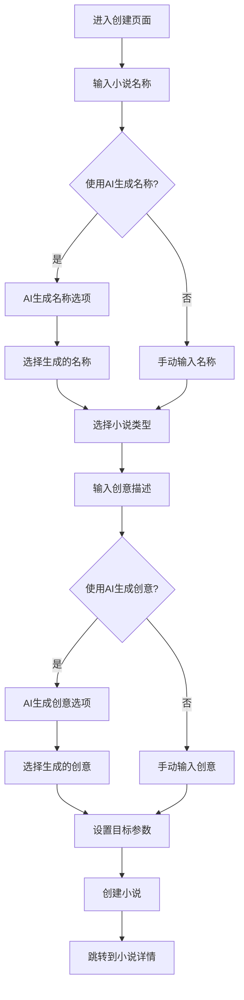
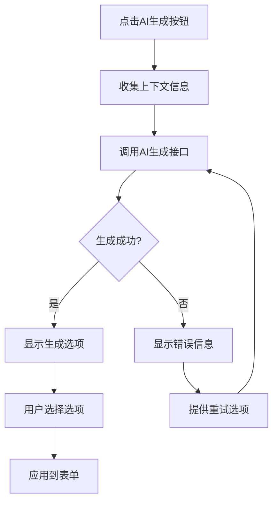

# 小说创建页面设计文档

## 页面概述

小说创建页面是用户开始创作的重要入口，通过向导式的表单引导用户完成小说的基本设置。页面集成AI生成功能，帮助用户生成小说名称和创意，降低创作门槛，提升用户体验。

## 页面布局设计

### 整体结构
```
┌─────────────────────────────────────────┐
│              页面头部                      │
│         (标题 + 进度指示器)                │
├─────────────────────────────────────────┤
│              创建表单区域                   │
│  ┌─────────────────────────────────────┐ │
│  │            小说名称                  │ │
│  │  ┌─────────────┐ ┌─────────────┐   │ │
│  │  │  输入框     │ │  AI生成     │   │ │
│  │  └─────────────┘ └─────────────┘   │ │
│  ├─────────────────────────────────────┤ │
│  │            小说类型                  │ │
│  │         (选择器组件)                 │ │
│  ├─────────────────────────────────────┤ │
│  │            小说创意                  │ │
│  │  ┌─────────────┐ ┌─────────────┐   │ │
│  │  │  文本域     │ │  AI生成     │   │ │
│  │  └─────────────┘ └─────────────┘   │ │
│  ├─────────────────────────────────────┤ │
│  │            其他设置                  │ │
│  │  (字数目标/读者群体/世界观数量)       │ │
│  └─────────────────────────────────────┘ │
├─────────────────────────────────────────┤
│              操作按钮区域                   │
│         (取消 + 保存草稿 + 创建)           │
└─────────────────────────────────────────┘
```

### 组件层次结构
```
NovelCreateView.vue
├── PageHeader.vue (页面标题和进度)
├── NovelCreateForm.vue (主表单容器)
│   ├── TitleSection.vue (标题输入+AI生成)
│   ├── GenreSection.vue (类型选择)
│   ├── IdeaSection.vue (创意输入+AI生成)
│   ├── TargetSettingsSection.vue (目标设置)
│   └── AdvancedSettingsSection.vue (高级设置)
├── AIGeneratorDialog.vue (AI生成对话框)
├── GeneratedOptionsDialog.vue (生成选项对话框)
└── ActionButtons.vue (操作按钮组)
```

### 响应式布局方案

#### 桌面端 (≥1024px)
- 居中布局，最大宽度800px
- 表单两列布局（标签在左，控件在右）
- AI生成按钮在输入框右侧
- 悬浮提示详细说明

#### 平板端 (768px - 1023px)
- 容器宽度90%
- 表单单列布局，标签在上
- AI生成按钮在输入框下方
- 简化提示信息

#### 移动端 (<768px)
- 全屏宽度，边距16px
- 垂直排列所有元素
- 大按钮便于点击
- 最小化非必要信息

### UI组件选择和样式规范

#### 组件库选择
- **表单组件**: el-form, el-form-item
- **输入组件**: el-input, el-select, el-radio-group
- **数值输入**: el-input-number
- **文本输入**: el-input (type="textarea")
- **按钮组**: el-button-group
- **对话框**: el-dialog (AI生成)
- **进度条**: el-steps (可选的向导模式)

#### 设计规范
```scss
// 创建表单样式
.novel-create-form {
  max-width: 800px;
  margin: 0 auto;
  padding: 24px;
  
  .form-section {
    margin-bottom: 32px;
    padding: 24px;
    background: #ffffff;
    border-radius: 8px;
    box-shadow: 0 2px 8px rgba(0, 0, 0, 0.1);
    
    .section-title {
      font-size: 18px;
      font-weight: 600;
      color: #303133;
      margin-bottom: 16px;
      display: flex;
      align-items: center;
      
      .icon {
        margin-right: 8px;
        color: #409EFF;
      }
    }
    
    .section-description {
      color: #606266;
      font-size: 14px;
      margin-bottom: 16px;
      line-height: 1.5;
    }
  }
  
  .input-with-ai {
    display: flex;
    gap: 12px;
    align-items: flex-start;
    
    .input-field {
      flex: 1;
    }
    
    .ai-generate-btn {
      flex-shrink: 0;
      height: 40px;
      
      .icon {
        margin-right: 4px;
      }
    }
  }
  
  .generated-options {
    margin-top: 16px;
    
    .option-card {
      padding: 12px;
      border: 1px solid #DCDFE6;
      border-radius: 6px;
      margin-bottom: 8px;
      cursor: pointer;
      transition: all 0.3s ease;
      
      &:hover {
        border-color: #409EFF;
        background-color: #F0F9FF;
      }
      
      &.selected {
        border-color: #409EFF;
        background-color: #E1F3FF;
      }
    }
  }
}

// 类型选择器样式
.genre-selector {
  .genre-grid {
    display: grid;
    grid-template-columns: repeat(auto-fit, minmax(120px, 1fr));
    gap: 12px;
    
    .genre-option {
      padding: 16px 12px;
      text-align: center;
      border: 2px solid #EBEEF5;
      border-radius: 8px;
      cursor: pointer;
      transition: all 0.3s ease;
      
      &:hover {
        border-color: #C6E2FF;
        background-color: #F0F9FF;
      }
      
      &.selected {
        border-color: #409EFF;
        background-color: #E1F3FF;
        color: #409EFF;
      }
      
      .icon {
        font-size: 24px;
        margin-bottom: 8px;
      }
      
      .label {
        font-size: 14px;
        font-weight: 500;
      }
    }
  }
}

// 目标设置样式
.target-settings {
  .setting-group {
    display: flex;
    gap: 24px;
    align-items: center;
    margin-bottom: 16px;
    
    .setting-label {
      min-width: 100px;
      font-weight: 500;
      color: #303133;
    }
    
    .setting-control {
      flex: 1;
    }
  }
  
  .word-count-options {
    display: flex;
    gap: 12px;
    flex-wrap: wrap;
    
    .word-count-btn {
      padding: 8px 16px;
      border: 1px solid #DCDFE6;
      border-radius: 20px;
      background: #ffffff;
      cursor: pointer;
      transition: all 0.3s ease;
      
      &:hover {
        border-color: #409EFF;
        color: #409EFF;
      }
      
      &.selected {
        background: #409EFF;
        border-color: #409EFF;
        color: #ffffff;
      }
    }
  }
}
```

## 按钮功能设计

### 主要操作按钮

#### 1. AI生成小说名按钮
- **位置**: 小说名称输入框右侧
- **样式**: Success类型，图标+文字
- **功能**: 基于用户输入生成小说名称选项
- **触发条件**: 可随时触发，建议用户先输入关键词
- **交互**:
  ```typescript
  const generateNovelTitle = async () => {
    if (!titleKeyword.value.trim()) {
      ElMessage.warning('请先输入一些关键词或想法');
      return;
    }
    
    try {
      isGeneratingTitle.value = true;
      const response = await generationAPI.generateNovelName({
        keyword: titleKeyword.value,
        genre: selectedGenre.value,
        style: writingStyle.value,
        count: 5
      });
      
      generatedTitles.value = response.options;
      showTitleOptions.value = true;
      
    } catch (error) {
      ElMessage.error('生成失败，请稍后重试');
    } finally {
      isGeneratingTitle.value = false;
    }
  };
  ```

#### 2. AI生成创意按钮
- **位置**: 创意描述文本域右侧
- **样式**: Success类型，图标+文字
- **功能**: 基于标题和类型生成创意描述
- **触发条件**: 建议已选择类型
- **交互**:
  ```typescript
  const generateNovelIdea = async () => {
    if (!selectedGenre.value) {
      ElMessage.warning('请先选择小说类型');
      return;
    }
    
    try {
      isGeneratingIdea.value = true;
      const response = await generationAPI.generateNovelIdea({
        title: novelForm.title,
        genre: selectedGenre.value,
        keywords: ideaKeywords.value,
        length: 'detailed',
        count: 3
      });
      
      generatedIdeas.value = response.options;
      showIdeaOptions.value = true;
      
    } catch (error) {
      ElMessage.error('创意生成失败，请稍后重试');
    } finally {
      isGeneratingIdea.value = false;
    }
  };
  ```

#### 3. 创建小说按钮
- **位置**: 页面底部右侧
- **样式**: Primary类型，大尺寸
- **功能**: 验证表单并创建小说
- **权限**: 需要登录
- **验证**: 必填字段检查
- **交互**:
  ```typescript
  const createNovel = async () => {
    try {
      // 表单验证
      const isValid = await formRef.value?.validate();
      if (!isValid) return;
      
      isCreating.value = true;
      
      const novelData = {
        title: novelForm.title,
        description: novelForm.description,
        genre: selectedGenre.value,
        target_words: selectedWordCount.value,
        audience: selectedAudience.value,
        worldview_count: worldviewCount.value,
        writing_style: writingStyle.value,
        tags: selectedTags.value
      };
      
      const response = await novelAPI.createNovel(novelData);
      
      ElMessage.success('小说创建成功！');
      
      // 跳转到小说详情或工作台
      router.push(`/novels/${response.novel.id}`);
      
    } catch (error) {
      handleCreateError(error);
    } finally {
      isCreating.value = false;
    }
  };
  ```

#### 4. 保存草稿按钮
- **位置**: 页面底部中间
- **样式**: Default类型，中等尺寸
- **功能**: 保存当前输入为草稿
- **触发条件**: 有任何内容输入时启用
- **交互**:
  ```typescript
  const saveDraft = async () => {
    try {
      const draftData = {
        ...novelForm,
        genre: selectedGenre.value,
        target_words: selectedWordCount.value,
        status: 'draft'
      };
      
      await novelAPI.saveDraft(draftData);
      ElMessage.success('草稿已保存');
      
    } catch (error) {
      ElMessage.error('保存草稿失败');
    }
  };
  ```

#### 5. 取消按钮
- **位置**: 页面底部左侧
- **样式**: Text类型，中等尺寸
- **功能**: 取消创建，返回上一页
- **确认**: 有内容时询问是否保存草稿
- **交互**:
  ```typescript
  const cancelCreate = async () => {
    if (hasUnsavedChanges.value) {
      const action = await ElMessageBox.confirm(
        '您有未保存的内容，是否要保存为草稿？',
        '确认离开',
        {
          confirmButtonText: '保存草稿',
          cancelButtonText: '直接离开',
          distinguishCancelAndClose: true,
          type: 'warning'
        }
      ).catch((action) => action);
      
      if (action === 'confirm') {
        await saveDraft();
      }
    }
    
    router.back();
  };
  ```

### 辅助功能按钮

#### 6. 选择生成选项按钮
- **位置**: 生成选项对话框中
- **样式**: 卡片式按钮，可多选
- **功能**: 选择AI生成的选项
- **交互**:
  ```typescript
  const selectGeneratedOption = (option: string, type: 'title' | 'idea') => {
    if (type === 'title') {
      novelForm.title = option;
      showTitleOptions.value = false;
    } else {
      novelForm.description = option;
      showIdeaOptions.value = false;
    }
    
    ElMessage.success('已应用生成的内容');
  };
  ```

#### 7. 重新生成按钮
- **位置**: 生成选项对话框底部
- **样式**: Default类型，小尺寸
- **功能**: 重新生成选项
- **交互**:
  ```typescript
  const regenerateOptions = async (type: 'title' | 'idea') => {
    if (type === 'title') {
      await generateNovelTitle();
    } else {
      await generateNovelIdea();
    }
  };
  ```

#### 8. 自定义输入按钮
- **位置**: 生成选项对话框底部
- **样式**: Text类型，小尺寸
- **功能**: 关闭生成对话框，返回手动输入
- **交互**:
  ```typescript
  const useCustomInput = (type: 'title' | 'idea') => {
    if (type === 'title') {
      showTitleOptions.value = false;
    } else {
      showIdeaOptions.value = false;
    }
  };
  ```

### 用户操作流程

#### 创建流程


#### AI生成流程


### 状态变化和反馈

#### 表单状态管理
```typescript
const formStates = ref({
  isValid: false,        // 表单验证状态
  isDirty: false,        // 是否有未保存的更改
  isSubmitting: false,   // 是否正在提交
  lastSaved: null        // 最后保存时间
});

// 表单验证
const validateForm = () => {
  const requiredFields = ['title', 'genre'];
  const isValid = requiredFields.every(field => novelForm[field]?.trim());
  formStates.value.isValid = isValid;
  return isValid;
};

// 监听表单变化
watch(novelForm, () => {
  formStates.value.isDirty = true;
  validateForm();
}, { deep: true });
```

#### AI生成状态
```typescript
const aiStates = ref({
  isGeneratingTitle: false,
  isGeneratingIdea: false,
  titleGenerated: false,
  ideaGenerated: false,
  generationErrors: {
    title: null,
    idea: null
  }
});

// 生成状态反馈
const handleGenerationStart = (type: string) => {
  aiStates.value[`isGenerating${capitalize(type)}`] = true;
  
  ElMessage({
    type: 'info',
    message: `正在生成${type === 'title' ? '标题' : '创意'}，请稍候...`,
    duration: 2000
  });
};

const handleGenerationComplete = (type: string) => {
  aiStates.value[`isGenerating${capitalize(type)}`] = false;
  aiStates.value[`${type}Generated`] = true;
  
  ElMessage.success(`${type === 'title' ? '标题' : '创意'}生成完成`);
};
```

#### 保存状态反馈
```typescript
const savingStates = ref({
  isDrafting: false,
  isCreating: false,
  lastDraftSave: null,
  autoSaveEnabled: true
});

// 自动保存草稿
const autoSaveDraft = debounce(async () => {
  if (!savingStates.value.autoSaveEnabled) return;
  if (!formStates.value.isDirty) return;
  
  try {
    await saveDraft();
    savingStates.value.lastDraftSave = new Date();
    formStates.value.isDirty = false;
    
    // 显示轻量级反馈
    ElMessage({
      type: 'success',
      message: '草稿已自动保存',
      duration: 1500,
      customClass: 'auto-save-message'
    });
    
  } catch (error) {
    console.warn('Auto save failed:', error);
  }
}, 10000); // 10秒后自动保存

// 监听表单变化触发自动保存
watch(() => formStates.value.isDirty, (isDirty) => {
  if (isDirty) {
    autoSaveDraft();
  }
});
```

## 后端接口列表设计

### AI生成接口

#### 1. 生成小说名称
```typescript
// POST /api/v1/generation/novel-name
interface GenerateNovelNameRequest {
  keyword?: string;         // 关键词提示
  genre?: string;          // 小说类型
  style?: string;          // 写作风格
  count?: number;          // 生成数量 (默认5)
  language?: string;       // 语言 (默认中文)
}

interface GenerateNovelNameResponse {
  success: boolean;
  options: string[];       // 生成的标题选项
  generation_id: string;   // 生成记录ID
  metadata: {
    prompt_used: string;
    model_used: string;
    generation_time: number;
  };
}
```

#### 2. 生成小说创意
```typescript
// POST /api/v1/generation/novel-idea
interface GenerateNovelIdeaRequest {
  title?: string;          // 小说标题
  genre: string;           // 小说类型 (必填)
  keywords?: string[];     // 关键词列表
  length: 'brief' | 'detailed' | 'comprehensive';  // 创意详细程度
  tone?: string;           // 语调风格
  count?: number;          // 生成数量 (默认3)
}

interface GenerateNovelIdeaResponse {
  success: boolean;
  options: NovelIdeaOption[];
  generation_id: string;
}

interface NovelIdeaOption {
  idea: string;            // 创意描述
  summary: string;         // 简要总结
  key_elements: string[];  // 关键要素
  estimated_length: string; // 预估长度
}
```

### 小说创建接口

#### 3. 创建小说
```typescript
// POST /api/v1/novels
interface CreateNovelRequest {
  title: string;           // 小说标题 (必填)
  description?: string;    // 小说简介
  genre: string;           // 小说类型 (必填)
  target_words?: number;   // 目标字数
  audience?: 'male' | 'female' | 'general';  // 读者群体
  writing_style?: string;  // 写作风格
  worldview_count?: 'single' | 'multiple';   // 世界观数量
  tags?: string[];         // 标签
  is_public?: boolean;     // 是否公开
  settings?: {             // 创作设置
    daily_target?: number;
    update_frequency?: string;
    chapter_length?: number;
  };
}

interface CreateNovelResponse {
  success: boolean;
  novel: NovelDetailResponse;
  message: string;
  next_steps: {
    recommended_actions: string[];
    workspace_url: string;
  };
}
```

#### 4. 保存草稿
```typescript
// POST /api/v1/novels/draft
interface SaveNovelDraftRequest {
  draft_id?: string;       // 已有草稿ID (更新用)
  title?: string;
  description?: string;
  genre?: string;
  target_words?: number;
  audience?: string;
  settings?: any;
  form_data: any;          // 完整表单数据
}

interface SaveNovelDraftResponse {
  success: boolean;
  draft_id: string;
  message: string;
  saved_at: string;
}
```

#### 5. 获取草稿列表
```typescript
// GET /api/v1/novels/drafts
interface GetDraftsResponse {
  drafts: NovelDraft[];
  total: number;
}

interface NovelDraft {
  id: string;
  title?: string;
  genre?: string;
  created_at: string;
  updated_at: string;
  completion_percentage: number;
  form_data: any;
}
```

#### 6. 加载草稿详情
```typescript
// GET /api/v1/novels/drafts/{draft_id}
interface GetDraftDetailResponse {
  draft: NovelDraft;
  form_data: CreateNovelRequest;
  metadata: {
    save_count: number;
    last_modified: string;
    auto_saved: boolean;
  };
}
```

### 辅助数据接口

#### 7. 获取小说类型列表
```typescript
// GET /api/v1/novels/genres
interface GetGenresResponse {
  genres: Genre[];
}

interface Genre {
  id: string;
  name: string;
  description: string;
  icon?: string;
  popular: boolean;
  example_titles?: string[];
  typical_length?: {
    min: number;
    max: number;
  };
}
```

#### 8. 获取推荐标签
```typescript
// GET /api/v1/novels/tags/suggestions?genre={genre}
interface GetTagSuggestionsResponse {
  tags: TagSuggestion[];
  popular_tags: string[];
}

interface TagSuggestion {
  tag: string;
  description: string;
  usage_count: number;
  related_tags: string[];
}
```

#### 9. 验证小说标题
```typescript
// POST /api/v1/novels/validate-title
interface ValidateTitleRequest {
  title: string;
}

interface ValidateTitleResponse {
  is_valid: boolean;
  is_unique: boolean;
  suggestions?: string[];
  issues?: {
    type: 'too_short' | 'too_long' | 'inappropriate' | 'duplicate';
    message: string;
  }[];
}
```

### 接口调用时机和错误处理

#### 调用时机设计
```typescript
// 页面初始化时获取基础数据
onMounted(async () => {
  try {
    const [genres, drafts] = await Promise.all([
      novelAPI.getGenres(),
      novelAPI.getDrafts()
    ]);
    
    availableGenres.value = genres;
    existingDrafts.value = drafts;
    
    // 如果有草稿，询问是否继续编辑
    if (drafts.length > 0) {
      showDraftDialog.value = true;
    }
    
  } catch (error) {
    handleInitError(error);
  }
});

// 标题输入时验证
const debouncedValidateTitle = debounce(async (title: string) => {
  if (title.trim().length < 2) return;
  
  try {
    const validation = await novelAPI.validateTitle({ title });
    titleValidation.value = validation;
  } catch (error) {
    console.warn('Title validation failed:', error);
  }
}, 500);

// 类型选择时获取相关标签
watch(selectedGenre, async (genre) => {
  if (genre) {
    try {
      const suggestions = await novelAPI.getTagSuggestions(genre);
      recommendedTags.value = suggestions.tags;
    } catch (error) {
      console.warn('Failed to load tag suggestions:', error);
    }
  }
});
```

#### 错误处理策略

##### 1. AI生成错误处理
```typescript
const handleGenerationError = (error: any, type: string) => {
  const status = error.response?.status;
  const message = error.response?.data?.message;
  
  switch (status) {
    case 429:
      ElMessage.error('生成请求过于频繁，请稍后再试');
      break;
      
    case 503:
      ElMessage.error('AI服务暂时不可用，请稍后重试');
      // 提供手动输入建议
      showManualInputTip.value = true;
      break;
      
    case 400:
      ElMessage.error(message || '生成参数有误，请检查输入');
      break;
      
    default:
      ElMessage.error('生成失败，请稍后重试');
      
      // 记录详细错误信息
      console.error(`AI generation error for ${type}:`, {
        status,
        message,
        request: error.config?.data
      });
  }
  
  // 更新生成状态
  aiStates.value.generationErrors[type] = message || '生成失败';
};
```

##### 2. 表单提交错误处理
```typescript
const handleCreateError = (error: any) => {
  const { status, data } = error.response || {};
  
  switch (status) {
    case 422:
      // 验证错误
      if (data.errors) {
        Object.keys(data.errors).forEach(field => {
          setFieldError(field, data.errors[field][0]);
        });
      }
      ElMessage.error('请检查表单内容');
      break;
      
    case 409:
      // 标题重复
      ElMessage.error('小说标题已存在，请使用其他标题');
      focusField('title');
      break;
      
    case 403:
      // 权限不足
      ElMessage.error('您没有创建小说的权限');
      break;
      
    default:
      ElMessage.error('创建失败，请稍后重试');
  }
};

// 字段错误设置
const setFieldError = (field: string, message: string) => {
  formErrors.value[field] = message;
  
  // 高亮错误字段
  nextTick(() => {
    const fieldElement = document.querySelector(`[data-field="${field}"]`);
    if (fieldElement) {
      fieldElement.scrollIntoView({ behavior: 'smooth', block: 'center' });
      fieldElement.focus();
    }
  });
};
```

##### 3. 网络错误处理
```typescript
const handleNetworkError = (error: AxiosError) => {
  if (!navigator.onLine) {
    ElMessage({
      type: 'warning',
      message: '网络连接已断开，数据将保存在本地',
      duration: 5000
    });
    
    // 启用离线模式
    enableOfflineMode();
    return;
  }
  
  if (error.code === 'ECONNABORTED') {
    ElMessage.error('请求超时，请检查网络连接');
    return;
  }
  
  ElMessage.error('网络错误，请稍后重试');
};

// 离线模式处理
const enableOfflineMode = () => {
  isOfflineMode.value = true;
  
  // 禁用AI生成功能
  aiGenerationEnabled.value = false;
  
  // 启用本地保存
  enableLocalSave();
};
```

#### 数据持久化和恢复

##### 本地存储策略
```typescript
// 本地草稿保存
const saveLocalDraft = () => {
  const draftData = {
    ...novelForm,
    genre: selectedGenre.value,
    savedAt: Date.now()
  };
  
  localStorage.setItem('novel_draft', JSON.stringify(draftData));
};

// 恢复本地草稿
const restoreLocalDraft = () => {
  const savedDraft = localStorage.getItem('novel_draft');
  if (savedDraft) {
    try {
      const draftData = JSON.parse(savedDraft);
      
      // 检查保存时间是否在24小时内
      const saveTime = draftData.savedAt;
      const now = Date.now();
      if (now - saveTime < 24 * 60 * 60 * 1000) {
        
        ElMessageBox.confirm(
          '检测到本地保存的草稿，是否恢复？',
          '恢复草稿',
          {
            confirmButtonText: '恢复',
            cancelButtonText: '忽略',
            type: 'info'
          }
        ).then(() => {
          Object.assign(novelForm, draftData);
          selectedGenre.value = draftData.genre;
          ElMessage.success('草稿已恢复');
        }).catch(() => {
          localStorage.removeItem('novel_draft');
        });
      }
    } catch (error) {
      console.warn('Failed to restore local draft:', error);
      localStorage.removeItem('novel_draft');
    }
  }
};

// 页面离开前保存
onBeforeRouteLeave((to, from, next) => {
  if (formStates.value.isDirty) {
    saveLocalDraft();
  }
  next();
});
```

## 性能优化考虑

### 表单性能优化
```typescript
// 大表单的响应式优化
const { formData, updateField } = useOptimizedForm({
  title: '',
  description: '',
  genre: '',
  // ... 其他字段
});

// 防抖验证
const debouncedValidation = useDebouncedRef(formData, 300);

// 字段级别的验证
const useFieldValidation = (field: string, rules: ValidationRule[]) => {
  const error = ref('');
  const isValidating = ref(false);
  
  const validate = async (value: any) => {
    isValidating.value = true;
    try {
      await validateField(value, rules);
      error.value = '';
    } catch (err) {
      error.value = err.message;
    } finally {
      isValidating.value = false;
    }
  };
  
  return { error, isValidating, validate };
};
```

### AI生成优化
```typescript
// 生成请求缓存
const generationCache = new Map();

const getCachedGeneration = (key: string, generator: () => Promise<any>) => {
  if (generationCache.has(key)) {
    return Promise.resolve(generationCache.get(key));
  }
  
  return generator().then(result => {
    generationCache.set(key, result);
    // 5分钟后清除缓存
    setTimeout(() => generationCache.delete(key), 5 * 60 * 1000);
    return result;
  });
};

// 批量生成优化
const batchGeneration = async (requests: GenerationRequest[]) => {
  const chunks = chunkArray(requests, 3); // 每批3个请求
  const results = [];
  
  for (const chunk of chunks) {
    const chunkResults = await Promise.all(
      chunk.map(req => generateContent(req))
    );
    results.push(...chunkResults);
    
    // 批次间间隔
    await sleep(500);
  }
  
  return results;
};