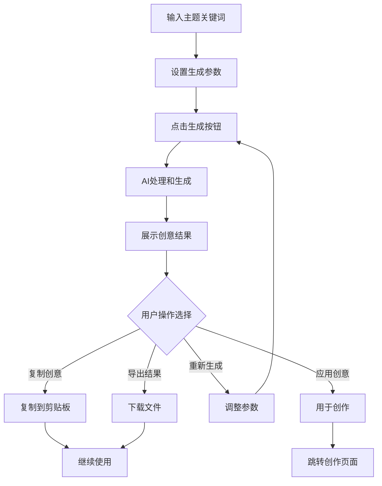
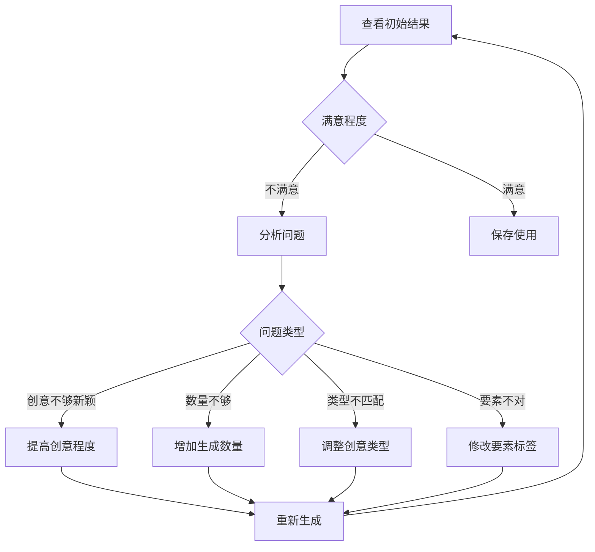

# 脑洞生成器页面设计文档

## 页面概述

脑洞生成器是AI小说创作平台的核心创意工具，帮助用户通过AI技术生成创作灵感和创意想法。页面设计注重交互的流畅性和生成结果的多样性，为用户提供源源不断的创作灵感。

## 页面布局设计

### 整体结构
```
┌─────────────────────────────────────────┐
│              页面头部                      │
│         (标题 + 使用说明)                  │
├─────────────────────────────────────────┤
│              输入控制区域                   │
│  ┌─────────────────────────────────────┐ │
│  │            主题输入框                │ │
│  ├─────────────────────────────────────┤ │
│  │           生成参数设置               │ │
│  │  (创意程度/数量/类型/要素)           │ │
│  ├─────────────────────────────────────┤ │
│  │         ┌─────────┐                │ │
│  │         │ 生成按钮 │                │ │
│  │         └─────────┘                │ │
│  └─────────────────────────────────────┘ │
├─────────────────────────────────────────┤
│              生成结果区域                   │
│  ┌─────────────┐ ┌─────────────┐       │
│  │   创意1     │ │   创意2     │       │
│  │ (一键复制)   │ │ (一键复制)   │       │
│  └─────────────┘ └─────────────┘       │
│  ┌─────────────┐ ┌─────────────┐       │
│  │   创意3     │ │   创意4     │       │
│  └─────────────┘ └─────────────┘       │
├─────────────────────────────────────────┤
│              历史记录区域                   │
│         (最近生成的创意记录)                │
└─────────────────────────────────────────┘
```

### 组件层次结构
```
BrainGeneratorView.vue
├── PageHeader.vue (页面标题和说明)
├── GeneratorPanel.vue (生成控制面板)
│   ├── TopicInput.vue (主题输入)
│   ├── ParameterSettings.vue (参数设置)
│   └── GenerateButton.vue (生成按钮)
├── ResultsDisplay.vue (结果展示区域)
│   ├── IdeaCard.vue (创意卡片)
│   ├── BatchActions.vue (批量操作)
│   └── ExportPanel.vue (导出功能)
├── HistoryPanel.vue (历史记录)
└── UsageTipsDialog.vue (使用提示对话框)
```

### 响应式布局方案

#### 桌面端 (≥1024px)
- 左右布局：左侧控制面板(30%)，右侧结果展示(70%)
- 结果区域3-4列网格展示
- 固定侧边栏，结果区域可滚动
- 详细的参数控制选项

#### 平板端 (768px - 1023px)
- 上下布局：控制面板在上，结果在下
- 结果区域2列网格展示
- 折叠式参数设置
- 适中的控件尺寸

#### 移动端 (<768px)
- 垂直单列布局
- 结果区域1列展示
- 简化参数选项
- 大按钮便于触摸操作

### UI组件选择和样式规范

#### 组件库选择
- **输入组件**: el-input, el-textarea
- **选择器**: el-select, el-slider, el-switch
- **按钮**: el-button, el-button-group
- **卡片**: el-card (创意展示)
- **标签**: el-tag (类型标识)
- **复制**: el-tooltip + 复制功能
- **历史**: el-timeline, el-collapse

#### 设计规范
```scss
// 生成器主面板样式
.brain-generator {
  min-height: calc(100vh - 120px);
  
  .generator-panel {
    background: #ffffff;
    border-radius: 12px;
    padding: 24px;
    box-shadow: 0 4px 12px rgba(0, 0, 0, 0.1);
    
    .panel-title {
      font-size: 20px;
      font-weight: 600;
      color: #303133;
      margin-bottom: 20px;
      display: flex;
      align-items: center;
      
      .icon {
        margin-right: 8px;
        color: #67C23A;
      }
    }
    
    .input-section {
      margin-bottom: 24px;
      
      .input-label {
        font-weight: 500;
        color: #606266;
        margin-bottom: 8px;
        display: block;
      }
      
      .topic-input {
        .el-textarea__inner {
          min-height: 100px;
          font-size: 16px;
          line-height: 1.5;
        }
      }
    }
    
    .parameter-section {
      .parameter-group {
        margin-bottom: 20px;
        padding: 16px;
        background: #F8F9FA;
        border-radius: 8px;
        
        .group-title {
          font-weight: 500;
          margin-bottom: 12px;
          color: #303133;
        }
        
        .parameter-item {
          display: flex;
          justify-content: space-between;
          align-items: center;
          margin-bottom: 8px;
          
          .item-label {
            flex: 1;
            color: #606266;
          }
          
          .item-control {
            flex: 1;
            margin-left: 16px;
          }
        }
      }
    }
    
    .generate-section {
      text-align: center;
      
      .generate-btn {
        padding: 12px 32px;
        font-size: 16px;
        background: linear-gradient(45deg, #67C23A, #85CE61);
        border: none;
        border-radius: 25px;
        color: white;
        transition: all 0.3s ease;
        
        &:hover {
          transform: translateY(-2px);
          box-shadow: 0 6px 16px rgba(103, 194, 58, 0.3);
        }
        
        &.loading {
          background: #C0C4CC;
          transform: none;
          box-shadow: none;
        }
        
        .icon {
          margin-right: 8px;
        }
      }
    }
  }
  
  .results-area {
    background: #F8F9FA;
    border-radius: 12px;
    padding: 24px;
    min-height: 500px;
    
    .results-header {
      display: flex;
      justify-content: space-between;
      align-items: center;
      margin-bottom: 20px;
      
      .results-title {
        font-size: 18px;
        font-weight: 600;
        color: #303133;
      }
      
      .results-actions {
        display: flex;
        gap: 8px;
      }
    }
    
    .ideas-grid {
      display: grid;
      grid-template-columns: repeat(auto-fill, minmax(300px, 1fr));
      gap: 16px;
      
      .idea-card {
        background: #ffffff;
        border-radius: 8px;
        padding: 20px;
        border: 1px solid #EBEEF5;
        transition: all 0.3s ease;
        position: relative;
        
        &:hover {
          border-color: #67C23A;
          box-shadow: 0 4px 12px rgba(103, 194, 58, 0.15);
        }
        
        .card-header {
          display: flex;
          justify-content: space-between;
          align-items: flex-start;
          margin-bottom: 12px;
          
          .idea-index {
            background: #67C23A;
            color: white;
            width: 24px;
            height: 24px;
            border-radius: 50%;
            display: flex;
            align-items: center;
            justify-content: center;
            font-size: 12px;
            font-weight: bold;
          }
          
          .card-actions {
            display: flex;
            gap: 4px;
          }
        }
        
        .idea-content {
          color: #303133;
          line-height: 1.6;
          font-size: 14px;
          margin-bottom: 12px;
          word-break: break-word;
        }
        
        .card-footer {
          display: flex;
          justify-content: space-between;
          align-items: center;
          
          .idea-tags {
            display: flex;
            gap: 4px;
            flex-wrap: wrap;
            
            .tag {
              font-size: 12px;
              padding: 2px 6px;
            }
          }
          
          .copy-button {
            padding: 4px 12px;
            font-size: 12px;
            border-radius: 15px;
            
            &.copied {
              background: #67C23A;
              border-color: #67C23A;
              color: white;
            }
          }
        }
      }
    }
    
    .empty-state {
      text-align: center;
      padding: 60px 20px;
      color: #909399;
      
      .empty-icon {
        font-size: 64px;
        color: #C0C4CC;
        margin-bottom: 16px;
      }
      
      .empty-text {
        font-size: 16px;
        margin-bottom: 8px;
      }
      
      .empty-description {
        font-size: 14px;
        color: #C0C4CC;
      }
    }
  }
}

// 参数控制样式
.creativity-slider {
  .el-slider__bar {
    background: linear-gradient(90deg, #409EFF, #67C23A, #E6A23C);
  }
  
  .el-slider__button {
    border: 2px solid #ffffff;
    box-shadow: 0 2px 6px rgba(0, 0, 0, 0.2);
  }
}

// 历史记录样式
.history-panel {
  .history-item {
    padding: 12px;
    border-left: 3px solid #EBEEF5;
    margin-bottom: 8px;
    background: #F8F9FA;
    border-radius: 0 6px 6px 0;
    transition: all 0.3s ease;
    
    &:hover {
      border-left-color: #67C23A;
      background: #F0F9FF;
    }
    
    .history-topic {
      font-weight: 500;
      color: #303133;
      margin-bottom: 4px;
    }
    
    .history-meta {
      font-size: 12px;
      color: #909399;
      display: flex;
      justify-content: space-between;
    }
  }
}
```

## 按钮功能设计

### 主要操作按钮

#### 1. 生成脑洞按钮
- **位置**: 控制面板底部中央
- **样式**: 大尺寸渐变按钮，带动画效果
- **功能**: 根据输入主题和参数生成创意
- **状态**: 支持加载状态和禁用状态
- **交互**:
  ```typescript
  const generateIdeas = async () => {
    if (!topicInput.value.trim()) {
      ElMessage.warning('请先输入一个主题或关键词');
      return;
    }
    
    try {
      isGenerating.value = true;
      
      const request = {
        topic: topicInput.value,
        creativity_level: creativityLevel.value,
        idea_count: ideaCount.value,
        idea_type: selectedIdeaType.value,
        elements: selectedElements.value,
        style: generationStyle.value,
        language: 'zh-CN'
      };
      
      const response = await generationAPI.generateBrainStorm(request);
      
      if (response.success) {
        generatedIdeas.value = response.ideas;
        saveToHistory(request, response);
        ElMessage.success(`成功生成${response.ideas.length}个创意`);
      }
      
    } catch (error) {
      handleGenerationError(error);
    } finally {
      isGenerating.value = false;
    }
  };
  ```

#### 2. 一键复制按钮
- **位置**: 每个创意卡片右下角
- **样式**: 小尺寸圆角按钮
- **功能**: 复制单个创意到剪贴板
- **反馈**: 复制成功时按钮变绿并显示"已复制"
- **交互**:
  ```typescript
  const copyIdea = async (idea: string, index: number) => {
    try {
      await navigator.clipboard.writeText(idea);
      
      // 更新按钮状态
      copiedStates.value[index] = true;
      
      ElMessage({
        type: 'success',
        message: '创意已复制到剪贴板',
        duration: 1500
      });
      
      // 2秒后恢复按钮状态
      setTimeout(() => {
        copiedStates.value[index] = false;
      }, 2000);
      
    } catch (error) {
      // 降级方案：使用传统复制方法
      fallbackCopyText(idea);
      ElMessage.success('创意已复制');
    }
  };
  ```

#### 3. 批量复制按钮
- **位置**: 结果区域头部操作栏
- **样式**: Default类型，带图标
- **功能**: 复制所有生成的创意
- **格式**: 带编号的列表格式
- **交互**:
  ```typescript
  const copyAllIdeas = async () => {
    if (generatedIdeas.value.length === 0) {
      ElMessage.warning('没有可复制的创意');
      return;
    }
    
    const formattedText = generatedIdeas.value
      .map((idea, index) => `${index + 1}. ${idea.content}`)
      .join('\n\n');
      
    try {
      await navigator.clipboard.writeText(formattedText);
      ElMessage.success(`已复制${generatedIdeas.value.length}个创意`);
    } catch (error) {
      fallbackCopyText(formattedText);
    }
  };
  ```

#### 4. 导出按钮
- **位置**: 结果区域头部操作栏
- **样式**: Info类型，带下拉菜单
- **功能**: 导出创意为不同格式
- **格式**: TXT, JSON, CSV
- **交互**:
  ```typescript
  const exportIdeas = (format: 'txt' | 'json' | 'csv') => {
    if (generatedIdeas.value.length === 0) {
      ElMessage.warning('没有可导出的创意');
      return;
    }
    
    let content = '';
    let filename = '';
    let mimeType = '';
    
    switch (format) {
      case 'txt':
        content = formatAsText(generatedIdeas.value);
        filename = `脑洞创意_${formatDate(new Date())}.txt`;
        mimeType = 'text/plain';
        break;
        
      case 'json':
        content = JSON.stringify({
          topic: topicInput.value,
          generated_at: new Date().toISOString(),
          ideas: generatedIdeas.value
        }, null, 2);
        filename = `脑洞创意_${formatDate(new Date())}.json`;
        mimeType = 'application/json';
        break;
        
      case 'csv':
        content = formatAsCSV(generatedIdeas.value);
        filename = `脑洞创意_${formatDate(new Date())}.csv`;
        mimeType = 'text/csv';
        break;
    }
    
    downloadFile(content, filename, mimeType);
    ElMessage.success('导出成功');
  };
  ```

#### 5. 重新生成按钮
- **位置**: 结果区域头部操作栏
- **样式**: Warning类型，图标按钮
- **功能**: 使用相同参数重新生成
- **确认**: 有结果时询问是否覆盖
- **交互**:
  ```typescript
  const regenerateIdeas = async () => {
    if (generatedIdeas.value.length > 0) {
      const confirmed = await ElMessageBox.confirm(
        '重新生成将覆盖当前结果，是否继续？',
        '确认重新生成',
        {
          confirmButtonText: '重新生成',
          cancelButtonText: '取消',
          type: 'warning'
        }
      ).catch(() => false);
      
      if (!confirmed) return;
    }
    
    await generateIdeas();
  };
  ```

### 参数控制按钮

#### 6. 创意程度滑块
- **位置**: 参数设置区域
- **功能**: 控制AI生成的创意程度
- **范围**: 1-10，1为保守，10为极具创意
- **默认值**: 7
- **交互**:
  ```typescript
  const creativityLevels = {
    1: '非常保守',
    3: '比较保守', 
    5: '中等创意',
    7: '富有创意',
    10: '极具创意'
  };
  
  const onCreativityChange = (value: number) => {
    creativityLevel.value = value;
    creativityDescription.value = creativityLevels[value] || '富有创意';
  };
  ```

#### 7. 生成数量选择器
- **位置**: 参数设置区域
- **功能**: 设置一次生成的创意数量
- **选项**: 5, 10, 15, 20个
- **默认值**: 10
- **限制**: 考虑API限制和性能

#### 8. 创意类型选择器
- **位置**: 参数设置区域
- **功能**: 选择生成创意的类型
- **选项**: 情节创意、角色创意、世界观创意、混合创意
- **多选**: 支持多种类型组合

#### 9. 要素标签选择器
- **位置**: 参数设置区域
- **功能**: 添加特定要素到生成提示中
- **选项**: 玄幻、科幻、现代、古代、爱情、冒险、悬疑等
- **交互**: 标签点击切换选中状态

### 历史功能按钮

#### 10. 查看历史按钮
- **位置**: 页面右侧或底部
- **样式**: Text类型，折叠面板触发器
- **功能**: 展开/收起历史记录面板
- **显示**: 显示最近20条生成记录

#### 11. 应用历史参数按钮
- **位置**: 历史记录项右侧
- **样式**: 小尺寸链接按钮
- **功能**: 应用历史记录的参数设置
- **交互**:
  ```typescript
  const applyHistoryParams = (historyItem: HistoryItem) => {
    topicInput.value = historyItem.topic;
    creativityLevel.value = historyItem.parameters.creativity_level;
    ideaCount.value = historyItem.parameters.idea_count;
    selectedIdeaType.value = historyItem.parameters.idea_type;
    selectedElements.value = [...historyItem.parameters.elements];
    
    ElMessage.success('参数已应用');
  };
  ```

#### 12. 清空历史按钮
- **位置**: 历史面板头部
- **样式**: Danger类型，Text样式
- **功能**: 清空所有历史记录
- **确认**: 二次确认对话框

### 用户操作流程

#### 基本生成流程


#### 参数调优流程


### 状态变化和反馈

#### 生成状态管理
```typescript
const generationStates = ref({
  isGenerating: false,      // 正在生成
  progress: 0,              // 生成进度
  currentStep: '',          // 当前步骤
  hasResults: false,        // 是否有结果
  lastGeneration: null      // 最后生成时间
});

// 生成进度模拟
const simulateProgress = () => {
  const steps = [
    '分析主题内容...',
    '构建创意框架...',
    '生成创意要点...',
    '优化表达方式...',
    '完成创意生成...'
  ];
  
  let stepIndex = 0;
  const progressInterval = setInterval(() => {
    if (stepIndex < steps.length) {
      generationStates.value.currentStep = steps[stepIndex];
      generationStates.value.progress = ((stepIndex + 1) / steps.length) * 100;
      stepIndex++;
    } else {
      clearInterval(progressInterval);
    }
  }, 800);
  
  return progressInterval;
};
```

#### 复制状态反馈
```typescript
const copiedStates = ref<boolean[]>([]);

// 初始化复制状态
watch(generatedIdeas, (ideas) => {
  copiedStates.value = new Array(ideas.length).fill(false);
});

// 复制状态重置
const resetCopyState = (index: number) => {
  setTimeout(() => {
    copiedStates.value[index] = false;
  }, 2000);
};
```

#### 错误状态处理
```typescript
const errorStates = ref({
  hasError: false,
  errorMessage: '',
  errorType: '',
  canRetry: true
});

const handleGenerationError = (error: any) => {
  const { status, data } = error.response || {};
  
  errorStates.value.hasError = true;
  
  switch (status) {
    case 429:
      errorStates.value.errorType = 'rate_limit';
      errorStates.value.errorMessage = '生成请求过于频繁，请稍后再试';
      errorStates.value.canRetry = true;
      break;
      
    case 400:
      errorStates.value.errorType = 'invalid_input';
      errorStates.value.errorMessage = '输入内容有误，请检查主题和参数设置';
      errorStates.value.canRetry = true;
      break;
      
    case 503:
      errorStates.value.errorType = 'service_unavailable';
      errorStates.value.errorMessage = 'AI服务暂时不可用，请稍后重试';
      errorStates.value.canRetry = true;
      break;
      
    default:
      errorStates.value.errorType = 'unknown';
      errorStates.value.errorMessage = '生成失败，请稍后重试';
      errorStates.value.canRetry = true;
  }
  
  ElMessage.error(errorStates.value.errorMessage);
};
```

## 后端接口列表设计

### 核心生成接口

#### 1. 脑洞生成接口
```typescript
// POST /api/v1/generation/brain-storm
interface BrainStormRequest {
  topic: string;                    // 主题关键词 (必填)
  creativity_level?: number;        // 创意程度 1-10 (默认7)
  idea_count?: number;             // 生成数量 (默认10, 最大20)
  idea_type?: ('plot' | 'character' | 'worldview' | 'mixed')[];  // 创意类型
  elements?: string[];             // 要素标签
  style?: string;                  // 生成风格
  language?: string;               // 语言 (默认zh-CN)
  avoid_keywords?: string[];       // 避免的关键词
  reference_works?: string[];      // 参考作品
}

interface BrainStormResponse {
  success: boolean;
  ideas: GeneratedIdea[];
  generation_id: string;
  metadata: {
    topic: string;
    parameters: BrainStormRequest;
    generation_time: number;
    model_used: string;
    prompt_tokens: number;
    completion_tokens: number;
  };
}

interface GeneratedIdea {
  id: string;
  content: string;                 // 创意内容
  type: string;                   // 创意类型
  tags: string[];                 // 相关标签
  creativity_score: number;       // 创意评分
  practical_score: number;        // 实用性评分
  summary: string;                // 简要总结
  potential_development: string;   // 发展潜力描述
  related_elements: string[];     // 相关要素
}
```

#### 2. 获取生成历史
```typescript
// GET /api/v1/generation/brain-storm/history?limit=20&offset=0
interface BrainStormHistoryResponse {
  history: HistoryItem[];
  total: number;
  limit: number;
  offset: number;
}

interface HistoryItem {
  id: string;
  topic: string;
  parameters: BrainStormRequest;
  ideas_count: number;
  created_at: string;
  generation_time: number;
  rating?: number;               // 用户评分
  tags: string[];               // 用户标签
}
```

#### 3. 获取历史详情
```typescript
// GET /api/v1/generation/brain-storm/history/{history_id}
interface HistoryDetailResponse {
  history: HistoryItem;
  ideas: GeneratedIdea[];
  usage_stats: {
    copied_count: number;
    exported_count: number;
    applied_count: number;
  };
}
```

### 辅助功能接口

#### 4. 获取推荐要素
```typescript
// GET /api/v1/generation/brain-storm/elements?category={category}
interface ElementSuggestionsResponse {
  categories: ElementCategory[];
}

interface ElementCategory {
  category: string;
  display_name: string;
  elements: ElementItem[];
}

interface ElementItem {
  name: string;
  description: string;
  usage_count: number;
  effectiveness_score: number;
  related_elements: string[];
}
```

#### 5. 主题建议接口
```typescript
// GET /api/v1/generation/brain-storm/topic-suggestions?q={query}
interface TopicSuggestionsResponse {
  suggestions: TopicSuggestion[];
}

interface TopicSuggestion {
  topic: string;
  description: string;
  popularity: number;
  expected_ideas: number;
  related_topics: string[];
  sample_ideas: string[];
}
```

#### 6. 生成统计接口
```typescript
// GET /api/v1/generation/brain-storm/stats
interface GenerationStatsResponse {
  total_generations: number;
  total_ideas: number;
  average_ideas_per_generation: number;
  most_popular_elements: string[];
  creativity_distribution: {
    level: number;
    count: number;
  }[];
  usage_trends: {
    date: string;
    generations: number;
  }[];
}
```

### 用户偏好接口

#### 7. 保存用户偏好
```typescript
// POST /api/v1/generation/brain-storm/preferences
interface SavePreferencesRequest {
  default_creativity_level?: number;
  default_idea_count?: number;
  preferred_types?: string[];
  favorite_elements?: string[];
  default_style?: string;
  auto_save_history?: boolean;
}

interface SavePreferencesResponse {
  success: boolean;
  preferences: UserPreferences;
}
```

#### 8. 获取用户偏好
```typescript
// GET /api/v1/generation/brain-storm/preferences
interface UserPreferences {
  default_creativity_level: number;
  default_idea_count: number;
  preferred_types: string[];
  favorite_elements: string[];
  default_style: string;
  auto_save_history: boolean;
  updated_at: string;
}
```

#### 9. 评价生成结果
```typescript
// POST /api/v1/generation/brain-storm/{generation_id}/rating
interface RateGenerationRequest {
  rating: number;               // 1-5星评分
  feedback?: string;           // 文字反馈
  useful_ideas?: string[];     // 有用的创意ID
  improvement_suggestions?: string;  // 改进建议
}

interface RateGenerationResponse {
  success: boolean;
  average_rating: number;
  feedback_received: boolean;
}
```

### 接口调用时机和错误处理

#### 调用时机设计
```typescript
// 页面初始化
onMounted(async () => {
  try {
    // 并行加载用户偏好和要素建议
    const [preferences, elements] = await Promise.all([
      generationAPI.getUserPreferences(),
      generationAPI.getElementSuggestions()
    ]);
    
    // 应用用户偏好
    applyUserPreferences(preferences);
    availableElements.value = elements;
    
    // 加载最近历史（后台）
    loadRecentHistory();
    
  } catch (error) {
    console.warn('Failed to load initial data:', error);
    // 使用默认设置
    useDefaultSettings();
  }
});

// 主题输入时获取建议
const debouncedTopicSuggestions = debounce(async (query: string) => {
  if (query.length >= 2) {
    try {
      const suggestions = await generationAPI.getTopicSuggestions(query);
      topicSuggestions.value = suggestions.suggestions;
    } catch (error) {
      console.warn('Failed to load topic suggestions:', error);
    }
  }
}, 300);

// 生成完成后保存历史
const saveGenerationToHistory = async (request: BrainStormRequest, response: BrainStormResponse) => {
  try {
    await generationAPI.saveToHistory({
      generation_id: response.generation_id,
      topic: request.topic,
      parameters: request,
      ideas: response.ideas
    });
  } catch (error) {
    console.warn('Failed to save history:', error);
  }
};
```

#### 错误处理策略

##### 1. 生成请求错误处理
```typescript
const handleGenerationError = (error: AxiosError) => {
  const { status, data } = error.response || {};
  
  switch (status) {
    case 400:
      // 请求参数错误
      ElNotification({
        title: '参数错误',
        message: data?.message || '请检查输入的主题和参数设置',
        type: 'error',
        duration: 5000
      });
      break;
      
    case 429:
      // 请求频率限制
      ElNotification({
        title: '请求过于频繁',
        message: '您的生成请求过于频繁，请稍后再试',
        type: 'warning',
        duration: 5000
      });
      
      // 显示剩余冷却时间
      showCooldownTimer(data?.retry_after);
      break;
      
    case 503:
      // 服务不可用
      ElNotification({
        title: 'AI服务暂时不可用',
        message: '服务正在维护中，请稍后重试',
        type: 'error',
        duration: 5000
      });
      
      // 启用离线模式或降级功能
      enableFallbackMode();
      break;
      
    default:
      ElNotification({
        title: '生成失败',
        message: '创意生成失败，请稍后重试',
        type: 'error',
        duration: 3000
      });
  }
  
  // 重置生成状态
  isGenerating.value = false;
  generationStates.value.progress = 0;
};
```

##### 2. 网络错误处理
```typescript
const handleNetworkError = (error: AxiosError) => {
  if (!navigator.onLine) {
    ElMessage({
      type: 'warning',
      message: '网络连接已断开，请检查网络设置',
      duration: 5000
    });
    
    // 启用离线模式
    enableOfflineMode();
    return;
  }
  
  if (error.code === 'ECONNABORTED') {
    ElMessage.error('请求超时，请检查网络连接后重试');
    return;
  }
  
  ElMessage.error('网络错误，请稍后重试');
};

// 离线模式处理
const enableOfflineMode = () => {
  isOfflineMode.value = true;
  
  ElNotification({
    title: '离线模式',
    message: '当前处于离线状态，您可以查看历史记录或使用本地功能',
    type: 'info',
    duration: 0,
    position: 'bottom-right'
  });
  
  // 加载本地缓存的数据
  loadCachedData();
};
```

##### 3. 降级功能处理
```typescript
const enableFallbackMode = () => {
  showFallbackNotice.value = true;
  
  // 提供备用功能
  fallbackFeatures.value = {
    randomIdeaGenerator: true,    // 随机创意生成器
    templateLibrary: true,        // 创意模板库
    historyBrowser: true,         // 历史记录浏览
    manualInput: true            // 手动输入助手
  };
  
  ElNotification({
    title: '功能降级',
    message: '部分AI功能暂时不可用，已启用替代功能',
    type: 'warning',
    duration: 5000
  });
};
```

#### 数据缓存和同步

##### 缓存策略
```typescript
// 生成结果缓存
const CACHE_CONFIG = {
  ideas: { ttl: 30 * 60 * 1000 },        // 创意结果30分钟
  history: { ttl: 10 * 60 * 1000 },      // 历史记录10分钟
  elements: { ttl: 24 * 60 * 60 * 1000 }, // 要素建议24小时
  preferences: { ttl: 7 * 24 * 60 * 60 * 1000 } // 用户偏好7天
};

// 智能缓存键生成
const generateCacheKey = (request: BrainStormRequest) => {
  const keyData = {
    topic: request.topic.toLowerCase().trim(),
    creativity_level: request.creativity_level,
    idea_type: request.idea_type?.sort(),
    elements: request.elements?.sort()
  };
  
  return `brain_storm_${btoa(JSON.stringify(keyData))}`;
};

// 缓存结果
const cacheGenerationResult = (request: BrainStormRequest, response: BrainStormResponse) => {
  const cacheKey = generateCacheKey(request);
  const cacheData = {
    timestamp: Date.now(),
    request,
    response
  };
  
  localStorage.setItem(cacheKey, JSON.stringify(cacheData));
};

// 获取缓存结果
const getCachedResult = (request: BrainStormRequest): BrainStormResponse | null => {
  const cacheKey = generateCacheKey(request);
  const cached = localStorage.getItem(cacheKey);
  
  if (cached) {
    try {
      const { timestamp, response } = JSON.parse(cached);
      const age = Date.now() - timestamp;
      
      if (age < CACHE_CONFIG.ideas.ttl) {
        return response;
      } else {
        localStorage.removeItem(cacheKey);
      }
    } catch (error) {
      localStorage.removeItem(cacheKey);
    }
  }
  
  return null;
};
```

## 性能优化考虑

### 生成优化
```typescript
// 流式生成（如果支持）
const streamGeneration = async (request: BrainStormRequest) => {
  const response = await fetch('/api/v1/generation/brain-storm/stream', {
    method: 'POST',
    headers: { 'Content-Type': 'application/json' },
    body: JSON.stringify(request)
  });
  
  const reader = response.body?.getReader();
  if (!reader) return;
  
  while (true) {
    const { done, value } = await reader.read();
    if (done) break;
    
    const chunk = new TextDecoder().decode(value);
    const lines = chunk.split('\n');
    
    for (const line of lines) {
      if (line.startsWith('data: ')) {
        const data = JSON.parse(line.slice(6));
        if (data.type === 'idea') {
          generatedIdeas.value.push(data.idea);
        } else if (data.type === 'progress') {
          generationStates.value.progress = data.progress;
        }
      }
    }
  }
};

// 预生成建议
const preloadSuggestions = async () => {
  const popularTopics = await generationAPI.getPopularTopics();
  
  // 预生成热门主题的创意（后台进行）
  Promise.all(
    popularTopics.slice(0, 3).map(topic => 
      generationAPI.generateBrainStorm({
        topic: topic.name,
        idea_count: 5,
        creativity_level: 7
      }).then(result => 
        cacheGenerationResult({ topic: topic.name }, result)
      ).catch(() => {})
    )
  );
};
```

### UI优化
```typescript
// 虚拟滚动（大量创意时）
const useVirtualScroll = (items: Ref<GeneratedIdea[]>) => {
  const containerRef = ref<HTMLElement>();
  const itemHeight = 200;
  const visibleCount = 6;
  
  const scrollTop = ref(0);
  const startIndex = computed(() => Math.floor(scrollTop.value / itemHeight));
  const endIndex = computed(() => Math.min(startIndex.value + visibleCount, items.value.length));
  const visibleItems = computed(() => items.value.slice(startIndex.value, endIndex.value));
  
  return {
    containerRef,
    visibleItems,
    startIndex,
    scrollTop
  };
};

// 图片懒加载（如果有插图）
const useLazyLoad = () => {
  const imageObserver = new IntersectionObserver((entries) => {
    entries.forEach(entry => {
      if (entry.isIntersecting) {
        const img = entry.target as HTMLImageElement;
        img.src = img.dataset.src || '';
        imageObserver.unobserve(img);
      }
    });
  });
  
  return { imageObserver };
};