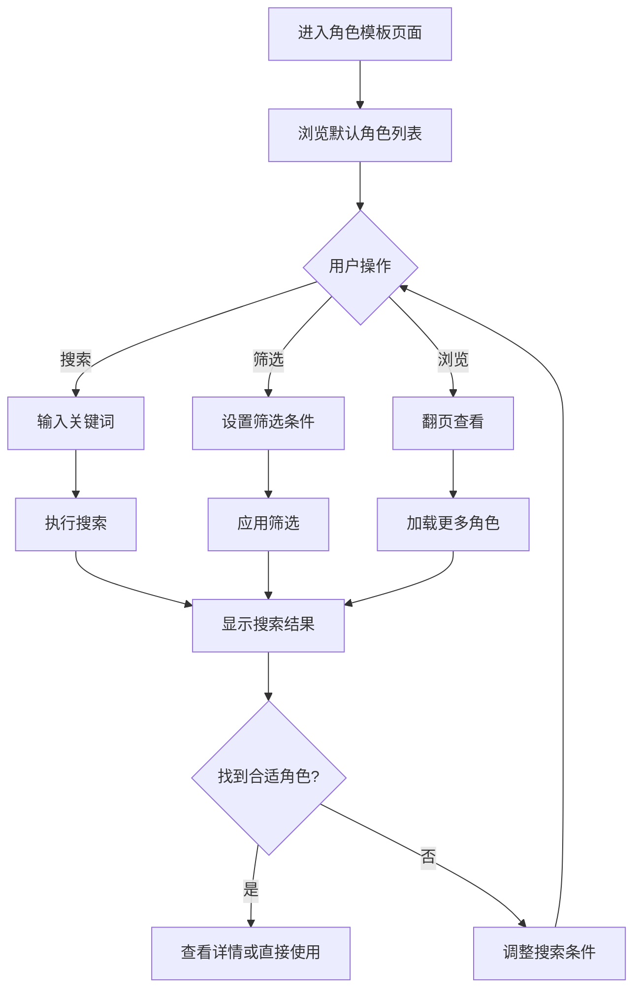
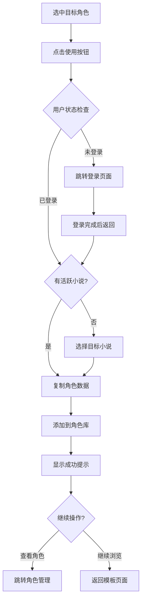

# 角色模板页面设计文档

## 页面概述

角色模板页面是一个预置角色资源库，为用户提供丰富的角色模板供参考和使用。页面设计注重角色信息的清晰展示、高效的筛选搜索功能，以及便捷的角色复制和应用机制。

## 页面布局设计

### 整体结构
```
┌─────────────────────────────────────────┐
│              页面头部                      │
│         (标题 + 搜索框 + 筛选按钮)          │
├─────────────────────────────────────────┤
│              筛选工具栏                    │
│  ┌─────────────────────────────────────┐ │
│  │ 性别 | 力量体系 | 世界观 | 标签 | 重置 │ │
│  └─────────────────────────────────────┘ │
├─────────────────────────────────────────┤
│              角色展示区域                   │
│  ┌─────────┐ ┌─────────┐ ┌─────────┐   │
│  │  角色1  │ │  角色2  │ │  角色3  │   │
│  │ 头像+信息│ │ 头像+信息│ │ 头像+信息│   │
│  │ [使用]   │ │ [使用]   │ │ [使用]   │   │
│  └─────────┘ └─────────┘ └─────────┘   │
│  ┌─────────┐ ┌─────────┐ ┌─────────┐   │
│  │  角色4  │ │  角色5  │ │  角色6  │   │
│  └─────────┘ └─────────┘ └─────────┘   │
├─────────────────────────────────────────┤
│              分页组件                      │
└─────────────────────────────────────────┘
```

### 组件层次结构
```
CharacterTemplatesView.vue
├── PageHeader.vue (页面标题和搜索)
├── FilterToolbar.vue (筛选工具栏)
│   ├── GenderFilter.vue (性别筛选)
│   ├── PowerSystemFilter.vue (力量体系筛选)
│   ├── WorldviewFilter.vue (世界观筛选)
│   ├── TagFilter.vue (标签筛选)
│   └── FilterReset.vue (重置筛选)
├── CharacterGrid.vue (角色网格展示)
│   ├── CharacterCard.vue (角色卡片)
│   ├── CharacterModal.vue (角色详情弹窗)
│   └── BatchActions.vue (批量操作)
├── PaginationBar.vue (分页控件)
└── EmptyState.vue (空状态组件)
```

### 响应式布局方案

#### 桌面端 (≥1200px)
- 5列网格布局，每行显示5个角色卡片
- 左侧筛选面板固定，右侧滚动
- 卡片尺寸: 220px × 300px
- 悬浮详情预览

#### 平板端 (768px - 1199px)
- 3列网格布局，每行显示3个角色卡片
- 顶部筛选工具栏，可折叠
- 卡片尺寸: 200px × 280px
- 点击查看详情

#### 移动端 (<768px)
- 2列网格布局，每行显示2个角色卡片
- 抽屉式筛选面板
- 卡片尺寸: 160px × 220px
- 简化信息展示

### UI组件选择和样式规范

#### 组件库选择
- **搜索框**: el-input (带搜索图标)
- **筛选器**: el-select, el-checkbox-group
- **卡片**: el-card (角色展示)
- **标签**: el-tag (角色标签)
- **按钮**: el-button (操作按钮)
- **分页**: el-pagination
- **对话框**: el-dialog (角色详情)

#### 设计规范
```scss
// 角色模板页面样式
.character-templates {
  min-height: calc(100vh - 120px);
  
  .page-header {
    padding: 24px 0;
    border-bottom: 1px solid #EBEEF5;
    margin-bottom: 24px;
    
    .header-content {
      display: flex;
      justify-content: space-between;
      align-items: center;
      
      .page-title {
        font-size: 24px;
        font-weight: 600;
        color: #303133;
        
        .subtitle {
          font-size: 14px;
          color: #909399;
          font-weight: normal;
          margin-top: 4px;
        }
      }
      
      .search-box {
        width: 320px;
        
        .el-input__inner {
          border-radius: 20px;
          padding-left: 40px;
        }
        
        .search-icon {
          position: absolute;
          left: 12px;
          top: 50%;
          transform: translateY(-50%);
          color: #C0C4CC;
        }
      }
    }
  }
  
  .filter-toolbar {
    background: #F8F9FA;
    padding: 16px 20px;
    border-radius: 8px;
    margin-bottom: 24px;
    
    .filter-group {
      display: flex;
      gap: 24px;
      align-items: center;
      flex-wrap: wrap;
      
      .filter-item {
        display: flex;
        align-items: center;
        gap: 8px;
        
        .filter-label {
          font-weight: 500;
          color: #606266;
          white-space: nowrap;
        }
        
        .filter-control {
          min-width: 120px;
        }
      }
      
      .filter-actions {
        margin-left: auto;
        
        .reset-btn {
          color: #909399;
          
          &:hover {
            color: #409EFF;
          }
        }
      }
    }
    
    .active-filters {
      margin-top: 12px;
      
      .filter-tag {
        margin-right: 8px;
        margin-bottom: 4px;
      }
    }
  }
  
  .character-grid {
    display: grid;
    grid-template-columns: repeat(auto-fill, minmax(220px, 1fr));
    gap: 20px;
    margin-bottom: 32px;
    
    .character-card {
      background: #ffffff;
      border-radius: 12px;
      overflow: hidden;
      box-shadow: 0 2px 8px rgba(0, 0, 0, 0.1);
      transition: all 0.3s ease;
      position: relative;
      
      &:hover {
        transform: translateY(-4px);
        box-shadow: 0 8px 24px rgba(0, 0, 0, 0.15);
      }
      
      .card-header {
        position: relative;
        height: 120px;
        background: linear-gradient(135deg, #667eea 0%, #764ba2 100%);
        display: flex;
        align-items: center;
        justify-content: center;
        
        .character-avatar {
          width: 80px;
          height: 80px;
          border-radius: 50%;
          border: 3px solid #ffffff;
          object-fit: cover;
        }
        
        .avatar-placeholder {
          width: 80px;
          height: 80px;
          border-radius: 50%;
          background: rgba(255, 255, 255, 0.3);
          display: flex;
          align-items: center;
          justify-content: center;
          font-size: 32px;
          color: #ffffff;
        }
        
        .card-badge {
          position: absolute;
          top: 8px;
          right: 8px;
          padding: 2px 8px;
          border-radius: 12px;
          font-size: 12px;
          font-weight: 500;
          
          &.new {
            background: #E6A23C;
            color: #ffffff;
          }
          
          &.popular {
            background: #F56C6C;
            color: #ffffff;
          }
        }
      }
      
      .card-body {
        padding: 16px;
        
        .character-name {
          font-size: 16px;
          font-weight: 600;
          color: #303133;
          margin-bottom: 8px;
          text-align: center;
        }
        
        .character-info {
          .info-item {
            display: flex;
            justify-content: space-between;
            align-items: center;
            margin-bottom: 6px;
            font-size: 13px;
            
            .label {
              color: #909399;
            }
            
            .value {
              color: #606266;
              font-weight: 500;
            }
          }
        }
        
        .character-description {
          color: #606266;
          font-size: 13px;
          line-height: 1.4;
          margin: 12px 0;
          display: -webkit-box;
          -webkit-line-clamp: 2;
          -webkit-box-orient: vertical;
          overflow: hidden;
        }
        
        .character-tags {
          margin: 12px 0;
          
          .tag {
            font-size: 11px;
            padding: 2px 6px;
            margin-right: 4px;
            margin-bottom: 4px;
          }
        }
      }
      
      .card-footer {
        padding: 12px 16px;
        border-top: 1px solid #F2F6FC;
        display: flex;
        gap: 8px;
        
        .use-btn {
          flex: 1;
          border-radius: 16px;
          font-size: 13px;
          padding: 6px 16px;
        }
        
        .detail-btn {
          padding: 6px 12px;
          border-radius: 16px;
          font-size: 13px;
        }
      }
    }
  }
  
  .empty-state {
    text-align: center;
    padding: 80px 20px;
    
    .empty-icon {
      font-size: 64px;
      color: #C0C4CC;
      margin-bottom: 16px;
    }
    
    .empty-title {
      font-size: 18px;
      color: #606266;
      margin-bottom: 8px;
    }
    
    .empty-description {
      color: #909399;
      margin-bottom: 24px;
    }
    
    .empty-actions {
      .action-btn {
        margin: 0 8px;
      }
    }
  }
}

// 角色详情弹窗样式
.character-detail-modal {
  .modal-header {
    display: flex;
    align-items: center;
    gap: 16px;
    padding-bottom: 20px;
    border-bottom: 1px solid #EBEEF5;
    
    .character-avatar-large {
      width: 80px;
      height: 80px;
      border-radius: 50%;
      object-fit: cover;
    }
    
    .character-basic {
      flex: 1;
      
      .character-name {
        font-size: 20px;
        font-weight: 600;
        color: #303133;
        margin-bottom: 4px;
      }
      
      .character-subtitle {
        color: #909399;
        font-size: 14px;
      }
    }
  }
  
  .modal-body {
    padding: 20px 0;
    
    .detail-section {
      margin-bottom: 24px;
      
      .section-title {
        font-size: 16px;
        font-weight: 600;
        color: #303133;
        margin-bottom: 12px;
        display: flex;
        align-items: center;
        
        .icon {
          margin-right: 8px;
          color: #409EFF;
        }
      }
      
      .section-content {
        color: #606266;
        line-height: 1.6;
        
        .detail-grid {
          display: grid;
          grid-template-columns: repeat(auto-fit, minmax(200px, 1fr));
          gap: 12px;
          
          .detail-item {
            display: flex;
            
            .item-label {
              min-width: 80px;
              color: #909399;
              font-size: 14px;
            }
            
            .item-value {
              flex: 1;
              color: #303133;
              font-weight: 500;
            }
          }
        }
      }
    }
  }
  
  .modal-footer {
    padding-top: 20px;
    border-top: 1px solid #EBEEF5;
    display: flex;
    justify-content: flex-end;
    gap: 12px;
  }
}

// 筛选器样式
.filter-dropdown {
  .filter-option {
    display: flex;
    justify-content: space-between;
    align-items: center;
    
    .option-count {
      color: #909399;
      font-size: 12px;
    }
  }
}

// 响应式样式
@media (max-width: 1199px) {
  .character-templates .character-grid {
    grid-template-columns: repeat(auto-fill, minmax(200px, 1fr));
    gap: 16px;
  }
}

@media (max-width: 767px) {
  .character-templates {
    .page-header .header-content {
      flex-direction: column;
      gap: 16px;
      
      .search-box {
        width: 100%;
      }
    }
    
    .filter-toolbar .filter-group {
      flex-direction: column;
      align-items: stretch;
      gap: 12px;
      
      .filter-item {
        justify-content: space-between;
      }
      
      .filter-actions {
        margin-left: 0;
        margin-top: 8px;
      }
    }
    
    .character-grid {
      grid-template-columns: repeat(2, 1fr);
      gap: 12px;
    }
    
    .character-card .card-body {
      padding: 12px;
      
      .character-info .info-item {
        font-size: 12px;
      }
    }
  }
}
```

## 按钮功能设计

### 主要操作按钮

#### 1. 使用角色按钮
- **位置**: 角色卡片底部
- **样式**: Primary类型，圆角按钮
- **功能**: 将角色模板复制到用户的角色库
- **权限**: 需要登录，并有对应小说的编辑权限
- **交互**:
  ```typescript
  const useCharacter = async (character: CharacterTemplate) => {
    try {
      // 检查是否已登录
      if (!authStore.isAuthenticated) {
        router.push('/auth/login');
        return;
      }
      
      // 检查是否有活跃的小说项目
      if (!activeNovelId.value) {
        const novels = await novelAPI.getNovels({ limit: 20 });
        if (novels.total === 0) {
          ElMessage.warning('请先创建一个小说项目');
          router.push('/novels/create');
          return;
        }
        
        // 让用户选择要添加到哪个小说
        await showNovelSelector(novels.novels);
      }
      
      // 复制角色到用户角色库
      const characterData = {
        name: character.name,
        gender: character.gender,
        personality: character.personality,
        description: character.description,
        abilities: character.abilities,
        tags: character.tags,
        power_system: character.power_system,
        novel_id: activeNovelId.value,
        from_template: character.id
      };
      
      const createdCharacter = await characterAPI.createCharacter(characterData);
      
      ElMessage.success(`角色"${character.name}"已添加到您的角色库`);
      
      // 询问是否跳转到角色管理页面
      const goToCharacters = await ElMessageBox.confirm(
        '角色已成功添加，是否查看角色详情？',
        '添加成功',
        {
          confirmButtonText: '查看角色',
          cancelButtonText: '继续浏览',
          type: 'success'
        }
      ).catch(() => false);
      
      if (goToCharacters) {
        router.push(`/workspace/${activeNovelId.value}/characters`);
      }
      
    } catch (error) {
      handleUseCharacterError(error, character);
    }
  };
  ```

#### 2. 查看详情按钮
- **位置**: 角色卡片底部右侧
- **样式**: Default类型，小尺寸
- **功能**: 打开角色详情弹窗
- **交互**:
  ```typescript
  const viewCharacterDetail = async (character: CharacterTemplate) => {
    try {
      // 获取完整的角色信息
      const detailData = await characterAPI.getCharacterTemplate(character.id);
      
      selectedCharacter.value = detailData;
      showDetailModal.value = true;
      
      // 记录查看行为（用于推荐算法）
      trackUserBehavior('view_character_detail', {
        character_id: character.id,
        character_name: character.name,
        power_system: character.power_system
      });
      
    } catch (error) {
      ElMessage.error('无法加载角色详情');
    }
  };
  ```

#### 3. 搜索按钮
- **位置**: 搜索框右侧
- **样式**: Icon按钮，集成在输入框内
- **功能**: 执行角色搜索
- **触发**: 点击或回车键
- **交互**:
  ```typescript
  const searchCharacters = async (keyword?: string) => {
    const searchTerm = keyword || searchInput.value.trim();
    
    if (searchTerm.length < 2) {
      ElMessage.warning('请输入至少2个字符进行搜索');
      return;
    }
    
    try {
      isSearching.value = true;
      
      const searchParams = {
        keyword: searchTerm,
        ...currentFilters.value,
        page: 1,
        page_size: pageSize.value
      };
      
      const results = await characterAPI.searchCharacterTemplates(searchParams);
      
      characters.value = results.characters;
      totalCount.value = results.total;
      currentPage.value = 1;
      
      // 保存搜索历史
      saveSearchHistory(searchTerm);
      
      if (results.total === 0) {
        showEmptySearchResult.value = true;
      }
      
    } catch (error) {
      ElMessage.error('搜索失败，请稍后重试');
    } finally {
      isSearching.value = false;
    }
  };
  
  // 防抖搜索
  const debouncedSearch = debounce(searchCharacters, 300);
  ```

#### 4. 筛选器按钮组

##### 4.1 性别筛选
- **位置**: 筛选工具栏
- **样式**: 单选下拉菜单
- **选项**: 全部、男性、女性、其他
- **交互**:
  ```typescript
  const filterByGender = (gender: string) => {
    currentFilters.value.gender = gender === 'all' ? undefined : gender;
    applyFilters();
  };
  ```

##### 4.2 力量体系筛选
- **位置**: 筛选工具栏
- **样式**: 多选下拉菜单
- **选项**: 动态加载可用的力量体系
- **交互**:
  ```typescript
  const filterByPowerSystem = (systems: string[]) => {
    currentFilters.value.power_systems = systems.length > 0 ? systems : undefined;
    applyFilters();
  };
  ```

##### 4.3 世界观筛选
- **位置**: 筛选工具栏
- **样式**: 搜索式下拉菜单
- **选项**: 支持搜索的世界观列表
- **交互**:
  ```typescript
  const filterByWorldview = (worldviews: string[]) => {
    currentFilters.value.worldviews = worldviews.length > 0 ? worldviews : undefined;
    applyFilters();
  };
  ```

##### 4.4 标签筛选
- **位置**: 筛选工具栏
- **样式**: 标签多选组件
- **选项**: 热门标签 + 搜索自定义标签
- **交互**:
  ```typescript
  const filterByTags = (tags: string[]) => {
    currentFilters.value.tags = tags.length > 0 ? tags : undefined;
    applyFilters();
  };
  ```

#### 5. 重置筛选按钮
- **位置**: 筛选工具栏右侧
- **样式**: Text类型，带图标
- **功能**: 清空所有筛选条件
- **交互**:
  ```typescript
  const resetFilters = () => {
    currentFilters.value = {};
    searchInput.value = '';
    
    // 重置UI状态
    resetFilterComponents();
    
    // 重新加载数据
    loadCharacters();
    
    ElMessage.success('筛选条件已重置');
  };
  ```

#### 6. 批量操作按钮

##### 6.1 批量添加按钮
- **位置**: 选中角色时在工具栏显示
- **样式**: Primary类型，固定在页面底部
- **功能**: 批量添加选中的角色
- **交互**:
  ```typescript
  const batchAddCharacters = async () => {
    if (selectedCharacters.value.length === 0) {
      ElMessage.warning('请先选择要添加的角色');
      return;
    }
    
    try {
      const batchRequest = {
        novel_id: activeNovelId.value,
        character_templates: selectedCharacters.value.map(id => ({
          template_id: id
        }))
      };
      
      const results = await characterAPI.batchAddFromTemplates(batchRequest);
      
      const successCount = results.success_count;
      const failedCount = results.failed_count;
      
      if (successCount > 0) {
        ElMessage.success(`成功添加${successCount}个角色`);
      }
      
      if (failedCount > 0) {
        ElMessage.warning(`${failedCount}个角色添加失败`);
      }
      
      // 清空选择
      selectedCharacters.value = [];
      
    } catch (error) {
      ElMessage.error('批量添加失败，请稍后重试');
    }
  };
  ```

##### 6.2 取消选择按钮
- **位置**: 批量操作栏
- **样式**: Text类型
- **功能**: 清空所有选择
- **交互**:
  ```typescript
  const clearSelection = () => {
    selectedCharacters.value = [];
    showBatchActions.value = false;
  };
  ```

### 辅助功能按钮

#### 7. 角色卡片收藏按钮
- **位置**: 角色卡片右上角
- **样式**: 爱心图标，透明背景
- **功能**: 收藏/取消收藏角色模板
- **状态**: 已收藏时图标变红
- **交互**:
  ```typescript
  const toggleFavorite = async (characterId: string) => {
    try {
      const isFavorited = favoriteCharacters.value.includes(characterId);
      
      if (isFavorited) {
        await characterAPI.removeFavorite(characterId);
        favoriteCharacters.value = favoriteCharacters.value.filter(id => id !== characterId);
        ElMessage.success('已取消收藏');
      } else {
        await characterAPI.addFavorite(characterId);
        favoriteCharacters.value.push(characterId);
        ElMessage.success('已添加到收藏');
      }
      
    } catch (error) {
      ElMessage.error('操作失败，请稍后重试');
    }
  };
  ```

#### 8. 排序切换按钮
- **位置**: 搜索框附近
- **样式**: 下拉菜单按钮
- **选项**: 最新、最受欢迎、名称、力量体系
- **交互**:
  ```typescript
  const changeSortOrder = (sortBy: string) => {
    currentSort.value = sortBy;
    currentPage.value = 1;
    loadCharacters();
  };
  ```

#### 9. 视图切换按钮
- **位置**: 工具栏右侧
- **样式**: 按钮组，图标按钮
- **选项**: 网格视图、列表视图
- **交互**:
  ```typescript
  const switchView = (viewType: 'grid' | 'list') => {
    currentView.value = viewType;
    localStorage.setItem('character_templates_view', viewType);
  };
  ```

### 用户操作流程

#### 角色搜索和筛选流程


#### 角色使用流程


### 状态变化和反馈

#### 加载状态管理
```typescript
const loadingStates = ref({
  initial: true,         // 初始加载
  search: false,         // 搜索中
  filter: false,         // 筛选中
  loadMore: false,       // 加载更多
  useCharacter: {},      // 使用角色 (按角色ID)
  batchAdd: false        // 批量添加
});

// 角色使用状态
const characterStates = ref<Record<string, {
  isUsing: boolean;
  isUsed: boolean;
  isFavorited: boolean;
}>>({});

// 初始化角色状态
const initializeCharacterStates = (characters: CharacterTemplate[]) => {
  characters.forEach(character => {
    characterStates.value[character.id] = {
      isUsing: false,
      isUsed: usedCharacters.value.includes(character.id),
      isFavorited: favoriteCharacters.value.includes(character.id)
    };
  });
};
```

#### 搜索状态反馈
```typescript
const searchStates = ref({
  hasSearched: false,     // 是否已搜索
  searchKeyword: '',      // 当前搜索关键词
  searchResults: 0,       // 搜索结果数
  noResults: false,       // 无搜索结果
  suggestions: []         // 搜索建议
});

// 搜索结果处理
const handleSearchResults = (results: CharacterSearchResponse) => {
  searchStates.value.hasSearched = true;
  searchStates.value.searchResults = results.total;
  searchStates.value.noResults = results.total === 0;
  
  if (results.total === 0) {
    // 提供搜索建议
    loadSearchSuggestions(searchStates.value.searchKeyword);
  }
};

// 搜索建议
const loadSearchSuggestions = async (keyword: string) => {
  try {
    const suggestions = await characterAPI.getSearchSuggestions(keyword);
    searchStates.value.suggestions = suggestions;
  } catch (error) {
    console.warn('Failed to load search suggestions:', error);
  }
};
```

#### 操作反馈机制
```typescript
// 成功反馈
const showSuccessMessage = (action: string, characterName: string) => {
  ElNotification({
    title: '操作成功',
    message: `角色"${characterName}"${action}`,
    type: 'success',
    position: 'top-right',
    duration: 3000
  });
};

// 错误反馈
const handleUseCharacterError = (error: any, character: CharacterTemplate) => {
  const { status, data } = error.response || {};
  
  switch (status) {
    case 401:
      ElMessage.error('请先登录后再使用角色');
      router.push('/auth/login');
      break;
      
    case 403:
      ElMessage.error('权限不足，无法添加角色');
      break;
      
    case 409:
      ElMessage.warning(`角色"${character.name}"已存在于您的角色库中`);
      break;
      
    case 422:
      ElMessage.error(data?.message || '角色数据有误，无法添加');
      break;
      
    default:
      ElMessage.error('添加角色失败，请稍后重试');
  }
};

// 进度反馈
const showProgressMessage = (action: string) => {
  return ElLoading.service({
    lock: true,
    text: `${action}中...`,
    spinner: 'el-icon-loading',
    background: 'rgba(0, 0, 0, 0.7)'
  });
};
```

## 后端接口列表设计

### 核心数据接口

#### 1. 获取角色模板列表
```typescript
// GET /api/v1/characters/templates
interface GetCharacterTemplatesRequest {
  page?: number;              // 页码 (默认1)
  page_size?: number;         // 每页数量 (默认20)
  keyword?: string;           // 搜索关键词
  gender?: string;            // 性别筛选
  power_systems?: string[];   // 力量体系筛选
  worldviews?: string[];      // 世界观筛选
  tags?: string[];           // 标签筛选
  sort_by?: string;          // 排序字段
  sort_order?: 'asc' | 'desc';  // 排序方向
  is_popular?: boolean;       // 是否只显示热门
  is_new?: boolean;          // 是否只显示新增
}

interface GetCharacterTemplatesResponse {
  characters: CharacterTemplate[];
  total: number;
  page: number;
  page_size: number;
  total_pages: number;
  filters_available: {
    genders: FilterOption[];
    power_systems: FilterOption[];
    worldviews: FilterOption[];
    tags: FilterOption[];
  };
}

interface CharacterTemplate {
  id: string;
  name: string;
  gender: 'male' | 'female' | 'other';
  personality: string;
  description: string;
  abilities: string[];
  tags: string[];
  power_system: string;
  worldview: string;
  avatar_url?: string;
  created_at: string;
  updated_at: string;
  usage_count: number;        // 使用次数
  rating: number;             // 评分
  is_popular: boolean;        // 是否热门
  is_new: boolean;            // 是否新增
}

interface FilterOption {
  value: string;
  label: string;
  count: number;
}
```

#### 2. 获取角色模板详情
```typescript
// GET /api/v1/characters/templates/{template_id}
interface CharacterTemplateDetailResponse {
  character: CharacterTemplateDetail;
  related_characters: CharacterTemplate[];  // 相关角色推荐
  usage_examples: UsageExample[];           // 使用示例
}

interface CharacterTemplateDetail extends CharacterTemplate {
  detailed_description: string;     // 详细描述
  background_story: string;         // 背景故事
  relationships: string;            // 人际关系
  strengths: string[];             // 优势特点
  weaknesses: string[];            // 弱点缺陷
  motivation: string;              // 动机目标
  character_arc: string;           // 角色发展弧
  dialogue_style: string;          // 对话风格
  appearance: {                    // 外貌描述
    height: string;
    build: string;
    hair: string;
    eyes: string;
    distinctive_features: string;
  };
  combat_style?: string;           // 战斗风格
  equipment?: string[];            // 装备道具
  special_abilities?: string[];    // 特殊能力
}

interface UsageExample {
  novel_genre: string;
  usage_context: string;
  adaptation_notes: string;
}
```

#### 3. 搜索角色模板
```typescript
// POST /api/v1/characters/templates/search
interface SearchCharacterTemplatesRequest {
  keyword: string;                 // 搜索关键词 (必填)
  filters?: GetCharacterTemplatesRequest;  // 额外筛选条件
  search_fields?: ('name' | 'description' | 'personality' | 'abilities' | 'tags')[];  // 搜索字段
  fuzzy_search?: boolean;          // 是否模糊搜索
  highlight?: boolean;             // 是否高亮匹配内容
}

interface SearchCharacterTemplatesResponse extends GetCharacterTemplatesResponse {
  search_metadata: {
    keyword: string;
    total_matches: number;
    search_time: number;
    suggestions?: string[];         // 搜索建议
  };
  highlighted_results?: {           // 高亮结果
    character_id: string;
    highlighted_fields: {
      field: string;
      content: string;
    }[];
  }[];
}
```

### 用户交互接口

#### 4. 使用角色模板
```typescript
// POST /api/v1/characters/templates/{template_id}/use
interface UseCharacterTemplateRequest {
  novel_id: string;               // 目标小说ID (必填)
  customizations?: {              // 自定义修改
    name?: string;
    personality?: string;
    description?: string;
    additional_abilities?: string[];
    custom_tags?: string[];
  };
  adaptation_notes?: string;       // 适配说明
}

interface UseCharacterTemplateResponse {
  success: boolean;
  character: Character;            // 创建的角色
  template_used: CharacterTemplate;
  adaptation_applied: boolean;
  message: string;
}
```

#### 5. 批量使用角色模板
```typescript
// POST /api/v1/characters/templates/batch-use
interface BatchUseTemplatesRequest {
  novel_id: string;
  templates: {
    template_id: string;
    customizations?: any;
  }[];
}

interface BatchUseTemplatesResponse {
  success_count: number;
  failed_count: number;
  created_characters: Character[];
  failed_items: {
    template_id: string;
    reason: string;
  }[];
  message: string;
}
```

#### 6. 收藏角色模板
```typescript
// POST /api/v1/characters/templates/{template_id}/favorite
interface FavoriteTemplateResponse {
  success: boolean;
  is_favorited: boolean;
  message: string;
}

// GET /api/v1/characters/templates/favorites
interface GetFavoriteTemplatesResponse {
  characters: CharacterTemplate[];
  total: number;
}
```

### 推荐和统计接口

#### 7. 获取推荐角色
```typescript
// GET /api/v1/characters/templates/recommendations
interface GetRecommendationsRequest {
  based_on?: 'usage_history' | 'current_novel' | 'popular' | 'similar';
  novel_id?: string;              // 基于特定小说推荐
  limit?: number;                 // 推荐数量
  exclude_used?: boolean;         // 排除已使用的
}

interface GetRecommendationsResponse {
  recommendations: RecommendedCharacter[];
  recommendation_reason: string;
}

interface RecommendedCharacter extends CharacterTemplate {
  recommendation_score: number;
  recommendation_reasons: string[];
  fit_score: number;              // 适配度评分
}
```

#### 8. 获取使用统计
```typescript
// GET /api/v1/characters/templates/stats
interface GetTemplateStatsResponse {
  total_templates: number;
  total_usages: number;
  popular_templates: CharacterTemplate[];
  trending_tags: string[];
  usage_by_genre: {
    genre: string;
    usage_count: number;
  }[];
  user_stats: {
    templates_used: number;
    favorite_count: number;
    most_used_tags: string[];
  };
}
```

#### 9. 获取搜索建议
```typescript
// GET /api/v1/characters/templates/search-suggestions?q={query}
interface GetSearchSuggestionsResponse {
  suggestions: SearchSuggestion[];
}

interface SearchSuggestion {
  text: string;
  type: 'character_name' | 'tag' | 'power_system' | 'worldview';
  match_count: number;
}
```

### 接口调用时机和错误处理

#### 调用时机设计
```typescript
// 页面初始化
onMounted(async () => {
  try {
    // 并行加载基础数据
    const [characters, filters, favorites] = await Promise.all([
      characterAPI.getCharacterTemplates({ page: 1 }),
      characterAPI.getFilterOptions(),
      authStore.isAuthenticated ? characterAPI.getFavoriteTemplates() : Promise.resolve({ characters: [] })
    ]);
    
    // 设置数据
    characterList.value = characters.characters;
    totalCount.value = characters.total;
    availableFilters.value = filters;
    favoriteCharacters.value = favorites.characters.map(c => c.id);
    
    // 初始化角色状态
    initializeCharacterStates(characters.characters);
    
  } catch (error) {
    handleInitializationError(error);
  } finally {
    loadingStates.value.initial = false;
  }
});

// 筛选条件变化时
watch([currentFilters, currentSort], 
  debounce(async () => {
    await loadCharacters();
  }, 300),
  { deep: true }
);

// 搜索输入变化时
watch(searchInput, 
  debounce(async (keyword) => {
    if (keyword.trim()) {
      await searchCharacters(keyword);
    } else {
      await loadCharacters();
    }
  }, 500)
);
```

#### 错误处理策略

##### 1. 加载错误处理
```typescript
const handleInitializationError = (error: any) => {
  const { status } = error.response || {};
  
  switch (status) {
    case 503:
      showServiceUnavailable.value = true;
      break;
      
    case 429:
      ElMessage.warning('请求过于频繁，请稍后再试');
      break;
      
    default:
      showLoadError.value = true;
      ElMessage.error('加载失败，请刷新页面重试');
  }
};

// 服务不可用状态
const showServiceUnavailable = ref(false);
const showLoadError = ref(false);
```

##### 2. 搜索错误处理
```typescript
const handleSearchError = (error: any, keyword: string) => {
  const { status, data } = error.response || {};
  
  switch (status) {
    case 400:
      ElMessage.error('搜索关键词格式有误');
      break;
      
    case 429:
      ElMessage.warning('搜索请求过于频繁，请稍后再试');
      break;
      
    default:
      ElMessage.error('搜索失败，请稍后重试');
      
      // 提供备用搜索建议
      showSearchFallback.value = true;
      fallbackSuggestions.value = generateFallbackSuggestions(keyword);
  }
};

// 生成备用搜索建议
const generateFallbackSuggestions = (keyword: string) => {
  const suggestions = [];
  
  // 基于关键词长度提供不同建议
  if (keyword.length > 10) {
    suggestions.push('尝试使用更短的关键词');
  }
  
  if (/[^\u4e00-\u9fa5a-zA-Z\s]/.test(keyword)) {
    suggestions.push('尝试使用中文或英文关键词');
  }
  
  suggestions.push('尝试使用相关的标签或类型');
  
  return suggestions;
};
```

##### 3. 使用角色错误处理
```typescript
const handleUseCharacterError = (error: any, character: CharacterTemplate) => {
  const { status, data } = error.response || {};
  
  // 重置按钮状态
  characterStates.value[character.id].isUsing = false;
  
  switch (status) {
    case 401:
      // 未登录
      ElMessageBox.confirm(
        '使用角色模板需要登录，是否前往登录？',
        '需要登录',
        {
          confirmButtonText: '前往登录',
          cancelButtonText: '取消',
          type: 'info'
        }
      ).then(() => {
        router.push('/auth/login');
      });
      break;
      
    case 403:
      ElMessage.error('权限不足，无法添加角色到此小说');
      break;
      
    case 409:
      // 角色已存在
      ElMessageBox.confirm(
        `角色"${character.name}"已存在于您的角色库中，是否查看现有角色？`,
        '角色已存在',
        {
          confirmButtonText: '查看角色',
          cancelButtonText: '取消',
          type: 'warning'
        }
      ).then(() => {
        router.push(`/workspace/${activeNovelId.value}/characters`);
      });
      break;
      
    case 422:
      ElMessage.error(data?.message || '角色数据有误，无法添加');
      break;
      
    default:
      ElMessage.error('添加角色失败，请稍后重试');
  }
};
```

#### 性能优化考虑

##### 数据缓存
```typescript
// 角色模板缓存策略
const CACHE_CONFIG = {
  templates: { ttl: 10 * 60 * 1000 },      // 模板列表10分钟
  detail: { ttl: 30 * 60 * 1000 },         // 详情30分钟
  filters: { ttl: 60 * 60 * 1000 },        // 筛选选项1小时
  search: { ttl: 5 * 60 * 1000 }           // 搜索结果5分钟
};

// 缓存实现
const useCharacterCache = () => {
  const cache = new Map();
  
  const getCachedData = (key: string, fetcher: () => Promise<any>, ttl: number) => {
    const cached = cache.get(key);
    
    if (cached && Date.now() - cached.timestamp < ttl) {
      return Promise.resolve(cached.data);
    }
    
    return fetcher().then(data => {
      cache.set(key, {
        data,
        timestamp: Date.now()
      });
      return data;
    });
  };
  
  return { getCachedData };
};
```

##### 懒加载和预加载
```typescript
// 图片懒加载
const useImageLazyLoad = () => {
  const imageObserver = new IntersectionObserver((entries) => {
    entries.forEach(entry => {
      if (entry.isIntersecting) {
        const img = entry.target as HTMLImageElement;
        img.src = img.dataset.src || '';
        img.classList.remove('lazy');
        imageObserver.unobserve(img);
      }
    });
  });
  
  return { imageObserver };
};

// 预加载热门角色
const preloadPopularCharacters = async () => {
  try {
    const popular = await characterAPI.getCharacterTemplates({
      is_popular: true,
      limit: 10
    });
    
    // 预加载详情
    popular.characters.forEach(character => {
      setTimeout(() => {
        characterAPI.getCharacterTemplate(character.id).catch(() => {});
      }, Math.random() * 5000);
    });
    
  } catch (error) {
    console.warn('Failed to preload popular characters:', error);
  }
};
```

##### 虚拟滚动
```typescript
// 大列表虚拟滚动优化
const useVirtualList = (items: Ref<CharacterTemplate[]>) => {
  const containerRef = ref<HTMLElement>();
  const itemHeight = 320;
  const visibleCount = 15;
  
  const scrollTop = ref(0);
  const startIndex = computed(() => Math.floor(scrollTop.value / itemHeight));
  const endIndex = computed(() => Math.min(startIndex.value + visibleCount, items.value.length));
  const visibleItems = computed(() => items.value.slice(startIndex.value, endIndex.value));
  
  const totalHeight = computed(() => items.value.length * itemHeight);
  const offsetY = computed(() => startIndex.value * itemHeight);
  
  return {
    containerRef,
    visibleItems,
    totalHeight,
    offsetY,
    scrollTop
  };
};