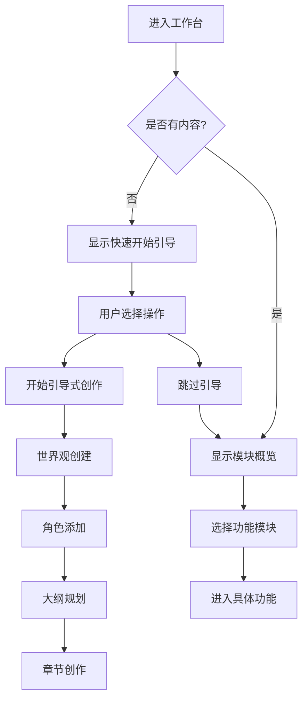
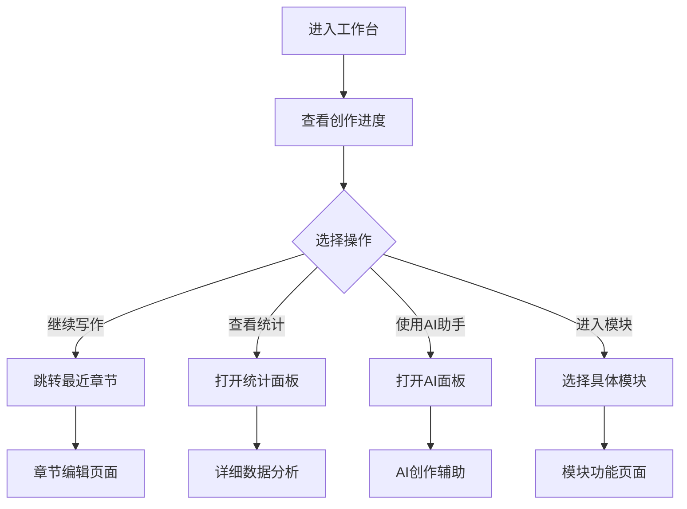

# 工作台页面设计文档

## 页面概述

工作台是AI小说创作平台的核心创作环境，集成了世界观管理、角色管理、大纲管理、章节编辑等所有创作工具。页面设计注重创作流程的连贯性和各模块间的协调配合，为用户提供沉浸式的创作体验。

## 页面布局设计

### 整体结构
```
┌─────────────────────────────────────────┐
│              工作台头部                    │
│  ┌─────────────────┐ ┌─────────────────┐ │
│  │   小说基本信息    │ │   快捷操作按钮   │ │
│  └─────────────────┘ └─────────────────┘ │
├─────────────────────────────────────────┤
│              功能模块区域                   │
│  ┌─────────┐ ┌─────────┐ ┌─────────┐   │
│  │         │ │         │ │         │   │
│  │ 世界观  │ │  角色   │ │  大纲   │   │
│  │         │ │         │ │         │   │
│  └─────────┘ └─────────┘ └─────────┘   │
│  ┌─────────┐ ┌─────────┐ ┌─────────┐   │
│  │         │ │         │ │         │   │
│  │  章节   │ │ 时间轴  │ │  设置   │   │
│  │         │ │         │ │         │   │
│  └─────────┘ └─────────┘ └─────────┘   │
├─────────────────────────────────────────┤
│              创作进度总览                   │
│         (统计数据 + 最近活动)               │
└─────────────────────────────────────────┘
```

### 组件层次结构
```
WorkspaceOverviewView.vue
├── WorkspaceHeader.vue (工作台头部)
│   ├── NovelBasicInfo.vue (小说基本信息)
│   └── QuickActions.vue (快捷操作)
├── ModuleGrid.vue (功能模块网格)
│   ├── ModuleCard.vue (模块卡片)
│   │   ├── WorldviewCard.vue (世界观模块)
│   │   ├── CharactersCard.vue (角色模块)
│   │   ├── OutlineCard.vue (大纲模块)
│   │   ├── ChaptersCard.vue (章节模块)
│   │   ├── TimelineCard.vue (时间轴模块)
│   │   └── SettingsCard.vue (设置模块)
├── ProgressOverview.vue (进度总览)
│   ├── WritingStats.vue (写作统计)
│   ├── ProgressChart.vue (进度图表)
│   └── RecentActivity.vue (最近活动)
└── QuickStartGuide.vue (快速开始引导)
```

### 响应式布局方案

#### 桌面端 (≥1024px)
- 3列网格布局，每行3个模块卡片
- 卡片尺寸: 300px × 200px
- 左右边距，居中对齐
- 悬浮效果和详细预览

#### 平板端 (768px - 1023px)
- 2列网格布局，每行2个模块卡片
- 卡片尺寸: 280px × 180px
- 适度简化信息展示
- 触摸友好的交互

#### 移动端 (<768px)
- 单列布局，垂直排列
- 卡片全宽，高度160px
- 最小化详细信息
- 大按钮便于点击

### UI组件选择和样式规范

#### 组件库选择
- **布局组件**: el-row, el-col
- **卡片组件**: el-card (模块展示)
- **进度条**: el-progress (进度显示)
- **统计组件**: el-statistic (数据统计)
- **图表组件**: ECharts (进度图表)
- **时间轴**: el-timeline (活动记录)
- **标签**: el-tag (状态标识)

#### 设计规范
```scss
// 工作台概览样式
.workspace-overview {
  min-height: calc(100vh - 120px);
  background: #F8F9FA;
  
  .workspace-header {
    background: #ffffff;
    padding: 24px;
    margin-bottom: 24px;
    border-radius: 12px;
    box-shadow: 0 2px 8px rgba(0, 0, 0, 0.1);
    
    .header-content {
      display: flex;
      justify-content: space-between;
      align-items: flex-start;
      
      .novel-info {
        flex: 1;
        
        .novel-title {
          font-size: 24px;
          font-weight: 600;
          color: #303133;
          margin-bottom: 8px;
        }
        
        .novel-meta {
          display: flex;
          gap: 16px;
          color: #606266;
          font-size: 14px;
          
          .meta-item {
            display: flex;
            align-items: center;
            gap: 4px;
            
            .icon {
              color: #909399;
            }
          }
        }
        
        .novel-description {
          color: #606266;
          margin-top: 12px;
          line-height: 1.5;
          max-width: 600px;
        }
      }
      
      .quick-actions {
        display: flex;
        gap: 12px;
        flex-shrink: 0;
        
        .action-btn {
          padding: 8px 16px;
          border-radius: 20px;
          font-size: 14px;
          
          &.primary-action {
            background: linear-gradient(45deg, #409EFF, #67C23A);
            border: none;
            color: white;
            
            &:hover {
              opacity: 0.9;
              transform: translateY(-1px);
            }
          }
        }
      }
    }
  }
  
  .module-grid {
    display: grid;
    grid-template-columns: repeat(auto-fit, minmax(300px, 1fr));
    gap: 20px;
    margin-bottom: 32px;
    
    .module-card {
      background: #ffffff;
      border-radius: 12px;
      padding: 24px;
      box-shadow: 0 2px 8px rgba(0, 0, 0, 0.1);
      transition: all 0.3s ease;
      position: relative;
      overflow: hidden;
      
      &:hover {
        transform: translateY(-4px);
        box-shadow: 0 8px 24px rgba(0, 0, 0, 0.15);
      }
      
      &::before {
        content: '';
        position: absolute;
        top: 0;
        left: 0;
        right: 0;
        height: 4px;
        background: var(--module-color);
      }
      
      .card-header {
        display: flex;
        justify-content: space-between;
        align-items: flex-start;
        margin-bottom: 16px;
        
        .module-info {
          .module-title {
            font-size: 18px;
            font-weight: 600;
            color: #303133;
            margin-bottom: 4px;
            display: flex;
            align-items: center;
            gap: 8px;
            
            .module-icon {
              font-size: 20px;
              color: var(--module-color);
            }
          }
          
          .module-description {
            color: #909399;
            font-size: 13px;
          }
        }
        
        .module-status {
          .status-badge {
            padding: 4px 8px;
            border-radius: 12px;
            font-size: 12px;
            font-weight: 500;
            
            &.complete {
              background: #F0F9FF;
              color: #409EFF;
            }
            
            &.partial {
              background: #FDF6EC;
              color: #E6A23C;
            }
            
            &.empty {
              background: #F0F0F0;
              color: #909399;
            }
          }
        }
      }
      
      .card-body {
        margin-bottom: 16px;
        
        .module-stats {
          display: grid;
          grid-template-columns: repeat(2, 1fr);
          gap: 12px;
          
          .stat-item {
            text-align: center;
            
            .stat-value {
              font-size: 20px;
              font-weight: 600;
              color: var(--module-color);
              margin-bottom: 4px;
            }
            
            .stat-label {
              font-size: 12px;
              color: #909399;
            }
          }
        }
        
        .module-preview {
          .preview-item {
            padding: 8px 0;
            border-bottom: 1px solid #F2F6FC;
            color: #606266;
            font-size: 13px;
            
            &:last-child {
              border-bottom: none;
            }
            
            .item-title {
              font-weight: 500;
              margin-bottom: 2px;
            }
            
            .item-meta {
              color: #909399;
              font-size: 12px;
            }
          }
        }
      }
      
      .card-footer {
        display: flex;
        justify-content: space-between;
        align-items: center;
        
        .module-progress {
          flex: 1;
          margin-right: 12px;
          
          .progress-text {
            font-size: 12px;
            color: #909399;
            margin-bottom: 4px;
          }
        }
        
        .module-actions {
          display: flex;
          gap: 8px;
          
          .action-btn {
            padding: 6px 12px;
            border-radius: 16px;
            font-size: 12px;
            
            &.enter-btn {
              background: var(--module-color);
              border-color: var(--module-color);
              color: white;
              
              &:hover {
                opacity: 0.9;
              }
            }
          }
        }
      }
      
      // 模块特定颜色
      &.worldview-card {
        --module-color: #E6A23C;
      }
      
      &.characters-card {
        --module-color: #F56C6C;
      }
      
      &.outline-card {
        --module-color: #909399;
      }
      
      &.chapters-card {
        --module-color: #409EFF;
      }
      
      &.timeline-card {
        --module-color: #67C23A;
      }
      
      &.settings-card {
        --module-color: #606266;
      }
    }
  }
  
  .progress-overview {
    background: #ffffff;
    border-radius: 12px;
    padding: 24px;
    box-shadow: 0 2px 8px rgba(0, 0, 0, 0.1);
    
    .overview-header {
      margin-bottom: 20px;
      
      .overview-title {
        font-size: 18px;
        font-weight: 600;
        color: #303133;
      }
    }
    
    .overview-content {
      display: grid;
      grid-template-columns: 1fr 1fr 1fr;
      gap: 24px;
      
      .stats-section {
        .section-title {
          font-size: 14px;
          font-weight: 500;
          color: #606266;
          margin-bottom: 12px;
        }
        
        .stats-grid {
          display: grid;
          gap: 8px;
          
          .stat-row {
            display: flex;
            justify-content: space-between;
            align-items: center;
            padding: 4px 0;
            
            .stat-label {
              color: #909399;
              font-size: 13px;
            }
            
            .stat-value {
              font-weight: 500;
              color: #303133;
            }
          }
        }
      }
      
      .chart-section {
        .chart-container {
          height: 200px;
          width: 100%;
        }
      }
      
      .activity-section {
        .activity-list {
          .activity-item {
            padding: 8px 0;
            border-bottom: 1px solid #F2F6FC;
            
            &:last-child {
              border-bottom: none;
            }
            
            .activity-content {
              font-size: 13px;
              color: #606266;
              margin-bottom: 2px;
            }
            
            .activity-time {
              font-size: 12px;
              color: #C0C4CC;
            }
          }
        }
      }
    }
  }
}

// 快速开始引导样式
.quick-start-guide {
  background: linear-gradient(135deg, #667eea 0%, #764ba2 100%);
  color: white;
  border-radius: 12px;
  padding: 24px;
  margin-bottom: 24px;
  
  .guide-header {
    margin-bottom: 16px;
    
    .guide-title {
      font-size: 20px;
      font-weight: 600;
      margin-bottom: 8px;
    }
    
    .guide-description {
      opacity: 0.9;
    }
  }
  
  .guide-steps {
    display: flex;
    gap: 16px;
    
    .step-item {
      flex: 1;
      background: rgba(255, 255, 255, 0.1);
      border-radius: 8px;
      padding: 16px;
      text-align: center;
      
      .step-number {
        width: 32px;
        height: 32px;
        background: rgba(255, 255, 255, 0.2);
        border-radius: 50%;
        display: flex;
        align-items: center;
        justify-content: center;
        margin: 0 auto 8px;
        font-weight: 600;
      }
      
      .step-title {
        font-weight: 500;
        margin-bottom: 4px;
      }
      
      .step-description {
        font-size: 12px;
        opacity: 0.8;
      }
    }
  }
}

// 响应式样式
@media (max-width: 1023px) {
  .workspace-overview {
    .module-grid {
      grid-template-columns: repeat(2, 1fr);
      gap: 16px;
    }
    
    .progress-overview .overview-content {
      grid-template-columns: 1fr;
      gap: 20px;
    }
  }
}

@media (max-width: 767px) {
  .workspace-overview {
    .workspace-header .header-content {
      flex-direction: column;
      gap: 16px;
      
      .quick-actions {
        width: 100%;
        justify-content: center;
      }
    }
    
    .module-grid {
      grid-template-columns: 1fr;
    }
    
    .quick-start-guide .guide-steps {
      flex-direction: column;
    }
  }
}
```

## 按钮功能设计

### 头部快捷操作按钮

#### 1. 继续写作按钮
- **位置**: 工作台头部右上角，最显眼位置
- **样式**: Primary类型，渐变背景，大尺寸
- **功能**: 快速跳转到最近编辑的章节
- **状态**: 根据是否有章节内容显示不同文案
- **交互**:
  ```typescript
  const continueWriting = async () => {
    try {
      // 获取最近编辑的章节
      const recentChapter = await chapterAPI.getRecentChapter(novelId.value);
      
      if (recentChapter) {
        // 跳转到最近章节编辑
        router.push(`/workspace/${novelId.value}/chapters?chapter=${recentChapter.id}`);
      } else {
        // 创建新章节
        const confirmed = await ElMessageBox.confirm(
          '还没有章节内容，是否创建第一章？',
          '开始创作',
          {
            confirmButtonText: '创建第一章',
            cancelButtonText: '取消',
            type: 'info'
          }
        );
        
        if (confirmed) {
          router.push(`/workspace/${novelId.value}/chapters?action=create`);
        }
      }
      
    } catch (error) {
      ElMessage.error('无法继续写作，请稍后重试');
    }
  };
  ```

#### 2. AI助手按钮
- **位置**: 头部快捷操作区域
- **样式**: Success类型，带AI图标
- **功能**: 打开AI创作助手面板
- **交互**:
  ```typescript
  const openAIAssistant = () => {
    showAIAssistant.value = true;
    
    // 记录使用行为
    trackUserBehavior('open_ai_assistant', {
      novel_id: novelId.value,
      current_module: 'overview'
    });
  };
  ```

#### 3. 设置按钮
- **位置**: 头部快捷操作区域
- **样式**: Default类型，齿轮图标
- **功能**: 快速访问小说设置
- **交互**:
  ```typescript
  const openSettings = () => {
    router.push(`/workspace/${novelId.value}/settings`);
  };
  ```

### 模块卡片操作按钮

#### 4. 进入模块按钮
- **位置**: 每个模块卡片底部右侧
- **样式**: 根据模块使用不同主题色
- **功能**: 进入对应的功能模块
- **交互**:
  ```typescript
  const enterModule = (moduleName: string) => {
    const moduleRoutes = {
      worldview: `/workspace/${novelId.value}/worldview`,
      characters: `/workspace/${novelId.value}/characters`,
      outline: `/workspace/${novelId.value}/outline`,
      chapters: `/workspace/${novelId.value}/chapters`,
      timeline: `/workspace/${novelId.value}/timeline`,
      settings: `/workspace/${novelId.value}/settings`
    };
    
    const route = moduleRoutes[moduleName];
    if (route) {
      router.push(route);
    }
  };
  ```

#### 5. 快速操作按钮
- **位置**: 模块卡片头部右侧
- **样式**: 小尺寸图标按钮，悬浮显示
- **功能**: 模块特定的快捷操作
- **交互**:
  ```typescript
  // 世界观模块快速操作
  const quickCreateWorldview = async () => {
    try {
      const worldviewData = {
        name: `${novel.value.title}世界观`,
        description: '主要世界观设定',
        novel_id: novelId.value
      };
      
      const created = await worldviewAPI.createWorldview(worldviewData);
      ElMessage.success('世界观已创建');
      
      // 刷新模块数据
      await loadModuleData('worldview');
      
    } catch (error) {
      ElMessage.error('创建世界观失败');
    }
  };
  
  // 角色模块快速操作
  const quickAddCharacter = () => {
    router.push(`/workspace/${novelId.value}/characters?action=create`);
  };
  
  // 章节模块快速操作
  const quickCreateChapter = () => {
    router.push(`/workspace/${novelId.value}/chapters?action=create`);
  };
  ```

### 进度总览操作按钮

#### 6. 详细统计按钮
- **位置**: 进度总览区域头部
- **样式**: Text类型，带图标
- **功能**: 查看详细的创作统计数据
- **交互**:
  ```typescript
  const viewDetailedStats = () => {
    showStatsModal.value = true;
    loadDetailedStats();
  };
  ```

#### 7. 导出报告按钮
- **位置**: 进度总览区域
- **样式**: Info类型，小尺寸
- **功能**: 导出创作进度报告
- **交互**:
  ```typescript
  const exportProgressReport = async () => {
    try {
      const reportData = await novelAPI.generateProgressReport(novelId.value);
      
      const content = formatProgressReport(reportData);
      const filename = `${novel.value.title}_创作报告_${formatDate(new Date())}.txt`;
      
      downloadFile(content, filename, 'text/plain');
      ElMessage.success('报告导出成功');
      
    } catch (error) {
      ElMessage.error('导出失败，请稍后重试');
    }
  };
  ```

### 快速开始引导按钮

#### 8. 跳过引导按钮
- **位置**: 快速开始引导右上角
- **样式**: Text类型，小尺寸
- **功能**: 隐藏新手引导
- **交互**:
  ```typescript
  const skipGuide = () => {
    showQuickGuide.value = false;
    localStorage.setItem('workspace_guide_completed', 'true');
  };
  ```

#### 9. 开始创作按钮
- **位置**: 快速开始引导底部
- **样式**: Primary类型，白色背景
- **功能**: 开始引导式创作流程
- **交互**:
  ```typescript
  const startGuidedCreation = () => {
    // 开始引导流程
    router.push(`/workspace/${novelId.value}/worldview?guided=true`);
  };
  ```

### 用户操作流程

#### 新用户首次进入流程


#### 日常创作流程


### 状态变化和反馈

#### 模块数据加载状态
```typescript
const moduleStates = ref({
  worldview: { loading: true, data: null, error: null },
  characters: { loading: true, data: null, error: null },
  outline: { loading: true, data: null, error: null },
  chapters: { loading: true, data: null, error: null },
  timeline: { loading: true, data: null, error: null },
  settings: { loading: true, data: null, error: null }
});

// 加载模块数据
const loadModuleData = async (moduleName: string) => {
  try {
    moduleStates.value[moduleName].loading = true;
    moduleStates.value[moduleName].error = null;
    
    const data = await getModuleData(moduleName, novelId.value);
    moduleStates.value[moduleName].data = data;
    
  } catch (error) {
    moduleStates.value[moduleName].error = error.message;
    ElMessage.error(`${getModuleDisplayName(moduleName)}加载失败`);
  } finally {
    moduleStates.value[moduleName].loading = false;
  }
};

// 获取模块数据
const getModuleData = async (moduleName: string, novelId: string) => {
  switch (moduleName) {
    case 'worldview':
      return await worldviewAPI.getWorldviews(novelId);
    case 'characters':
      return await characterAPI.getCharacters(novelId);
    case 'outline':
      return await outlineAPI.getOutlines(novelId);
    case 'chapters':
      return await chapterAPI.getChapters(novelId);
    case 'timeline':
      return await timelineAPI.getEvents(novelId);
    default:
      return null;
  }
};
```

#### 创作进度状态
```typescript
const progressStates = ref({
  overall: 0,              // 整体进度
  worldview: 0,            // 世界观完成度
  characters: 0,           // 角色完成度
  outline: 0,              // 大纲完成度
  chapters: 0,             // 章节完成度
  wordCount: 0,            // 总字数
  targetWords: 0,          // 目标字数
  writingDays: 0,          // 创作天数
  averageDailyWords: 0     // 日均字数
});

// 计算整体进度
const calculateOverallProgress = () => {
  const weights = {
    worldview: 0.15,
    characters: 0.15,
    outline: 0.20,
    chapters: 0.50
  };
  
  progressStates.value.overall = 
    progressStates.value.worldview * weights.worldview +
    progressStates.value.characters * weights.characters +
    progressStates.value.outline * weights.outline +
    progressStates.value.chapters * weights.chapters;
};

// 监听进度变化
watch(
  () => [
    progressStates.value.worldview,
    progressStates.value.characters,
    progressStates.value.outline,
    progressStates.value.chapters
  ],
  () => {
    calculateOverallProgress();
  },
  { deep: true }
);
```

#### 实时状态更新
```typescript
// WebSocket连接用于实时更新
const setupRealtimeUpdates = () => {
  const ws = new WebSocket(`${WS_BASE_URL}/workspace/${novelId.value}/updates`);
  
  ws.onmessage = (event) => {
    const { type, data } = JSON.parse(event.data);
    
    switch (type) {
      case 'module_updated':
        updateModuleData(data.module, data.updates);
        break;
        
      case 'progress_changed':
        updateProgressData(data);
        break;
        
      case 'activity_added':
        addRecentActivity(data.activity);
        break;
        
      case 'stats_updated':
        updateWritingStats(data.stats);
        break;
    }
  };
  
  return ws;
};

// 更新模块数据
const updateModuleData = (moduleName: string, updates: any) => {
  if (moduleStates.value[moduleName].data) {
    Object.assign(moduleStates.value[moduleName].data, updates);
  }
  
  // 触发进度重新计算
  recalculateModuleProgress(moduleName);
};

// 添加最近活动
const addRecentActivity = (activity: Activity) => {
  recentActivities.value.unshift(activity);
  
  // 保持最多10条记录
  if (recentActivities.value.length > 10) {
    recentActivities.value = recentActivities.value.slice(0, 10);
  }
  
  // 显示活动通知
  showActivityNotification(activity);
};

// 显示活动通知
const showActivityNotification = (activity: Activity) => {
  ElNotification({
    title: '创作更新',
    message: activity.description,
    type: 'info',
    position: 'bottom-right',
    duration: 3000
  });
};
```

## 后端接口列表设计

### 工作台数据接口

#### 1. 获取工作台概览数据
```typescript
// GET /api/v1/workspace/{novel_id}/overview
interface WorkspaceOverviewResponse {
  novel: NovelBasicInfo;
  modules: ModuleOverview;
  progress: ProgressOverview;
  recent_activities: Activity[];
  writing_stats: WritingStats;
  quick_actions: QuickAction[];
}

interface NovelBasicInfo {
  id: string;
  title: string;
  description: string;
  genre: string;
  status: string;
  created_at: string;
  updated_at: string;
  last_activity: string;
}

interface ModuleOverview {
  worldview: ModuleStats;
  characters: ModuleStats;
  outline: ModuleStats;
  chapters: ModuleStats;
  timeline: ModuleStats;
  settings: ModuleStats;
}

interface ModuleStats {
  total_count: number;
  completed_count: number;
  completion_percentage: number;
  last_updated: string;
  status: 'empty' | 'partial' | 'complete';
  recent_items: RecentItem[];
  quick_stats: Record<string, any>;
}

interface ProgressOverview {
  overall_progress: number;
  word_count: number;
  target_words: number;
  chapter_count: number;
  completion_estimate: string;
  milestones: Milestone[];
}

interface WritingStats {
  writing_days: number;
  total_sessions: number;
  average_daily_words: number;
  most_productive_day: string;
  writing_streak: number;
  productivity_trend: 'increasing' | 'stable' | 'decreasing';
}
```

#### 2. 获取模块详细统计
```typescript
// GET /api/v1/workspace/{novel_id}/modules/{module_name}/stats
interface ModuleDetailStatsResponse {
  module_name: string;
  detailed_stats: Record<string, any>;
  trends: TrendData[];
  recent_changes: Change[];
  recommendations: Recommendation[];
}

interface TrendData {
  date: string;
  value: number;
  metric: string;
}

interface Change {
  type: string;
  description: string;
  timestamp: string;
  user_id: string;
}

interface Recommendation {
  type: 'improvement' | 'suggestion' | 'warning';
  title: string;
  description: string;
  action_url?: string;
  priority: 'high' | 'medium' | 'low';
}
```

#### 3. 获取最近活动
```typescript
// GET /api/v1/workspace/{novel_id}/activities?limit=20
interface RecentActivitiesResponse {
  activities: Activity[];
  total: number;
}

interface Activity {
  id: string;
  type: 'chapter_created' | 'character_added' | 'outline_updated' | 'worldview_modified';
  title: string;
  description: string;
  module: string;
  entity_id?: string;
  metadata: Record<string, any>;
  timestamp: string;
  word_count_change?: number;
}
```

### 快捷操作接口

#### 4. 获取快捷操作配置
```typescript
// GET /api/v1/workspace/{novel_id}/quick-actions
interface QuickActionsResponse {
  actions: QuickAction[];
  user_preferences: ActionPreferences;
}

interface QuickAction {
  id: string;
  name: string;
  description: string;
  icon: string;
  url: string;
  enabled: boolean;
  condition?: string;        // 显示条件
  badge?: string;           // 徽章文本
  priority: number;         // 显示优先级
}

interface ActionPreferences {
  pinned_actions: string[];
  hidden_actions: string[];
  custom_actions: CustomAction[];
}
```

#### 5. 执行快捷操作
```typescript
// POST /api/v1/workspace/{novel_id}/quick-actions/{action_id}/execute
interface ExecuteQuickActionRequest {
  parameters?: Record<string, any>;
  context?: Record<string, any>;
}

interface ExecuteQuickActionResponse {
  success: boolean;
  result: any;
  redirect_url?: string;
  message?: string;
  next_actions?: QuickAction[];
}
```

#### 6. 获取最近编辑的章节
```typescript
// GET /api/v1/workspace/{novel_id}/recent-chapter
interface RecentChapterResponse {
  chapter?: Chapter;
  last_edit_position?: {
    paragraph: number;
    character: number;
  };
  editing_session?: {
    started_at: string;
    word_count_start: number;
    current_word_count: number;
  };
}
```

### AI助手接口

#### 7. 获取AI建议
```typescript
// POST /api/v1/workspace/{novel_id}/ai-suggestions
interface AIWorkspaceSuggestionsRequest {
  context: 'general' | 'stuck' | 'planning' | 'review';
  current_module?: string;
  specific_needs?: string[];
  novel_progress?: ProgressOverview;
}

interface AIWorkspaceSuggestionsResponse {
  suggestions: AISuggestion[];
  priority_actions: PriorityAction[];
  writing_prompts?: string[];
}

interface AISuggestion {
  type: 'content' | 'structure' | 'improvement' | 'inspiration';
  title: string;
  description: string;
  confidence: number;
  action_url?: string;
  preview?: string;
}

interface PriorityAction {
  action: string;
  reason: string;
  urgency: 'high' | 'medium' | 'low';
  estimated_time: string;
}
```

#### 8. 生成创作计划
```typescript
// POST /api/v1/workspace/{novel_id}/generate-plan
interface GenerateCreationPlanRequest {
  time_available: string;      // 可用时间
  target_completion: string;   // 目标完成时间
  focus_areas?: string[];      // 重点关注领域
  writing_style: string;       // 写作风格偏好
}

interface GenerateCreationPlanResponse {
  plan: CreationPlan;
  milestones: Milestone[];
  daily_targets: DailyTarget[];
  suggestions: string[];
}

interface CreationPlan {
  phases: PlanPhase[];
  total_estimated_time: string;
  success_probability: number;
}

interface PlanPhase {
  name: string;
  description: string;
  tasks: Task[];
  estimated_days: number;
  prerequisites: string[];
}
```

### 导出和分享接口

#### 9. 生成进度报告
```typescript
// POST /api/v1/workspace/{novel_id}/progress-report
interface GenerateProgressReportRequest {
  format: 'summary' | 'detailed' | 'visual';
  include_sections?: string[];
  date_range?: {
    start: string;
    end: string;
  };
}

interface GenerateProgressReportResponse {
  report: ProgressReport;
  download_url?: string;
  charts?: ChartData[];
}

interface ProgressReport {
  summary: ReportSummary;
  sections: ReportSection[];
  statistics: ReportStatistics;
  recommendations: string[];
}
```

#### 10. 工作台设置接口
```typescript
// GET /api/v1/workspace/{novel_id}/settings
// PUT /api/v1/workspace/{novel_id}/settings
interface WorkspaceSettings {
  layout_preferences: {
    module_order: string[];
    hidden_modules: string[];
    dashboard_widgets: string[];
  };
  notification_settings: {
    progress_updates: boolean;
    milestone_alerts: boolean;
    ai_suggestions: boolean;
    collaboration_updates: boolean;
  };
  writing_preferences: {
    auto_save_interval: number;
    word_count_goals: boolean;
    distraction_free_mode: boolean;
    writing_music: boolean;
  };
  ai_assistant_settings: {
    suggestion_frequency: 'high' | 'medium' | 'low';
    preferred_suggestion_types: string[];
    auto_suggestions: boolean;
  };
}
```

### 接口调用时机和错误处理

#### 调用时机设计
```typescript
// 工作台初始化
onMounted(async () => {
  try {
    loadingStates.value.overview = true;
    
    // 并行加载核心数据
    const [overview, quickActions, recentChapter] = await Promise.all([
      workspaceAPI.getOverview(novelId.value),
      workspaceAPI.getQuickActions(novelId.value),
      workspaceAPI.getRecentChapter(novelId.value)
    ]);
    
    // 设置数据
    overviewData.value = overview;
    quickActions.value = quickActions.actions;
    recentChapter.value = recentChapter.chapter;
    
    // 计算进度状态
    calculateProgressStates(overview.progress);
    
    // 设置模块状态
    initializeModuleStates(overview.modules);
    
    // 建立实时连接
    setupRealtimeUpdates();
    
  } catch (error) {
    handleInitializationError(error);
  } finally {
    loadingStates.value.overview = false;
  }
});

// 定期刷新数据
const startPeriodicRefresh = () => {
  setInterval(async () => {
    try {
      const stats = await workspaceAPI.getWritingStats(novelId.value);
      updateWritingStats(stats);
    } catch (error) {
      console.warn('Failed to refresh stats:', error);
    }
  }, 60000); // 每分钟刷新一次统计数据
};

// 页面可见性变化时刷新
document.addEventListener('visibilitychange', () => {
  if (!document.hidden) {
    refreshWorkspaceData();
  }
});
```

#### 错误处理策略

##### 1. 初始化错误处理
```typescript
const handleInitializationError = (error: any) => {
  const { status } = error.response || {};
  
  switch (status) {
    case 404:
      // 小说不存在
      showErrorState.value = true;
      errorConfig.value = {
        type: 'not_found',
        title: '小说不存在',
        message: '您访问的小说可能已被删除或不存在',
        actions: [
          {
            text: '返回小说列表',
            handler: () => router.push('/novels')
          }
        ]
      };
      break;
      
    case 403:
      // 无权限访问
      showErrorState.value = true;
      errorConfig.value = {
        type: 'forbidden',
        title: '无权限访问',
        message: '您没有权限访问此工作台',
        actions: [
          {
            text: '返回首页',
            handler: () => router.push('/')
          }
        ]
      };
      break;
      
    default:
      // 加载失败
      showErrorState.value = true;
      errorConfig.value = {
        type: 'load_error',
        title: '加载失败',
        message: '工作台数据加载失败，请刷新页面重试',
        actions: [
          {
            text: '重新加载',
            handler: () => window.location.reload()
          },
          {
            text: '返回小说列表',
            handler: () => router.push('/novels')
          }
        ]
      };
  }
};
```

##### 2. 模块数据错误处理
```typescript
const handleModuleError = (moduleName: string, error: any) => {
  console.error(`Module ${moduleName} error:`, error);
  
  // 更新模块状态
  moduleStates.value[moduleName].error = error.message;
  moduleStates.value[moduleName].loading = false;
  
  // 提供降级体验
  const fallbackData = generateFallbackModuleData(moduleName);
  moduleStates.value[moduleName].data = fallbackData;
  
  // 显示轻量级错误提示
  ElMessage({
    type: 'warning',
    message: `${getModuleDisplayName(moduleName)}数据加载失败，显示缓存数据`,
    duration: 3000
  });
};

// 生成降级数据
const generateFallbackModuleData = (moduleName: string) => {
  const fallbackTemplates = {
    worldview: { total_count: 0, completion_percentage: 0, status: 'empty' },
    characters: { total_count: 0, completion_percentage: 0, status: 'empty' },
    outline: { total_count: 0, completion_percentage: 0, status: 'empty' },
    chapters: { total_count: 0, completion_percentage: 0, status: 'empty' },
    timeline: { total_count: 0, completion_percentage: 0, status: 'empty' },
    settings: { total_count: 0, completion_percentage: 0, status: 'empty' }
  };
  
  return fallbackTemplates[moduleName] || {};
};
```

##### 3. 实时更新错误处理
```typescript
const handleWebSocketError = (error: Event) => {
  console.warn('WebSocket connection error:', error);
  
  // 显示连接状态
  connectionStatus.value = 'disconnected';
  
  // 尝试重连
  setTimeout(() => {
    if (connectionStatus.value === 'disconnected') {
      attemptReconnection();
    }
  }, 5000);
  
  // 通知用户
  ElNotification({
    title: '连接中断',
    message: '实时更新连接中断，正在尝试重连...',
    type: 'warning',
    duration: 3000,
    position: 'bottom-right'
  });
};

// 重连机制
const attemptReconnection = () => {
  let attempts = 0;
  const maxAttempts = 5;
  
  const reconnect = () => {
    attempts++;
    
    try {
      const ws = setupRealtimeUpdates();
      
      ws.onopen = () => {
        connectionStatus.value = 'connected';
        ElMessage.success('连接已恢复');
      };
      
      ws.onerror = () => {
        if (attempts < maxAttempts) {
          setTimeout(reconnect, Math.pow(2, attempts) * 1000);
        } else {
          connectionStatus.value = 'failed';
          ElMessage.error('无法恢复连接，请刷新页面');
        }
      };
      
    } catch (error) {
      if (attempts < maxAttempts) {
        setTimeout(reconnect, Math.pow(2, attempts) * 1000);
      }
    }
  };
  
  reconnect();
};
```

## 性能优化考虑

### 数据预加载和缓存
```typescript
// 智能预加载策略
const preloadStrategies = {
  // 预加载用户可能访问的模块
  predictivePreload: async () => {
    const userHistory = getUserAccessHistory();
    const predictedModules = predictNextModules(userHistory);
    
    predictedModules.forEach(module => {
      setTimeout(() => {
        preloadModuleData(module);
      }, Math.random() * 3000);
    });
  },
  
  // 预加载关键路径
  criticalPathPreload: async () => {
    const criticalModules = ['chapters', 'characters'];
    
    Promise.all(
      criticalModules.map(module => preloadModuleData(module))
    ).catch(error => {
      console.warn('Critical path preload failed:', error);
    });
  }
};

// 模块数据缓存
const moduleCache = new Map();
const CACHE_TTL = 5 * 60 * 1000; // 5分钟

const getCachedModuleData = (moduleName: string) => {
  const cached = moduleCache.get(moduleName);
  
  if (cached && Date.now() - cached.timestamp < CACHE_TTL) {
    return cached.data;
  }
  
  return null;
};

const setCachedModuleData = (moduleName: string, data: any) => {
  moduleCache.set(moduleName, {
    data,
    timestamp: Date.now()
  });
};
```

### UI渲染优化
```typescript
// 虚拟化长列表
const useVirtualizedList = (items: Ref<any[]>) => {
  const containerRef = ref<HTMLElement>();
  const itemHeight = 60;
  const visibleCount = 10;
  
  const scrollTop = ref(0);
  const startIndex = computed(() => Math.floor(scrollTop.value / itemHeight));
  const endIndex = computed(() => Math.min(startIndex.value + visibleCount, items.value.length));
  const visibleItems = computed(() => items.value.slice(startIndex.value, endIndex.value));
  
  return {
    containerRef,
    visibleItems,
    startIndex,
    scrollTop
  };
};

// 图表懒加载
const useChartLazyLoad = () => {
  const chartRefs = ref<HTMLElement[]>([]);
  const loadedCharts = ref<Set<string>>(new Set());
  
  const chartObserver = new IntersectionObserver((entries) => {
    entries.forEach(entry => {
      if (entry.isIntersecting) {
        const chartId = entry.target.id;
        if (!loadedCharts.value.has(chartId)) {
          loadChart(chartId);
          loadedCharts.value.add(chartId);
        }
      }
    });
  });
  
  return { chartRefs, chartObserver };
};

// 防抖刷新
const debouncedRefresh = debounce(async () => {
  await refreshWorkspaceData();
}, 1000);
```

### 内存管理
```typescript
// 组件清理
onUnmounted(() => {
  // 清理WebSocket连接
  if (wsConnection.value) {
    wsConnection.value.close();
  }
  
  // 清理定时器
  if (refreshTimer.value) {
    clearInterval(refreshTimer.value);
  }
  
  // 清理缓存
  moduleCache.clear();
  
  // 清理事件监听器
  document.removeEventListener('visibilitychange', handleVisibilityChange);
});

// 内存监控
const monitorMemoryUsage = () => {
  if ('memory' in performance) {
    const memInfo = (performance as any).memory;
    
    if (memInfo.usedJSHeapSize > memInfo.jsHeapSizeLimit * 0.9) {
      console.warn('High memory usage detected, triggering cleanup');
      performMemoryCleanup();
    }
  }
};

// 内存清理
const performMemoryCleanup = () => {
  // 清理过期缓存
  moduleCache.clear();
  
  // 清理未使用的图表实例
  cleanupUnusedCharts();
  
  // 强制垃圾回收（如果可用）
  if ('gc' in window) {
    (window as any).gc();
  }
};