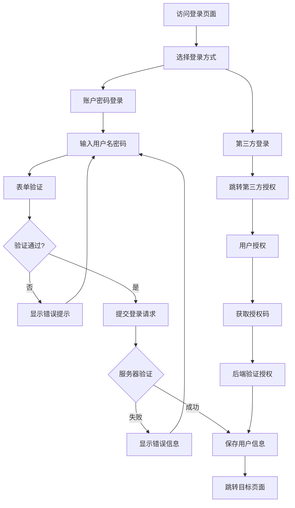
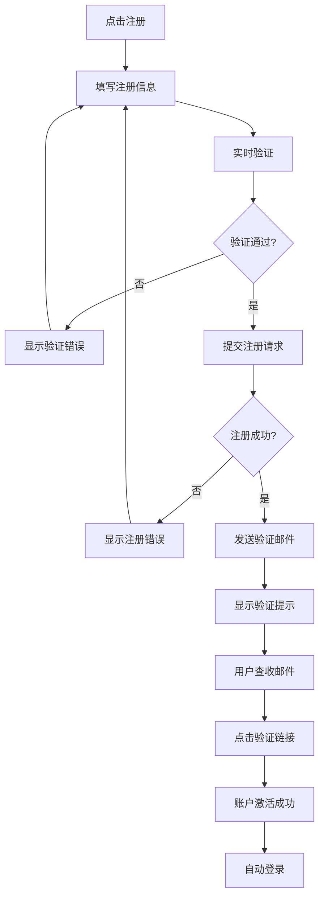

# 登录注册页面设计文档

## 页面概述

登录注册页面是用户进入AI小说创作平台的入口，承担用户身份验证和账户创建的重要功能。页面设计注重用户体验的流畅性、安全性的保障以及视觉效果的吸引力，为用户提供便捷可靠的认证服务。

## 页面布局设计

### 整体结构
```
┌─────────────────────────────────────────┐
│              全屏背景区域                   │
│  ┌─────────────────────────────────────┐ │
│  │            左侧装饰区域               │ │
│  │        (品牌展示 + 特性介绍)          │ │
│  │                                   │ │
│  └─────────────────────────────────────┘ │
│                                         │
│  ┌─────────────────────────────────────┐ │
│  │            右侧表单区域               │ │
│  │  ┌─────────────────────────────┐   │ │
│  │  │        登录/注册表单          │   │ │
│  │  │     (标签切换 + 输入框)       │   │ │
│  │  │     (提交按钮 + 其他选项)     │   │ │
│  │  └─────────────────────────────┘   │ │
│  └─────────────────────────────────────┘ │
└─────────────────────────────────────────┘
```

### 组件层次结构
```
AuthView.vue
├── AuthBackground.vue (背景装饰)
├── BrandShowcase.vue (品牌展示区域)
│   ├── PlatformIntro.vue (平台介绍)
│   ├── FeatureHighlights.vue (特性亮点)
│   └── TestimonialSlider.vue (用户评价轮播)
├── AuthFormContainer.vue (表单容器)
│   ├── TabSwitcher.vue (登录/注册切换)
│   ├── LoginForm.vue (登录表单)
│   ├── RegisterForm.vue (注册表单)
│   ├── SocialLogin.vue (第三方登录)
│   ├── ForgotPassword.vue (忘记密码)
│   └── FormFooter.vue (表单底部链接)
└── LoadingOverlay.vue (加载遮罩)
```

### 响应式布局方案

#### 桌面端 (≥1024px)
- 左右分栏布局：左侧品牌展示(60%)，右侧表单(40%)
- 表单容器最大宽度400px，居中对齐
- 完整的品牌展示内容
- 丰富的视觉效果和动画

#### 平板端 (768px - 1023px)
- 上下布局：顶部简化品牌展示，底部表单
- 表单容器宽度80%，居中对齐
- 简化装饰元素
- 保持核心功能完整

#### 移动端 (<768px)
- 全屏表单布局
- 最小化品牌展示，仅保留Logo
- 表单占据主要空间
- 大按钮便于触摸操作

### UI组件选择和样式规范

#### 组件库选择
- **表单组件**: el-form, el-form-item
- **输入组件**: el-input (密码、邮箱、用户名)
- **按钮组件**: el-button (提交、切换、第三方登录)
- **标签页**: el-tabs (登录/注册切换)
- **加载组件**: el-loading
- **消息提示**: el-message, el-notification
- **图标组件**: el-icon

#### 设计规范
```scss
// 认证页面样式
.auth-view {
  min-height: 100vh;
  background: linear-gradient(135deg, #667eea 0%, #764ba2 100%);
  display: flex;
  align-items: center;
  justify-content: center;
  position: relative;
  overflow: hidden;
  
  // 动态背景
  &::before {
    content: '';
    position: absolute;
    top: 0;
    left: 0;
    right: 0;
    bottom: 0;
    background: url('/images/auth-pattern.png') repeat;
    opacity: 0.1;
    animation: float 20s ease-in-out infinite;
  }
  
  .auth-container {
    width: 100%;
    max-width: 1200px;
    margin: 0 auto;
    padding: 40px 20px;
    display: grid;
    grid-template-columns: 1.5fr 1fr;
    gap: 60px;
    align-items: center;
    
    .brand-section {
      color: white;
      
      .brand-header {
        margin-bottom: 40px;
        
        .logo {
          width: 80px;
          height: 80px;
          margin-bottom: 24px;
        }
        
        .brand-title {
          font-size: 36px;
          font-weight: 700;
          margin-bottom: 12px;
          background: linear-gradient(45deg, #ffffff, #f0f9ff);
          -webkit-background-clip: text;
          -webkit-text-fill-color: transparent;
        }
        
        .brand-tagline {
          font-size: 18px;
          opacity: 0.9;
          line-height: 1.6;
        }
      }
      
      .features-showcase {
        .feature-item {
          display: flex;
          align-items: center;
          margin-bottom: 20px;
          padding: 16px;
          background: rgba(255, 255, 255, 0.1);
          border-radius: 12px;
          backdrop-filter: blur(10px);
          
          .feature-icon {
            width: 48px;
            height: 48px;
            background: rgba(255, 255, 255, 0.2);
            border-radius: 50%;
            display: flex;
            align-items: center;
            justify-content: center;
            margin-right: 16px;
            font-size: 20px;
          }
          
          .feature-content {
            .feature-title {
              font-weight: 600;
              margin-bottom: 4px;
            }
            
            .feature-description {
              opacity: 0.8;
              font-size: 14px;
            }
          }
        }
      }
    }
    
    .form-section {
      .form-container {
        background: rgba(255, 255, 255, 0.95);
        backdrop-filter: blur(20px);
        border-radius: 20px;
        padding: 40px;
        box-shadow: 0 20px 40px rgba(0, 0, 0, 0.1);
        border: 1px solid rgba(255, 255, 255, 0.2);
        
        .form-header {
          text-align: center;
          margin-bottom: 32px;
          
          .form-title {
            font-size: 28px;
            font-weight: 600;
            color: #303133;
            margin-bottom: 8px;
          }
          
          .form-subtitle {
            color: #606266;
            font-size: 14px;
          }
        }
        
        .auth-tabs {
          margin-bottom: 24px;
          
          .el-tabs__header {
            margin: 0;
            
            .el-tabs__nav-wrap {
              &::after {
                display: none;
              }
            }
            
            .el-tabs__item {
              font-weight: 500;
              color: #909399;
              
              &.is-active {
                color: #409EFF;
              }
            }
          }
        }
        
        .auth-form {
          .form-item {
            margin-bottom: 20px;
            
            .el-input {
              .el-input__inner {
                height: 48px;
                border-radius: 12px;
                border: 2px solid #EBEEF5;
                font-size: 16px;
                padding: 0 16px;
                transition: all 0.3s ease;
                
                &:focus {
                  border-color: #409EFF;
                  box-shadow: 0 0 0 3px rgba(64, 158, 255, 0.1);
                }
              }
              
              .el-input__prefix,
              .el-input__suffix {
                color: #C0C4CC;
              }
            }
            
            .password-strength {
              margin-top: 8px;
              
              .strength-bar {
                height: 4px;
                background: #EBEEF5;
                border-radius: 2px;
                overflow: hidden;
                
                .strength-fill {
                  height: 100%;
                  transition: all 0.3s ease;
                  
                  &.weak {
                    width: 33%;
                    background: #F56C6C;
                  }
                  
                  &.medium {
                    width: 66%;
                    background: #E6A23C;
                  }
                  
                  &.strong {
                    width: 100%;
                    background: #67C23A;
                  }
                }
              }
              
              .strength-text {
                font-size: 12px;
                margin-top: 4px;
                color: #909399;
              }
            }
          }
          
          .form-options {
            display: flex;
            justify-content: space-between;
            align-items: center;
            margin-bottom: 24px;
            
            .remember-me {
              display: flex;
              align-items: center;
              gap: 8px;
              font-size: 14px;
              color: #606266;
            }
            
            .forgot-password {
              color: #409EFF;
              font-size: 14px;
              text-decoration: none;
              
              &:hover {
                text-decoration: underline;
              }
            }
          }
          
          .submit-btn {
            width: 100%;
            height: 48px;
            border-radius: 12px;
            font-size: 16px;
            font-weight: 600;
            background: linear-gradient(45deg, #409EFF, #67C23A);
            border: none;
            color: white;
            transition: all 0.3s ease;
            
            &:hover {
              opacity: 0.9;
              transform: translateY(-2px);
              box-shadow: 0 8px 20px rgba(64, 158, 255, 0.3);
            }
            
            &:disabled {
              opacity: 0.6;
              transform: none;
              box-shadow: none;
            }
            
            &.loading {
              .loading-icon {
                animation: spin 1s linear infinite;
              }
            }
          }
        }
        
        .social-login {
          margin-top: 24px;
          
          .divider {
            text-align: center;
            margin: 20px 0;
            position: relative;
            color: #909399;
            font-size: 14px;
            
            &::before {
              content: '';
              position: absolute;
              top: 50%;
              left: 0;
              right: 0;
              height: 1px;
              background: #EBEEF5;
              z-index: 1;
            }
            
            span {
              background: white;
              padding: 0 16px;
              position: relative;
              z-index: 2;
            }
          }
          
          .social-buttons {
            display: flex;
            gap: 12px;
            
            .social-btn {
              flex: 1;
              height: 48px;
              border-radius: 12px;
              display: flex;
              align-items: center;
              justify-content: center;
              gap: 8px;
              font-size: 14px;
              font-weight: 500;
              transition: all 0.3s ease;
              
              &.github {
                background: #24292e;
                color: white;
                border: none;
                
                &:hover {
                  background: #1a1e22;
                }
              }
              
              &.google {
                background: white;
                color: #5f6368;
                border: 2px solid #EBEEF5;
                
                &:hover {
                  border-color: #C0C4CC;
                }
              }
              
              .social-icon {
                width: 20px;
                height: 20px;
              }
            }
          }
        }
        
        .form-footer {
          text-align: center;
          margin-top: 24px;
          font-size: 14px;
          color: #606266;
          
          .switch-form {
            color: #409EFF;
            cursor: pointer;
            
            &:hover {
              text-decoration: underline;
            }
          }
          
          .terms-privacy {
            margin-top: 16px;
            font-size: 12px;
            color: #909399;
            line-height: 1.5;
            
            a {
              color: #409EFF;
              text-decoration: none;
              
              &:hover {
                text-decoration: underline;
              }
            }
          }
        }
      }
    }
  }
}

// 响应式样式
@media (max-width: 1023px) {
  .auth-view .auth-container {
    grid-template-columns: 1fr;
    gap: 40px;
    
    .brand-section {
      text-align: center;
      
      .brand-header .brand-title {
        font-size: 28px;
      }
      
      .features-showcase {
        display: grid;
        grid-template-columns: repeat(2, 1fr);
        gap: 16px;
        
        .feature-item {
          flex-direction: column;
          text-align: center;
          padding: 20px 12px;
          
          .feature-icon {
            margin-right: 0;
            margin-bottom: 12px;
          }
        }
      }
    }
  }
}

@media (max-width: 767px) {
  .auth-view {
    .auth-container {
      padding: 20px;
      
      .brand-section {
        .brand-header .brand-title {
          font-size: 24px;
        }
        
        .features-showcase {
          grid-template-columns: 1fr;
        }
      }
      
      .form-section .form-container {
        padding: 24px;
        
        .form-header .form-title {
          font-size: 24px;
        }
        
        .social-login .social-buttons {
          flex-direction: column;
        }
      }
    }
  }
}

// 动画效果
@keyframes float {
  0%, 100% {
    transform: translateY(0px);
  }
  50% {
    transform: translateY(-20px);
  }
}

@keyframes spin {
  0% {
    transform: rotate(0deg);
  }
  100% {
    transform: rotate(360deg);
  }
}

@keyframes slideInRight {
  from {
    opacity: 0;
    transform: translateX(30px);
  }
  to {
    opacity: 1;
    transform: translateX(0);
  }
}

.form-container {
  animation: slideInRight 0.6s ease-out;
}
```

## 按钮功能设计

### 主要操作按钮

#### 1. 登录提交按钮
- **位置**: 登录表单底部
- **样式**: Primary类型，渐变背景，全宽
- **功能**: 验证用户凭据并执行登录
- **状态**: 支持加载、禁用、错误状态
- **交互**:
  ```typescript
  const handleLogin = async () => {
    try {
      // 表单验证
      const isValid = await loginFormRef.value?.validate();
      if (!isValid) return;
      
      isLoading.value = true;
      
      const loginData = {
        username: loginForm.username,
        password: loginForm.password,
        remember_me: loginForm.rememberMe
      };
      
      const response = await authAPI.login(loginData);
      
      // 保存用户信息和令牌
      authStore.setUser(response.user);
      authStore.setToken(response.access_token);
      
      // 保存记住我状态
      if (loginForm.rememberMe) {
        localStorage.setItem('remember_me', 'true');
      }
      
      ElMessage.success('登录成功');
      
      // 跳转到目标页面或首页
      const redirectUrl = route.query.redirect as string || '/';
      router.push(redirectUrl);
      
    } catch (error) {
      handleLoginError(error);
    } finally {
      isLoading.value = false;
    }
  };
  ```

#### 2. 注册提交按钮
- **位置**: 注册表单底部
- **样式**: Primary类型，渐变背景，全宽
- **功能**: 创建新用户账户
- **验证**: 实时密码强度验证，邮箱格式验证
- **交互**:
  ```typescript
  const handleRegister = async () => {
    try {
      // 表单验证
      const isValid = await registerFormRef.value?.validate();
      if (!isValid) return;
      
      // 密码强度检查
      if (passwordStrength.value < 2) {
        ElMessage.warning('密码强度太弱，请设置更安全的密码');
        return;
      }
      
      isLoading.value = true;
      
      const registerData = {
        username: registerForm.username,
        email: registerForm.email,
        password: registerForm.password,
        agree_terms: registerForm.agreeTerms
      };
      
      const response = await authAPI.register(registerData);
      
      ElMessage.success('注册成功，请查收验证邮件');
      
      // 显示邮箱验证提示
      showEmailVerification.value = true;
      verificationEmail.value = registerForm.email;
      
      // 切换到登录表单
      setTimeout(() => {
        activeTab.value = 'login';
        loginForm.username = registerForm.username;
      }, 3000);
      
    } catch (error) {
      handleRegisterError(error);
    } finally {
      isLoading.value = false;
    }
  };
  ```

#### 3. 第三方登录按钮

##### 3.1 GitHub登录按钮
- **位置**: 社交登录区域
- **样式**: GitHub品牌色，带GitHub图标
- **功能**: OAuth GitHub授权登录
- **交互**:
  ```typescript
  const handleGitHubLogin = () => {
    const clientId = import.meta.env.VITE_GITHUB_CLIENT_ID;
    const redirectUri = encodeURIComponent(`${window.location.origin}/auth/callback/github`);
    const scope = encodeURIComponent('user:email');
    
    const authUrl = `https://github.com/login/oauth/authorize?client_id=${clientId}&redirect_uri=${redirectUri}&scope=${scope}`;
    
    window.location.href = authUrl;
  };
  ```

##### 3.2 Google登录按钮
- **位置**: 社交登录区域
- **样式**: Google品牌色，带Google图标
- **功能**: OAuth Google授权登录
- **交互**:
  ```typescript
  const handleGoogleLogin = () => {
    // 初始化Google登录
    if (window.google) {
      window.google.accounts.id.initialize({
        client_id: import.meta.env.VITE_GOOGLE_CLIENT_ID,
        callback: handleGoogleCallback
      });
      
      window.google.accounts.id.prompt();
    }
  };
  
  const handleGoogleCallback = async (response: any) => {
    try {
      const result = await authAPI.googleLogin({
        credential: response.credential
      });
      
      authStore.setUser(result.user);
      authStore.setToken(result.access_token);
      
      ElMessage.success('Google登录成功');
      router.push('/');
      
    } catch (error) {
      ElMessage.error('Google登录失败');
    }
  };
  ```

#### 4. 忘记密码按钮
- **位置**: 登录表单选项区域
- **样式**: 链接样式，无边框
- **功能**: 打开密码重置流程
- **交互**:
  ```typescript
  const handleForgotPassword = () => {
    showForgotPasswordDialog.value = true;
  };
  
  const sendPasswordReset = async () => {
    try {
      if (!resetEmail.value) {
        ElMessage.warning('请输入邮箱地址');
        return;
      }
      
      isResetting.value = true;
      
      await authAPI.sendPasswordReset({
        email: resetEmail.value
      });
      
      ElMessage.success('密码重置邮件已发送，请查收');
      showForgotPasswordDialog.value = false;
      resetEmail.value = '';
      
    } catch (error) {
      ElMessage.error('发送失败，请稍后重试');
    } finally {
      isResetting.value = false;
    }
  };
  ```

### 辅助功能按钮

#### 5. 表单切换按钮
- **位置**: 表单顶部Tab区域
- **样式**: Tab标签样式
- **功能**: 在登录和注册表单间切换
- **交互**:
  ```typescript
  const switchForm = (formType: 'login' | 'register') => {
    activeTab.value = formType;
    
    // 清空表单错误
    clearFormErrors();
    
    // 重置表单状态
    resetFormStates();
  };
  ```

#### 6. 密码显示/隐藏按钮
- **位置**: 密码输入框右侧
- **样式**: 眼睛图标，切换状态
- **功能**: 切换密码可见性
- **交互**:
  ```typescript
  const togglePasswordVisibility = () => {
    showPassword.value = !showPassword.value;
  };
  ```

#### 7. 记住我复选框
- **位置**: 登录表单选项区域
- **样式**: 复选框 + 文字标签
- **功能**: 设置登录状态持久化
- **交互**:
  ```typescript
  const handleRememberMe = (checked: boolean) => {
    loginForm.rememberMe = checked;
    
    if (checked) {
      // 设置更长的Token有效期
      authStore.setTokenExpiry(30 * 24 * 60 * 60 * 1000); // 30天
    } else {
      authStore.setTokenExpiry(24 * 60 * 60 * 1000); // 1天
    }
  };
  ```

#### 8. 邮箱验证重发按钮
- **位置**: 邮箱验证提示框
- **样式**: Text类型，倒计时显示
- **功能**: 重新发送验证邮件
- **交互**:
  ```typescript
  const resendVerificationEmail = async () => {
    try {
      if (resendCountdown.value > 0) {
        ElMessage.warning(`请等待${resendCountdown.value}秒后重试`);
        return;
      }
      
      await authAPI.resendVerification({
        email: verificationEmail.value
      });
      
      ElMessage.success('验证邮件已重新发送');
      
      // 开始倒计时
      startResendCountdown();
      
    } catch (error) {
      ElMessage.error('发送失败，请稍后重试');
    }
  };
  
  const startResendCountdown = () => {
    resendCountdown.value = 60;
    const timer = setInterval(() => {
      resendCountdown.value--;
      if (resendCountdown.value <= 0) {
        clearInterval(timer);
      }
    }, 1000);
  };
  ```

### 用户操作流程

#### 登录流程


#### 注册流程


### 状态变化和反馈

#### 表单验证状态
```typescript
const formStates = ref({
  login: {
    isValid: false,
    errors: {},
    touched: {}
  },
  register: {
    isValid: false,
    errors: {},
    touched: {}
  }
});

// 实时验证
const validateField = async (field: string, value: string) => {
  const currentForm = activeTab.value;
  
  try {
    await validateSingleField(field, value);
    
    // 清除错误
    delete formStates.value[currentForm].errors[field];
    
  } catch (error) {
    // 设置错误
    formStates.value[currentForm].errors[field] = error.message;
  }
  
  // 标记为已触摸
  formStates.value[currentForm].touched[field] = true;
  
  // 更新整体验证状态
  updateFormValidation(currentForm);
};

// 密码强度检查
const checkPasswordStrength = (password: string) => {
  let strength = 0;
  
  // 长度检查
  if (password.length >= 8) strength++;
  if (password.length >= 12) strength++;
  
  // 复杂度检查
  if (/[a-z]/.test(password)) strength++;
  if (/[A-Z]/.test(password)) strength++;
  if (/[0-9]/.test(password)) strength++;
  if (/[^A-Za-z0-9]/.test(password)) strength++;
  
  passwordStrength.value = Math.min(strength, 3);
  
  const strengthTexts = ['弱', '中等', '强'];
  passwordStrengthText.value = strengthTexts[passwordStrength.value - 1] || '很弱';
};
```

#### 提交状态反馈
```typescript
const submitStates = ref({
  isSubmitting: false,
  submitType: '',        // 'login' | 'register' | 'reset'
  progress: 0,
  statusMessage: ''
});

// 提交状态管理
const handleSubmitStart = (type: string) => {
  submitStates.value.isSubmitting = true;
  submitStates.value.submitType = type;
  submitStates.value.progress = 0;
  
  // 模拟进度
  const progressInterval = setInterval(() => {
    if (submitStates.value.progress < 90) {
      submitStates.value.progress += Math.random() * 10;
    }
  }, 100);
  
  return progressInterval;
};

const handleSubmitComplete = (progressInterval: number) => {
  clearInterval(progressInterval);
  submitStates.value.progress = 100;
  
  setTimeout(() => {
    submitStates.value.isSubmitting = false;
    submitStates.value.progress = 0;
  }, 500);
};

// 错误状态处理
const handleSubmitError = (error: any) => {
  const { status, data } = error.response || {};
  
  switch (status) {
    case 401:
      ElMessage.error('用户名或密码错误');
      break;
    case 403:
      ElMessage.error('账户已被禁用，请联系管理员');
      break;
    case 429:
      ElMessage.error('登录尝试过于频繁，请稍后再试');
      break;
    case 422:
      // 显示字段验证错误
      if (data.errors) {
        Object.keys(data.errors).forEach(field => {
          formStates.value[activeTab.value].errors[field] = data.errors[field][0];
        });
      }
      break;
    default:
      ElMessage.error('操作失败，请稍后重试');
  }
};
```

#### 第三方登录状态
```typescript
const socialLoginStates = ref({
  github: { loading: false, error: null },
  google: { loading: false, error: null }
});

// 第三方登录状态管理
const handleSocialLoginStart = (provider: string) => {
  socialLoginStates.value[provider].loading = true;
  socialLoginStates.value[provider].error = null;
};

const handleSocialLoginComplete = (provider: string) => {
  socialLoginStates.value[provider].loading = false;
};

const handleSocialLoginError = (provider: string, error: any) => {
  socialLoginStates.value[provider].loading = false;
  socialLoginStates.value[provider].error = error.message;
  
  ElMessage.error(`${provider}登录失败：${error.message}`);
};
```

## 后端接口列表设计

### 用户认证接口

#### 1. 用户登录
```typescript
// POST /api/v1/auth/login
interface LoginRequest {
  username: string;          // 用户名或邮箱
  password: string;          // 密码
  remember_me?: boolean;     // 记住我
  captcha_token?: string;    // 验证码令牌
}

interface LoginResponse {
  success: boolean;
  user: UserInfo;
  access_token: string;
  refresh_token: string;
  token_type: 'bearer';
  expires_in: number;        // Token有效期(秒)
  permissions: string[];     // 用户权限
  last_login_at?: string;    // 上次登录时间
  login_count: number;       // 登录次数
}

interface UserInfo {
  id: string;
  username: string;
  email: string;
  avatar_url?: string;
  display_name?: string;
  role: string;
  email_verified: boolean;
  created_at: string;
  last_active_at: string;
  preferences: UserPreferences;
}
```

#### 2. 用户注册
```typescript
// POST /api/v1/auth/register
interface RegisterRequest {
  username: string;          // 用户名 (必填)
  email: string;            // 邮箱 (必填)
  password: string;         // 密码 (必填)
  confirm_password: string; // 确认密码 (必填)
  agree_terms: boolean;     // 同意条款 (必填)
  invite_code?: string;     // 邀请码
  captcha_token?: string;   // 验证码令牌
}

interface RegisterResponse {
  success: boolean;
  user: UserInfo;
  verification_sent: boolean;
  message: string;
  next_steps: string[];
}
```

#### 3. 邮箱验证
```typescript
// POST /api/v1/auth/verify-email
interface VerifyEmailRequest {
  token: string;            // 验证令牌
}

interface VerifyEmailResponse {
  success: boolean;
  user: UserInfo;
  access_token?: string;    // 验证后自动登录
  message: string;
}

// POST /api/v1/auth/resend-verification
interface ResendVerificationRequest {
  email: string;
}

interface ResendVerificationResponse {
  success: boolean;
  message: string;
  next_resend_time: string; // 下次可发送时间
}
```

#### 4. 密码重置
```typescript
// POST /api/v1/auth/forgot-password
interface ForgotPasswordRequest {
  email: string;
}

interface ForgotPasswordResponse {
  success: boolean;
  message: string;
  reset_token_expires: string;
}

// POST /api/v1/auth/reset-password
interface ResetPasswordRequest {
  token: string;            // 重置令牌
  password: string;         // 新密码
  confirm_password: string; // 确认新密码
}

interface ResetPasswordResponse {
  success: boolean;
  message: string;
  auto_login: boolean;
}
```

### 第三方登录接口

#### 5. GitHub OAuth登录
```typescript
// POST /api/v1/auth/github
interface GitHubLoginRequest {
  code: string;             // GitHub授权码
  state?: string;           // 状态参数
}

interface GitHubLoginResponse extends LoginResponse {
  is_new_user: boolean;     // 是否为新用户
  github_profile: {
    github_id: string;
    login: string;
    name: string;
    avatar_url: string;
    bio?: string;
  };
}
```

#### 6. Google OAuth登录
```typescript
// POST /api/v1/auth/google
interface GoogleLoginRequest {
  credential: string;       // Google ID Token
}

interface GoogleLoginResponse extends LoginResponse {
  is_new_user: boolean;
  google_profile: {
    google_id: string;
    email: string;
    name: string;
    picture: string;
    locale?: string;
  };
}
```

### 会话管理接口

#### 7. 刷新Token
```typescript
// POST /api/v1/auth/refresh
interface RefreshTokenRequest {
  refresh_token: string;
}

interface RefreshTokenResponse {
  access_token: string;
  refresh_token: string;
  expires_in: number;
}
```

#### 8. 登出
```typescript
// POST /api/v1/auth/logout
interface LogoutRequest {
  all_devices?: boolean;    // 是否登出所有设备
}

interface LogoutResponse {
  success: boolean;
  message: string;
}
```

#### 9. 获取当前用户信息
```typescript
// GET /api/v1/auth/me
interface GetCurrentUserResponse {
  user: UserInfo;
  session_info: {
    login_time: string;
    ip_address: string;
    user_agent: string;
    last_activity: string;
  };
}
```

### 安全相关接口

#### 10. 获取验证码
```typescript
// GET /api/v1/auth/captcha
interface GetCaptchaResponse {
  captcha_token: string;
  captcha_image: string;    // Base64编码图片
  expires_in: number;
}

// POST /api/v1/auth/verify-captcha
interface VerifyCaptchaRequest {
  captcha_token: string;
  captcha_value: string;
}

interface VerifyCaptchaResponse {
  success: boolean;
  verified_token: string;   // 验证通过的令牌
}
```

### 接口调用时机和错误处理

#### 调用时机设计
```typescript
// 页面初始化检查认证状态
onMounted(async () => {
  // 检查是否有有效的Token
  const token = authStore.getToken();
  if (token) {
    try {
      // 验证Token有效性
      const userInfo = await authAPI.getCurrentUser();
      authStore.setUser(userInfo.user);
      
      // 如果用户已登录，重定向到目标页面
      const redirectUrl = route.query.redirect as string || '/';
      router.push(redirectUrl);
      
    } catch (error) {
      // Token无效，清除本地状态
      authStore.clearAuth();
    }
  }
  
  // 检查是否有记住我状态
  const rememberMe = localStorage.getItem('remember_me');
  if (rememberMe) {
    loginForm.rememberMe = true;
  }
  
  // 处理OAuth回调
  handleOAuthCallback();
});

// OAuth回调处理
const handleOAuthCallback = () => {
  const { provider, code, state } = route.query;
  
  if (provider && code) {
    handleOAuthLogin(provider as string, code as string, state as string);
  }
};

const handleOAuthLogin = async (provider: string, code: string, state?: string) => {
  try {
    let response;
    
    switch (provider) {
      case 'github':
        response = await authAPI.githubLogin({ code, state });
        break;
      case 'google':
        response = await authAPI.googleLogin({ credential: code });
        break;
      default:
        throw new Error('不支持的登录方式');
    }
    
    authStore.setUser(response.user);
    authStore.setToken(response.access_token);
    
    ElMessage.success('登录成功');
    router.push('/');
    
  } catch (error) {
    ElMessage.error('第三方登录失败');
    router.push('/auth/login');
  }
};
```

#### 错误处理策略

##### 1. 登录错误处理
```typescript
const handleLoginError = (error: AxiosError) => {
  const { status, data } = error.response || {};
  
  switch (status) {
    case 401:
      // 用户名或密码错误
      ElMessage.error('用户名或密码错误，请重新输入');
      
      // 增加登录失败次数
      loginFailCount.value++;
      
      // 多次失败后显示验证码
      if (loginFailCount.value >= 3) {
        showCaptcha.value = true;
        loadCaptcha();
      }
      break;
      
    case 403:
      const errorType = data?.error_type;
      
      switch (errorType) {
        case 'account_disabled':
          ElMessage.error('账户已被禁用，请联系管理员');
          break;
        case 'email_not_verified':
          ElMessage.warning('邮箱未验证，请先验证邮箱');
          showEmailVerification.value = true;
          verificationEmail.value = loginForm.username;
          break;
        default:
          ElMessage.error('登录被拒绝，请联系管理员');
      }
      break;
      
    case 429:
      const retryAfter = data?.retry_after || 60;
      ElMessage.error(`登录尝试过于频繁，请${retryAfter}秒后重试`);
      
      // 开始倒计时
      startLoginCooldown(retryAfter);
      break;
      
    case 422:
      // 验证错误
      if (data?.errors) {
        Object.keys(data.errors).forEach(field => {
          setFieldError(field, data.errors[field][0]);
        });
      }
      break;
      
    default:
      ElMessage.error('登录失败，请稍后重试');
  }
};
```

##### 2. 注册错误处理
```typescript
const handleRegisterError = (error: AxiosError) => {
  const { status, data } = error.response || {};
  
  switch (status) {
    case 409:
      const conflictType = data?.conflict_field;
      
      switch (conflictType) {
        case 'username':
          setFieldError('username', '用户名已被使用，请选择其他用户名');
          break;
        case 'email':
          setFieldError('email', '邮箱已被注册，请使用其他邮箱或直接登录');
          break;
        default:
          ElMessage.error('注册信息冲突，请检查输入内容');
      }
      break;
      
    case 422:
      // 验证错误
      if (data?.errors) {
        Object.keys(data.errors).forEach(field => {
          setFieldError(field, data.errors[field][0]);
        });
      }
      break;
      
    case 429:
      ElMessage.error('注册请求过于频繁，请稍后再试');
      break;
      
    default:
      ElMessage.error('注册失败，请稍后重试');
  }
};
```

##### 3. 网络错误处理
```typescript
const handleNetworkError = (error: AxiosError) => {
  if (!navigator.onLine) {
    ElMessage.error('网络连接已断开，请检查网络设置');
    return;
  }
  
  if (error.code === 'ECONNABORTED') {
    ElMessage.error('请求超时，请检查网络连接后重试');
    return;
  }
  
  ElMessage.error('网络错误，请稍后重试');
};
```

#### 表单验证规则
```typescript
const validationRules = {
  username: [
    { required: true, message: '请输入用户名', trigger: 'blur' },
    { min: 3, max: 20, message: '用户名长度应在3-20字符之间', trigger: 'blur' },
    { pattern: /^[a-zA-Z0-9_-]+$/, message: '用户名只能包含字母、数字、下划线和短横线', trigger: 'blur' }
  ],
  email: [
    { required: true, message: '请输入邮箱地址', trigger: 'blur' },
    { type: 'email', message: '请输入有效的邮箱地址', trigger: 'blur' }
  ],
  password: [
    { required: true, message: '请输入密码', trigger: 'blur' },
    { min: 8, message: '密码长度不能少于8位', trigger: 'blur' },
    { validator: validatePasswordStrength, trigger: 'blur' }
  ],
  confirmPassword: [
    { required: true, message: '请确认密码', trigger: 'blur' },
    { validator: validatePasswordMatch, trigger: 'blur' }
  ]
};

// 密码强度验证
const validatePasswordStrength = (rule: any, value: string, callback: Function) => {
  if (!value) {
    return callback();
  }
  
  checkPasswordStrength(value);
  
  if (passwordStrength.value < 2) {
    callback(new Error('密码强度太弱，请包含大小写字母、数字和特殊字符'));
  } else {
    callback();
  }
};

// 密码匹配验证
const validatePasswordMatch = (rule: any, value: string, callback: Function) => {
  if (value !== registerForm.password) {
    callback(new Error('两次输入的密码不一致'));
  } else {
    callback();
  }
};
```

## 安全考虑

### 前端安全措施
```typescript
// CSRF保护
const csrfToken = ref('');

const loadCSRFToken = async () => {
  try {
    const response = await axios.get('/api/v1/auth/csrf-token');
    csrfToken.value = response.data.token;
    
    // 设置默认请求头
    axios.defaults.headers.common['X-CSRF-TOKEN'] = csrfToken.value;
  } catch (error) {
    console.warn('Failed to load CSRF token:', error);
  }
};

// XSS防护
const sanitizeInput = (input: string) => {
  return input
    .replace(/[<>]/g, '')
    .trim();
};

// 敏感信息处理
const clearSensitiveData = () => {
  // 清除表单中的敏感信息
  loginForm.password = '';
  registerForm.password = '';
  registerForm.confirmPassword = '';
  
  // 清除可能缓存的敏感数据
  sessionStorage.removeItem('temp_form_data');
};

// 页面离开时清理
onBeforeUnmount(() => {
  clearSensitiveData();
});
```

### Token安全管理
```typescript
// Token存储策略
const tokenStorage = {
  set(token: string, rememberMe: boolean = false) {
    if (rememberMe) {
      // 记住我时使用localStorage
      localStorage.setItem('access_token', token);
    } else {
      // 默认使用sessionStorage
      sessionStorage.setItem('access_token', token);
    }
  },
  
  get(): string | null {
    return localStorage.getItem('access_token') || 
           sessionStorage.getItem('access_token');
  },
  
  remove() {
    localStorage.removeItem('access_token');
    sessionStorage.removeItem('access_token');
    localStorage.removeItem('refresh_token');
    sessionStorage.removeItem('refresh_token');
  }
};

// Token自动刷新
const setupTokenRefresh = () => {
  const token = tokenStorage.get();
  if (!token) return;
  
  const payload = JSON.parse(atob(token.split('.')[1]));
  const expiry = payload.exp * 1000;
  const now = Date.now();
  const refreshTime = expiry - now - 5 * 60 * 1000; // 提前5分钟刷新
  
  if (refreshTime > 0) {
    setTimeout(async () => {
      try {
        await authAPI.refreshToken();
      } catch (error) {
        // 刷新失败，跳转到登录页
        authStore.clearAuth();
        router.push('/auth/login');
      }
    }, refreshTime);
  }
};