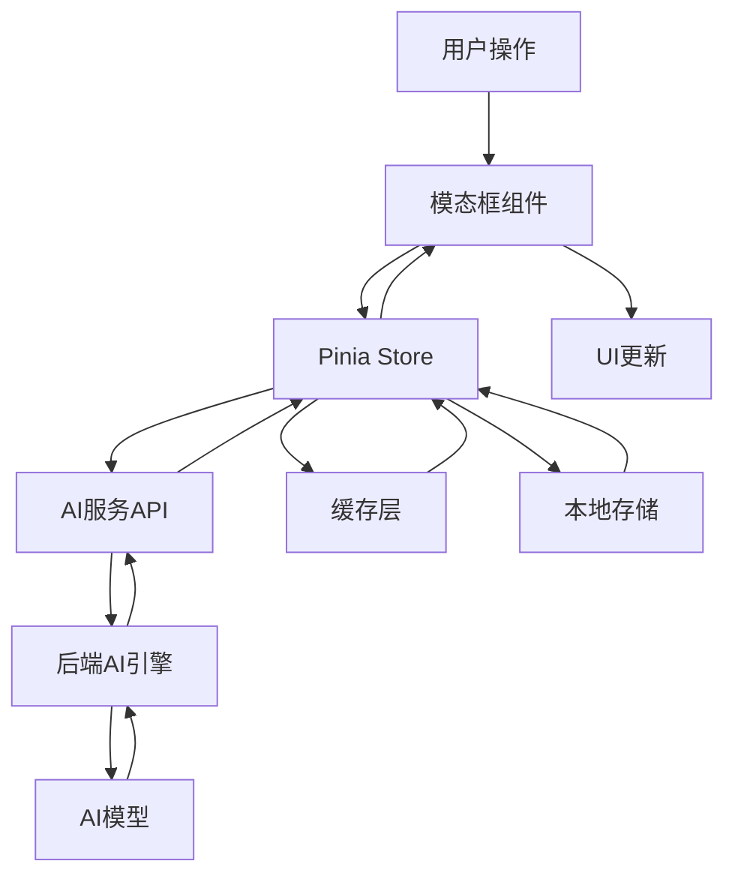

# 模态框组件设计汇总文档

## 汇总概述

本文档汇总了AI小说创作平台的7个核心模态框组件设计，建立统一的设计规范、技术架构和复用策略。这些模态框组件构成了平台AI功能交互的核心界面层，通过统一的设计语言和技术实现，为用户提供一致、专业、高效的AI辅助创作体验。

## 组件架构总览

### 1. 模态框组件清单

| 序号 | 组件名称 | 核心功能 | AI集成特色 | 复用价值 |
|------|----------|----------|------------|----------|
| 16 | 预览提示词模态框 | 智能提示词构建与优化 | 动态提示词组装、效果预测、质量评估 | 所有AI生成功能的核心入口 |
| 17 | AI审核结果模态框 | 内容质量分析与修复建议 | 多维度分析、智能修复、批量优化 | 所有内容质量控制场景 |
| 18 | 生成总结模态框 | 智能内容总结与提炼 | 多角度总结、质量评分、用途适配 | 内容管理和知识梳理场景 |
| 19 | 角色库选择模态框 | 智能角色匹配与推荐 | AI角色匹配、关系分析、适配评估 | 角色管理和选择场景 |
| 20 | 章节预览模态框 | 内容预览与质量评估 | 深度分析、读者模拟、改进建议 | 内容预览和质量控制场景 |
| 21 | 小说导出模态框 | 智能格式转换与发布优化 | 格式优化、平台适配、质量检查 | 内容发布和分享场景 |
| 22 | 时间轴标记模态框 | 时间线管理与一致性控制 | 事件提取、冲突检测、逻辑验证 | 故事逻辑管理场景 |

### 2. 统一技术架构

#### 基础架构模式
```typescript
// 统一的模态框基础接口
interface BaseModalComponent {
  // 基础属性
  visible: boolean;
  title: string;
  size: ModalSize;
  destroyOnClose: boolean;
  
  // AI服务集成
  aiServiceConfig: AIServiceConfig;
  loadingState: LoadingState;
  errorHandling: ErrorHandling;
  
  // 数据管理
  dataState: DataState;
  cacheStrategy: CacheStrategy;
  syncMechanism: SyncMechanism;
  
  // 用户交互
  userInteraction: UserInteraction;
  operationHistory: OperationHistory;
  preferences: UserPreferences;
}

// AI功能集成基础接口
interface AIIntegrationBase {
  // AI服务调用
  aiRequestHandler: AIRequestHandler;
  responseProcessor: ResponseProcessor;
  qualityAssessment: QualityAssessment;
  
  // 智能建议系统
  suggestionEngine: SuggestionEngine;
  recommendationSystem: RecommendationSystem;
  learningMechanism: LearningMechanism;
  
  // 性能优化
  computeOptimization: ComputeOptimization;
  cacheManagement: CacheManagement;
  resourceScheduling: ResourceScheduling;
}
```

## 统一设计规范

### 1. 视觉设计规范

#### 布局规范
- **模态框尺寸**: 统一的尺寸规格体系，支持5种标准尺寸
- **间距系统**: 基于8px网格的统一间距系统
- **分区原则**: 统一的头部/主体/底部三段式布局
- **响应式适配**: 一致的桌面/平板/移动端适配策略

#### 色彩系统
- **主色调**: Element Plus主题色作为基础色彩
- **功能色**: 统一的成功/警告/错误/信息色彩规范
- **AI功能色**: 专门的AI功能标识色彩（蓝紫色系）
- **状态色**: 加载/完成/失败等状态的统一色彩

#### 字体规范
- **标题字体**: 统一的标题字体层级（H1-H6）
- **正文字体**: 统一的正文字体大小和行高
- **代码字体**: AI生成内容和代码的等宽字体
- **多语言字体**: 不同语言的字体适配方案

### 2. 交互设计规范

#### 操作模式统一
- **开启方式**: 按钮点击/快捷键/程序调用的统一触发方式
- **关闭机制**: ESC键/遮罩点击/确认取消按钮的统一关闭方式
- **导航模式**: Tab切换/步骤向导/侧边导航的统一模式
- **确认流程**: 重要操作的统一确认和取消流程

#### 反馈机制统一
- **加载状态**: 统一的加载动画和进度指示
- **成功反馈**: 统一的成功提示和结果展示
- **错误处理**: 统一的错误提示和恢复建议
- **操作确认**: 统一的操作确认和状态更新

### 3. AI功能集成规范

#### AI调用标准化
- **请求格式**: 统一的AI服务请求格式和参数结构
- **响应处理**: 统一的AI响应解析和错误处理
- **质量控制**: 统一的AI生成质量评估和过滤
- **缓存策略**: 统一的AI结果缓存和失效策略

#### 用户体验标准化
- **AI状态显示**: 统一的AI处理状态和进度显示
- **建议展示**: 统一的AI建议格式和交互方式
- **结果预览**: 统一的AI生成结果预览和编辑方式
- **学习反馈**: 统一的用户反馈收集和学习机制

## 技术实现架构

### 1. 公共基础组件

#### BaseModal 基础模态框
```vue
<template>
  <el-dialog
    :model-value="visible"
    :title="title"
    :width="modalWidth"
    :destroy-on-close="destroyOnClose"
    :close-on-click-modal="closeOnClickModal"
    @close="handleClose"
    class="ai-modal-base"
  >
    <!-- 头部区域 -->
    <template #header>
      <div class="modal-header">
        <h3 class="modal-title">{{ title }}</h3>
        <div class="modal-actions">
          <slot name="header-actions"></slot>
        </div>
      </div>
    </template>
    
    <!-- 主体内容区域 -->
    <div class="modal-body">
      <slot></slot>
    </div>
    
    <!-- 底部操作区域 -->
    <template #footer>
      <div class="modal-footer">
        <slot name="footer" :loading="loading">
          <el-button @click="handleCancel">取消</el-button>
          <el-button 
            type="primary" 
            :loading="loading"
            @click="handleConfirm"
          >
            确认
          </el-button>
        </slot>
      </div>
    </template>
  </el-dialog>
</template>
```

#### AIServiceMixin 通用AI服务混入
```typescript
export const AIServiceMixin = {
  data() {
    return {
      aiLoading: false,
      aiError: null,
      aiResult: null,
      aiQuality: null
    }
  },
  
  methods: {
    async callAIService(endpoint: string, params: any) {
      this.aiLoading = true;
      this.aiError = null;
      
      try {
        const response = await this.$api.ai[endpoint](params);
        this.aiResult = response.data;
        this.aiQuality = response.quality;
        return response;
      } catch (error) {
        this.aiError = error;
        this.handleAIError(error);
        throw error;
      } finally {
        this.aiLoading = false;
      }
    },
    
    handleAIError(error: Error) {
      // 统一的AI错误处理逻辑
      this.$message.error(`AI服务调用失败: ${error.message}`);
    },
    
    assessAIQuality(result: any): QualityScore {
      // 统一的AI质量评估逻辑
      return this.qualityAssessmentService.assess(result);
    }
  }
}
```

### 2. 状态管理架构

#### 统一的Store模式
```typescript
// stores/modals.ts
export const useModalsStore = defineStore('modals', {
  state: () => ({
    // 模态框状态管理
    visibleModals: new Set<string>(),
    modalData: new Map<string, any>(),
    modalHistory: new Map<string, any[]>(),
    
    // AI服务状态
    aiServiceStates: new Map<string, AIServiceState>(),
    globalAISettings: GlobalAISettings,
    
    // 用户偏好
    userPreferences: UserModalPreferences,
    operationHistory: OperationHistory[]
  }),
  
  actions: {
    // 模态框控制
    showModal(modalName: string, data?: any) {
      this.visibleModals.add(modalName);
      if (data) this.modalData.set(modalName, data);
    },
    
    hideModal(modalName: string) {
      this.visibleModals.delete(modalName);
      this.modalData.delete(modalName);
    },
    
    // AI服务状态管理
    setAIServiceState(service: string, state: AIServiceState) {
      this.aiServiceStates.set(service, state);
    },
    
    // 操作历史记录
    recordOperation(operation: Operation) {
      this.operationHistory.push({
        ...operation,
        timestamp: Date.now()
      });
    }
  }
});
```

### 3. API服务架构

#### 统一的API客户端
```typescript
// api/ai-services.ts
export class AIServicesClient {
  private baseURL: string;
  private apiKey: string;
  
  // 统一的请求方法
  async request<T>(
    endpoint: string, 
    params: AIRequestParams,
    options?: RequestOptions
  ): Promise<AIResponse<T>> {
    const requestData = {
      ...params,
      userId: this.getCurrentUserId(),
      timestamp: Date.now(),
      requestId: this.generateRequestId()
    };
    
    try {
      const response = await fetch(`${this.baseURL}${endpoint}`, {
        method: 'POST',
        headers: this.getHeaders(),
        body: JSON.stringify(requestData),
        ...options
      });
      
      return await this.processResponse<T>(response);
    } catch (error) {
      return this.handleRequestError(error);
    }
  }
  
  // 专用AI服务方法
  async generateContent(params: ContentGenerationParams) {
    return this.request('/ai/generate-content', params);
  }
  
  async analyzeQuality(params: QualityAnalysisParams) {
    return this.request('/ai/analyze-quality', params);
  }
  
  async detectConflicts(params: ConflictDetectionParams) {
    return this.request('/ai/detect-conflicts', params);
  }
}
```

## 性能优化策略

### 1. 统一性能优化

#### 组件级优化
- **懒加载**: 所有模态框组件的懒加载机制
- **虚拟滚动**: 大数据量的统一虚拟滚动处理
- **内存管理**: 统一的组件内存管理和清理
- **状态优化**: 最小化状态变更的统一策略

#### AI服务优化
- **请求合并**: 相似AI请求的智能合并
- **结果缓存**: 多层级的AI结果缓存策略
- **并行处理**: AI任务的并行处理和资源调度
- **降级策略**: AI服务不可用时的降级策略

### 2. 资源管理优化

#### 计算资源优化
- **CPU使用**: 复杂计算的Web Worker处理
- **内存使用**: 大对象的及时释放和垃圾回收
- **网络带宽**: 数据传输的压缩和优化
- **存储空间**: 本地存储的智能管理

#### 用户体验优化
- **响应时间**: 优化各种操作的响应时间
- **加载体验**: 改善加载过程的用户体验
- **错误恢复**: 快速的错误恢复和重试机制
- **离线支持**: 基础功能的离线可用性

## 数据流架构

### 1. 统一数据流模式

#### 数据流向设计


#### 数据状态管理
- **单向数据流**: 确保数据流向的可预测性
- **状态分离**: 组件状态和全局状态的合理分离
- **数据规范化**: 统一的数据结构和序列化格式
- **错误边界**: 完善的错误边界和容错机制

### 2. 缓存策略架构

#### 多层级缓存设计
- **内存缓存**: 热点数据的内存缓存
- **本地存储**: 持久化数据的本地存储
- **会话存储**: 会话期间的临时数据存储
- **服务端缓存**: 服务端的结果缓存

#### 缓存失效策略
- **时间失效**: 基于时间的缓存失效
- **版本失效**: 基于数据版本的失效策略
- **容量失效**: 基于存储容量的LRU失效
- **依赖失效**: 基于数据依赖的失效策略

## 安全性架构

### 1. 数据安全保护

#### 统一安全措施
- **数据加密**: 敏感数据的端到端加密
- **访问控制**: 基于角色的访问控制机制
- **输入验证**: 所有用户输入的严格验证
- **输出过滤**: AI生成内容的安全过滤

#### 隐私保护机制
- **数据最小化**: 只收集必要的用户数据
- **匿名化处理**: 统计分析的数据匿名化
- **用户控制**: 用户对数据使用的控制权
- **透明度**: 数据使用的透明度和可审计性

### 2. AI安全防护

#### AI服务安全
- **模型安全**: AI模型的安全性验证
- **输入安全**: 防止恶意输入攻击
- **输出安全**: AI输出的安全性检查
- **使用监控**: AI服务使用的监控和审计

#### 内容安全保护
- **内容过滤**: 不当内容的自动过滤
- **版权保护**: 知识产权的保护机制
- **滥用防护**: 防止服务滥用的机制
- **合规检查**: 内容合规性的自动检查

## 扩展性设计

### 1. 组件扩展架构

#### 插件化设计
- **组件插件**: 支持第三方组件插件
- **功能插件**: 支持功能扩展插件
- **AI插件**: 支持AI模型和服务插件
- **主题插件**: 支持UI主题扩展插件

#### 模块化架构
- **核心模块**: 不可替换的核心功能模块
- **扩展模块**: 可插拔的功能扩展模块
- **适配器模式**: 外部服务的适配器模式
- **工厂模式**: 动态创建和配置组件

### 2. 平台集成扩展

#### API开放策略
- **组件API**: 开放组件操作的API接口
- **数据API**: 开放数据访问的API接口
- **AI API**: 开放AI功能的API接口
- **集成API**: 开放平台集成的API接口

#### 生态系统扩展
- **开发者工具**: 提供组件开发和调试工具
- **文档系统**: 完善的API文档和示例
- **社区支持**: 开发者社区和技术支持
- **认证体系**: 第三方插件的认证体系

## 测试策略

### 1. 组件测试架构

#### 单元测试
- **组件测试**: 每个模态框组件的单元测试
- **工具函数测试**: 公共工具函数的测试
- **API测试**: AI服务API的模拟测试
- **状态测试**: Pinia store的状态管理测试

#### 集成测试
- **组件集成**: 模态框组件间的集成测试
- **服务集成**: 前后端服务的集成测试
- **AI集成**: AI服务的集成测试
- **用户流程**: 完整用户流程的端到端测试

### 2. AI功能测试

#### 功能测试
- **生成质量**: AI生成内容的质量测试
- **响应时间**: AI服务的性能测试
- **准确性**: AI分析结果的准确性测试
- **稳定性**: AI服务的稳定性和可靠性测试

#### 用户体验测试
- **可用性**: 组件的可用性和易用性测试
- **无障碍**: 无障碍访问的测试
- **性能**: 用户体验性能的测试
- **兼容性**: 不同浏览器和设备的兼容性测试

## 运维和监控

### 1. 监控体系

#### 性能监控
- **响应时间**: 组件加载和操作响应时间
- **资源使用**: CPU、内存、网络资源使用
- **错误率**: 各种操作的错误率统计
- **用户行为**: 用户使用模式和行为分析

#### AI服务监控
- **调用量**: AI服务的调用频次和量级
- **成功率**: AI服务的成功率和失败率
- **质量指标**: AI生成内容的质量指标
- **资源消耗**: AI服务的资源消耗情况

### 2. 运维策略

#### 部署策略
- **灰度发布**: 新版本的灰度发布策略
- **回滚机制**: 问题版本的快速回滚
- **负载均衡**: 服务负载的均衡分配
- **容错机制**: 服务故障的容错和恢复

#### 优化策略
- **性能优化**: 基于监控数据的性能优化
- **资源优化**: 计算和存储资源的优化
- **用户体验优化**: 基于用户反馈的体验优化
- **成本优化**: AI服务成本的优化控制

## 总结与展望

### 设计成果总结

本模态框组件设计汇总建立了完整的AI小说创作平台模态框组件体系，主要成果包括：

1. **统一架构**: 建立了7个核心模态框组件的统一技术架构和设计规范
2. **AI深度集成**: 每个组件都深度集成了AI功能，提供智能化的用户体验
3. **高度复用**: 通过基础组件和公共服务的设计，实现了高度的代码复用
4. **性能优化**: 建立了完整的性能优化策略和实施方案
5. **安全保障**: 提供了全面的数据安全和AI安全保护机制
6. **扩展性强**: 设计了良好的扩展性架构，支持未来功能扩展

### 技术价值

- **创新性**: 在模态框组件中深度集成AI功能，创新了传统UI组件的设计模式
- **专业性**: 提供了专业级的AI辅助创作工具，满足不同层次用户的需求
- **可维护性**: 统一的架构和规范大大提升了代码的可维护性
- **可扩展性**: 良好的架构设计支持功能的持续扩展和升级
- **用户体验**: 通过AI技术显著提升了用户的创作效率和体验质量

### 未来发展方向

- **AI能力升级**: 集成更先进的AI模型和算法，提供更智能的功能
- **跨平台扩展**: 扩展到移动端、桌面端等多个平台
- **生态系统**: 建设开发者生态，支持第三方插件和扩展
- **国际化**: 支持多语言和不同文化背景的用户需求
- **企业级功能**: 增加企业级的协作、管理和定制功能

这套模态框组件设计将为AI小说创作平台提供强大的技术基础，推动平台在AI辅助创作领域的创新和发展。